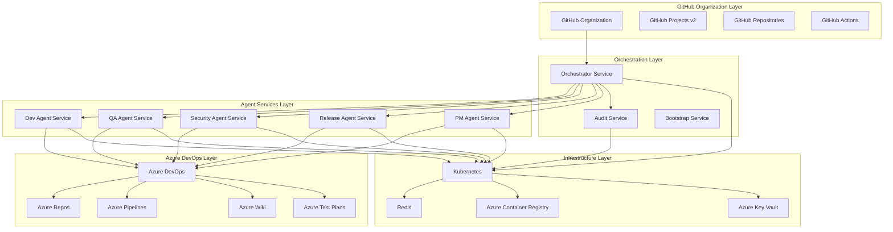
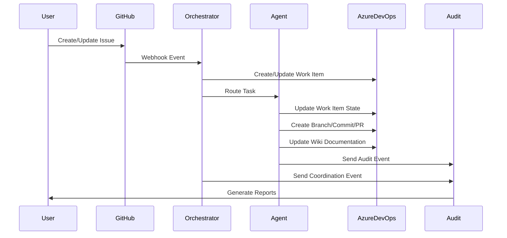
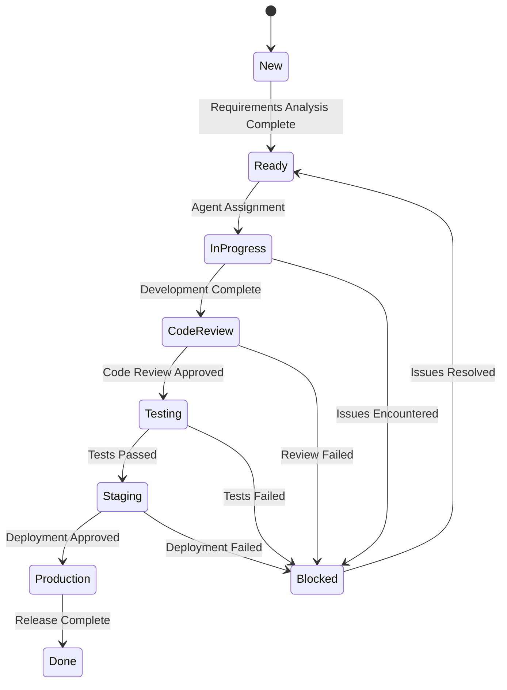

# AI DevOps System Design Specification

## 1. System Architecture Overview

### 1.1 High-Level Architecture

The AI DevOps System follows a distributed microservices architecture with clear separation of concerns:



### 1.2 Design Principles

**1. Microservice Architecture**
- Each agent service is independently deployable and scalable
- Clear service boundaries with well-defined APIs
- Stateless design for horizontal scaling

**2. Event-Driven Communication**
- Azure DevOps webhooks trigger workflow orchestration
- Asynchronous processing with message queuing
- Audit events for complete traceability

**3. Security-First Design**
- Multi-tier PAT scope management (admin vs. scoped permissions)
- Service identity separation in container orchestration
- Secrets management through Azure Key Vault

**4. CMMI Compliance**
- Work item hierarchy validation at all levels
- Process template enforcement for project creation
- Comprehensive traceability matrix maintenance

## 2. Service Architecture Details

### 2.1 Orchestrator Service

**Primary Responsibilities:**
- Azure DevOps project bootstrap and lifecycle management
- Webhook processing and agent routing
- Work item state coordination across services
- Human-in-the-loop escalation for complex scenarios

**Key Components:**
```python
orchestrator-service/
├── src/
│   ├── main.py              # FastAPI application with webhook endpoints
│   ├── bootstrap.py         # Project creation and initialization logic
│   ├── handlers.py          # Webhook handlers and routing logic
│   ├── azure_devops.py      # Azure DevOps API client (admin scope)
│   ├── models.py            # Pydantic models and enums
│   └── utils.py             # Logging, audit, and helper functions
├── docker-compose.yml       # Multi-service orchestration for development
├── Makefile                 # Cross-platform build and deployment scripts
└── azure-pipelines.yml     # CI/CD pipeline configuration
```

**API Endpoints:**
- `POST /webhooks/azure-devops` - Process Azure DevOps webhook events
- `GET /projects/{project}/status` - Check project provisioning status
- `POST /bootstrap` - Trigger manual project bootstrap
- `GET /healthz` - Health and readiness checks
- `GET /metrics` - Prometheus metrics for monitoring

**Bootstrap Workflow:**
1. Check if Azure DevOps project exists
2. Create project with appropriate process template (CMMI/Agile/Scrum)
3. Initialize repository with branch policies
4. Configure work item types and team settings
5. Set up CI/CD pipelines and security policies
6. Generate audit events for all operations

### 2.2 Development Agent Service

**Primary Responsibilities:**
- Program scaffolding for multiple frameworks
- Azure Repos integration for version control
- Code generation with intelligent templates
- Documentation automation and wiki updates

**Key Components:**
```python
dev-agent-service/
├── src/
│   ├── main.py              # FastAPI application with async task endpoints
│   ├── agent.py             # Core development logic with Celery integration
│   ├── azure_devops.py      # Work item operations
│   ├── azure_repos.py       # Repository and Git operations
│   ├── azure_wiki.py        # Documentation automation
│   ├── models.py            # Request/response models
│   └── utils.py             # Logging and audit utilities
├── tests/                   # Comprehensive test suite with mocks
├── Dockerfile               # Production-ready container
└── azure-pipelines.yml     # Azure DevOps CI/CD pipeline
```

**Scaffolding Capabilities:**
- **Backend Frameworks**: FastAPI, Flask, Django with best practices
- **Frontend Integration**: React, Vue.js with TypeScript support
- **Database Integration**: SQL Server, PostgreSQL, MongoDB
- **API Documentation**: OpenAPI/Swagger generation
- **Testing Framework**: pytest, Jest, Cypress setup

**Azure Integration Features:**
- Automatic work item linking in commits (`#workitemid` syntax)
- Pull request creation with rich metadata and acceptance criteria
- Tag management for release versioning (`task-<workitemid>-dev`)
- Wiki page updates with implementation notes and decisions

### 2.3 Quality Assurance Agent Service

**Primary Responsibilities:**
- Automated test suite generation and execution
- Bug detection and quality metrics reporting
- Integration with Azure Test Plans
- Performance and load testing coordination

**Key Components:**
```python
qa-agent-service/
├── src/
│   ├── main.py              # FastAPI application
│   ├── agent.py             # QA automation logic
│   ├── azure_test_plans.py  # Test plan and case management
│   ├── test_generators.py   # Automated test generation
│   ├── quality_metrics.py   # Code quality and coverage analysis
│   └── utils.py             # Testing utilities and reporting
```

**Testing Capabilities:**
- **Unit Testing**: Automated test generation for new code
- **Integration Testing**: API and service integration validation
- **Performance Testing**: Load testing with Azure Load Testing
- **Security Testing**: OWASP compliance and vulnerability scanning

### 2.4 Security Agent Service

**Primary Responsibilities:**
- Static and dynamic security analysis
- Dependency vulnerability assessment
- Security policy enforcement
- Compliance validation and reporting

**Key Components:**
```python
security-agent-service/
├── src/
│   ├── main.py              # FastAPI application
│   ├── agent.py             # Security analysis logic
│   ├── static_analysis.py   # SAST tools integration
│   ├── dependency_check.py  # Dependency vulnerability scanning
│   ├── compliance.py        # Policy and compliance validation
│   └── utils.py             # Security utilities and reporting
```

**Security Features:**
- **Static Analysis**: Integration with SonarQube, CodeQL, Semgrep
- **Dependency Scanning**: NPM audit, pip-audit, OWASP Dependency Check
- **Container Security**: Trivy, Clair, Azure Container Registry scanning
- **Compliance**: SOX, GDPR, HIPAA policy validation

### 2.5 Release Agent Service

**Primary Responsibilities:**
- Automated deployment pipeline execution
- Environment promotion with approval workflows
- Release notes generation and artifact management
- Rollback capabilities and disaster recovery

**Key Components:**
```python
release-agent-service/
├── src/
│   ├── main.py              # FastAPI application
│   ├── agent.py             # Release automation logic
│   ├── deployment.py        # Deployment pipeline management
│   ├── artifacts.py         # Artifact management and promotion
│   ├── rollback.py          # Rollback and recovery procedures
│   └── utils.py             # Release utilities and notifications
```

**Deployment Features:**
- **Blue-Green Deployment**: Zero-downtime deployments with traffic switching
- **Canary Releases**: Gradual rollout with monitoring and automatic rollback
- **Infrastructure as Code**: Terraform and ARM template management
- **Monitoring Integration**: Application Insights, Azure Monitor alerts

### 2.6 Project Management Agent Service

**Primary Responsibilities:**
- Requirements analysis and Epic/Feature breakdown
- Sprint planning and capacity management
- Stakeholder communication and status reporting
- Business value assessment and prioritization

**Key Components:**
```python
pm-agent-service/
├── src/
│   ├── main.py              # FastAPI application
│   ├── agent.py             # PM automation logic
│   ├── requirements.py      # Requirements analysis and breakdown
│   ├── planning.py          # Sprint planning and capacity management
│   ├── reporting.py         # Status reporting and metrics
│   └── utils.py             # PM utilities and communication
```

**Management Features:**
- **Epic Decomposition**: Intelligent breakdown of business requirements
- **Velocity Tracking**: Team performance metrics and predictive planning
- **Stakeholder Dashboards**: Executive reporting with business metrics
- **Risk Assessment**: Project risk analysis and mitigation planning

### 2.7 Audit Service

**Primary Responsibilities:**
- Comprehensive audit trail collection and storage
- Compliance reporting and validation
- Performance metrics and monitoring
- Business intelligence and analytics

**Key Components:**
```python
audit-service/
├── src/
│   ├── main.py              # FastAPI application
│   ├── collector.py         # Audit event collection and storage
│   ├── reporting.py         # Compliance and business reporting
│   ├── analytics.py         # Performance analytics and insights
│   └── utils.py             # Audit utilities and validation
```

**Audit Features:**
- **Event Collection**: All service operations with correlation IDs
- **Immutable Storage**: Blockchain-inspired audit log integrity
- **Compliance Reports**: Automated generation for regulatory requirements
- **Performance Dashboards**: Real-time metrics and trend analysis

## 3. Data Architecture

### 3.1 Data Flow Design



### 3.2 State Management

**Work Item State Machine:**


### 3.3 Data Models

**Core Work Item Model:**
```python
@dataclass
class WorkItem:
    id: int
    type: WorkItemType  # Epic, Feature, Requirement, Task
    title: str
    description: str
    state: WorkItemState
    assigned_to: Optional[str]
    area_path: str
    iteration_path: str
    tags: List[str]
    parent_id: Optional[int]
    children_ids: List[int]
    created_date: datetime
    modified_date: datetime
    correlation_id: str
```

**Audit Event Model:**
```python
@dataclass
class AuditEvent:
    correlation_id: str
    event_type: str
    service_name: str
    work_item_id: Optional[int]
    repository_id: Optional[str]
    old_state: Optional[str]
    new_state: Optional[str]
    metadata: Dict[str, Any]
    timestamp: datetime
    user_context: Optional[str]
```

## 4. Security Architecture

### 4.1 Authentication and Authorization

**Multi-Tier PAT Management:**
```python
# Orchestrator Service (Admin Tier)
ORCHESTRATOR_PAT_SCOPES = [
    "vso.project_create",     # Create Azure DevOps projects
    "vso.project_manage",     # Configure project settings
    "vso.code_write",         # Initialize repositories
    "vso.work_full"           # Manage work items and process
]

# Agent Services (Scoped Tier)
AGENT_PAT_SCOPES = {
    "dev-agent": ["vso.work_write", "vso.code_write", "vso.wiki_write"],
    "qa-agent": ["vso.work_write", "vso.test_write"],
    "security-agent": ["vso.work_write", "vso.code_read"],
    "release-agent": ["vso.work_write", "vso.release_manage"],
    "pm-agent": ["vso.work_write", "vso.analytics"]
}
```

**Service Identity Separation:**
```yaml
# Kubernetes Service Account Configuration
apiVersion: v1
kind: ServiceAccount
metadata:
  name: orchestrator-service-account
  namespace: ai-devops
---
apiVersion: v1
kind: ServiceAccount
metadata:
  name: dev-agent-service-account
  namespace: ai-devops
```

### 4.2 Data Protection

**Encryption Strategy:**
- **At Rest**: Azure Key Vault for secrets, encrypted storage for audit logs
- **In Transit**: TLS 1.3 for all service-to-service communication
- **In Memory**: Secure coding practices, no plaintext secrets in logs

**Secret Management:**
```python
# Azure Key Vault Integration
class SecretManager:
    def __init__(self):
        self.client = SecretClient(
            vault_url=os.environ["AZURE_KEY_VAULT_URL"],
            credential=DefaultAzureCredential()
        )
    
    def get_pat_token(self, service_name: str) -> str:
        return self.client.get_secret(f"{service_name}-pat").value
```

### 4.3 Network Security

**Service Mesh Configuration:**
- **Istio Integration**: Service-to-service mTLS encryption
- **Network Policies**: Kubernetes network segmentation
- **API Gateway**: Azure API Management for external access
- **DDoS Protection**: Azure DDoS Protection Standard

## 5. Deployment Architecture

### 5.1 Container Orchestration

**Kubernetes Deployment Strategy:**
```yaml
apiVersion: apps/v1
kind: Deployment
metadata:
  name: orchestrator-service
spec:
  replicas: 3
  selector:
    matchLabels:
      app: orchestrator-service
  template:
    metadata:
      labels:
        app: orchestrator-service
    spec:
      serviceAccountName: orchestrator-service-account
      containers:
      - name: orchestrator
        image: acr.azurecr.io/ai-devops/orchestrator-service:latest
        ports:
        - containerPort: 8000
        env:
        - name: AZURE_DEVOPS_PAT
          valueFrom:
            secretKeyRef:
              name: orchestrator-secrets
              key: azure-devops-pat
        livenessProbe:
          httpGet:
            path: /healthz
            port: 8000
          initialDelaySeconds: 30
          periodSeconds: 10
        readinessProbe:
          httpGet:
            path: /healthz
            port: 8000
          initialDelaySeconds: 5
          periodSeconds: 5
```

### 5.2 CI/CD Pipeline Architecture

**Azure Pipelines Integration:**
```yaml
# azure-pipelines.yml
trigger:
  branches:
    include:
    - main
    - develop
  paths:
    include:
    - src/*
    - Dockerfile
    - requirements.txt

stages:
- stage: Build
  jobs:
  - job: BuildAndTest
    pool:
      vmImage: 'ubuntu-latest'
    steps:
    - task: UsePythonVersion@0
      inputs:
        versionSpec: '3.11'
    - script: |
        pip install -r requirements.txt
        pytest tests/ --cov=src --cov-report=xml
      displayName: 'Run Tests'
    - task: Docker@2
      inputs:
        command: 'buildAndPush'
        repository: 'ai-devops/$(Build.Repository.Name)'
        dockerfile: 'Dockerfile'
        containerRegistry: 'AzureContainerRegistry'
        tags: |
          $(Build.BuildId)
          latest

- stage: Deploy
  dependsOn: Build
  condition: and(succeeded(), eq(variables['Build.SourceBranch'], 'refs/heads/main'))
  jobs:
  - deployment: DeployToProduction
    environment: 'production'
    strategy:
      runOnce:
        deploy:
          steps:
          - task: KubernetesManifest@0
            inputs:
              action: 'deploy'
              kubernetesServiceConnection: 'AKS-Connection'
              manifests: |
                k8s/deployment.yaml
                k8s/service.yaml
                k8s/ingress.yaml
```

### 5.3 Monitoring and Observability

**Prometheus and Grafana Integration:**
```python
# Metrics collection in each service
from prometheus_client import Counter, Histogram, generate_latest

# Service-specific metrics
TASKS_PROCESSED = Counter('tasks_processed_total', 'Total tasks processed', ['service', 'status'])
TASK_DURATION = Histogram('task_duration_seconds', 'Task processing duration', ['service', 'operation'])
WORK_ITEM_OPERATIONS = Counter('work_item_operations_total', 'Work item operations', ['operation', 'status'])

@app.get("/metrics")
async def metrics():
    return Response(generate_latest(), media_type="text/plain")
```

**Structured Logging:**
```python
import structlog

logger = structlog.get_logger()

# Standardized log format across all services
logger.info(
    "work_item_updated",
    correlation_id=correlation_id,
    work_item_id=work_item_id,
    old_state=old_state,
    new_state=new_state,
    service="dev-agent-service",
    operation="update_work_item_state"
)
```

## 6. Integration Architecture

### 6.1 GitHub Integration Layer

**GitHub CLI Automation:**
```bash
# Multi-project bootstrap with template mapping
gh project create \
  --owner "$ORG_NAME" \
  --title "$PROJECT_TITLE" \
  --template "$TEMPLATE_TYPE"
```

**Issue Management Integration:**
```python
class GitHubIntegration:
    def normalize_epic_issues(self, epic_content: str) -> List[Issue]:
        """Parse Epic content and create Feature/Task hierarchy"""
        sections = self.parse_epic_sections(epic_content)
        features = self.create_feature_issues(sections)
        tasks = self.create_task_issues(features)
        return features + tasks
```

### 6.2 Azure DevOps Integration Layer

**REST API Client:**
```python
class AzureDevOpsClient:
    def __init__(self, organization_url: str, pat: str):
        self.base_url = f"{organization_url}/_apis"
        self.session = httpx.AsyncClient(
            headers={"Authorization": f"Basic {base64.b64encode(f':{pat}'.encode()).decode()}"}
        )
    
    @retry(stop=stop_after_attempt(3), wait=wait_exponential(multiplier=1, min=4, max=60))
    async def create_work_item(self, project: str, work_item_type: str, fields: Dict) -> WorkItem:
        """Create work item with retry logic and audit trail"""
        response = await self.session.post(
            f"{self.base_url}/wit/workitems/${work_item_type}",
            params={"api-version": "7.1-preview.3"},
            json=[{"op": "add", "path": f"/fields/{key}", "value": value} for key, value in fields.items()]
        )
        return WorkItem.from_azure_response(response.json())
```

### 6.3 Container Registry Integration

**Multi-Stage Build Optimization:**
```dockerfile
# Production-optimized Dockerfile
FROM python:3.11-slim AS builder
WORKDIR /app
COPY requirements.txt .
RUN pip install --no-cache-dir -r requirements.txt

FROM python:3.11-slim AS runtime
RUN groupadd -g 1001 appuser && useradd -r -u 1001 -g appuser appuser
WORKDIR /app
COPY --from=builder /usr/local/lib/python3.11/site-packages /usr/local/lib/python3.11/site-packages
COPY --from=builder /usr/local/bin /usr/local/bin
COPY src/ ./src/
USER appuser
EXPOSE 8000
CMD ["uvicorn", "src.main:app", "--host", "0.0.0.0", "--port", "8000"]
```

## 7. Performance and Scalability Design

### 7.1 Horizontal Scaling Strategy

**Service Scaling Configuration:**
```yaml
apiVersion: autoscaling/v2
kind: HorizontalPodAutoscaler
metadata:
  name: dev-agent-hpa
spec:
  scaleTargetRef:
    apiVersion: apps/v1
    kind: Deployment
    name: dev-agent-service
  minReplicas: 2
  maxReplicas: 10
  metrics:
  - type: Resource
    resource:
      name: cpu
      target:
        type: Utilization
        averageUtilization: 70
  - type: Resource
    resource:
      name: memory
      target:
        type: Utilization
        averageUtilization: 80
```

### 7.2 Caching Strategy

**Redis Integration:**
```python
import redis.asyncio as redis

class CacheManager:
    def __init__(self):
        self.redis_client = redis.Redis.from_url(os.environ["REDIS_URL"])
    
    async def cache_work_item(self, work_item_id: int, work_item: WorkItem, ttl: int = 3600):
        """Cache work item data with TTL"""
        await self.redis_client.setex(
            f"work_item:{work_item_id}",
            ttl,
            work_item.json()
        )
    
    async def get_cached_work_item(self, work_item_id: int) -> Optional[WorkItem]:
        """Retrieve cached work item"""
        cached_data = await self.redis_client.get(f"work_item:{work_item_id}")
        return WorkItem.parse_raw(cached_data) if cached_data else None
```

### 7.3 Database Optimization

**Connection Pooling:**
```python
from sqlalchemy.ext.asyncio import create_async_engine, AsyncSession
from sqlalchemy.pool import NullPool

class DatabaseManager:
    def __init__(self):
        self.engine = create_async_engine(
            os.environ["DATABASE_URL"],
            poolclass=NullPool,  # For serverless compatibility
            pool_pre_ping=True,
            pool_recycle=3600
        )
    
    async def get_session(self) -> AsyncSession:
        """Get database session with proper lifecycle management"""
        async with AsyncSession(self.engine) as session:
            try:
                yield session
                await session.commit()
            except Exception:
                await session.rollback()
                raise
            finally:
                await session.close()
```

## 8. Error Handling and Resilience

### 8.1 Retry Strategy

**Exponential Backoff Implementation:**
```python
from tenacity import retry, stop_after_attempt, wait_exponential, retry_if_exception_type

@retry(
    stop=stop_after_attempt(5),
    wait=wait_exponential(multiplier=1, min=4, max=60),
    retry=retry_if_exception_type((httpx.HTTPStatusError, httpx.ConnectError))
)
async def resilient_api_call(client: httpx.AsyncClient, url: str, **kwargs):
    """API call with exponential backoff and jitter"""
    response = await client.request(**kwargs)
    response.raise_for_status()
    return response.json()
```

### 8.2 Circuit Breaker Pattern

**Service Protection:**
```python
from pybreaker import CircuitBreaker

class ServiceClient:
    def __init__(self):
        self.circuit_breaker = CircuitBreaker(
            fail_max=5,           # Open circuit after 5 failures
            reset_timeout=60,     # Try to close circuit after 60 seconds
            exclude=[httpx.HTTPStatusError]  # Don't count client errors
        )
    
    @circuit_breaker
    async def call_external_service(self, endpoint: str):
        """Protected external service call"""
        response = await httpx.get(endpoint)
        return response.json()
```

### 8.3 Graceful Degradation

**Fallback Mechanisms:**
```python
class WorkItemService:
    async def update_work_item_with_fallback(self, work_item_id: int, updates: Dict):
        """Update work item with graceful degradation"""
        try:
            # Primary: Azure DevOps API
            return await self.azure_client.update_work_item(work_item_id, updates)
        except Exception as e:
            logger.warning("Azure DevOps unavailable, using cache", error=str(e))
            # Fallback: Cache the update for later
            await self.cache_pending_update(work_item_id, updates)
            return {"status": "cached", "work_item_id": work_item_id}
```

## 9. Testing Architecture

### 9.1 Testing Strategy

**Multi-Layer Testing Approach:**
```python
# Unit Tests with Mocking
@pytest.fixture
def mock_azure_client():
    with patch('src.azure_devops.AzureDevOpsClient') as mock:
        mock.return_value.create_work_item.return_value = mock_work_item()
        yield mock

# Integration Tests with Test Containers
@pytest.fixture
async def test_database():
    async with TestContainer("postgres:13") as container:
        database_url = container.get_connection_url()
        yield database_url

# End-to-End Tests with Real Services
@pytest.mark.e2e
async def test_complete_workflow():
    """Test complete workflow from issue creation to deployment"""
    # Create GitHub issue
    # Verify Azure DevOps work item creation
    # Trigger agent processing
    # Verify code generation
    # Validate deployment
```

### 9.2 Performance Testing

**Load Testing Configuration:**
```yaml
# K6 load testing script
import http from 'k6/http';
import { check } from 'k6';

export let options = {
  stages: [
    { duration: '5m', target: 100 },   // Ramp up
    { duration: '10m', target: 100 },  // Steady state
    { duration: '5m', target: 0 },     // Ramp down
  ],
};

export default function() {
  let response = http.post('http://dev-agent-service/work/start', {
    work_item_id: Math.floor(Math.random() * 1000),
    framework: 'fastapi',
  });
  
  check(response, {
    'status is 202': (r) => r.status === 202,
    'response time < 2s': (r) => r.timings.duration < 2000,
  });
}
```

## 10. Future Architecture Considerations

### 10.1 Multi-Cloud Strategy

**Cloud-Agnostic Design:**
```python
# Abstract cloud provider interface
class CloudProvider(ABC):
    @abstractmethod
    async def create_container_instance(self, spec: ContainerSpec) -> ContainerInstance:
        pass
    
    @abstractmethod
    async def get_secret(self, secret_name: str) -> str:
        pass

# Azure implementation
class AzureCloudProvider(CloudProvider):
    async def create_container_instance(self, spec: ContainerSpec) -> ContainerInstance:
        # Azure Container Instances implementation
        pass

# AWS implementation (future)
class AWSCloudProvider(CloudProvider):
    async def create_container_instance(self, spec: ContainerSpec) -> ContainerInstance:
        # AWS ECS/Fargate implementation
        pass
```

### 10.2 AI/ML Enhancement

**Intelligent Automation:**
```python
class IntelligentAgent:
    def __init__(self):
        self.ml_model = load_model("requirement_classification")
        self.code_generator = CodeGenerator()
    
    async def analyze_requirement(self, requirement_text: str) -> RequirementAnalysis:
        """AI-powered requirement analysis"""
        classification = self.ml_model.predict(requirement_text)
        complexity_score = self.estimate_complexity(requirement_text)
        recommendations = self.generate_recommendations(classification, complexity_score)
        
        return RequirementAnalysis(
            classification=classification,
            complexity=complexity_score,
            recommendations=recommendations
        )
```

### 10.3 Advanced Compliance

**Regulatory Framework Support:**
```python
class ComplianceFramework:
    def __init__(self, framework_type: str):  # SOX, GDPR, HIPAA, etc.
        self.rules = load_compliance_rules(framework_type)
        self.validators = create_validators(self.rules)
    
    async def validate_operation(self, operation: SystemOperation) -> ComplianceResult:
        """Validate operation against compliance rules"""
        violations = []
        for validator in self.validators:
            result = await validator.validate(operation)
            if not result.compliant:
                violations.append(result.violation)
        
        return ComplianceResult(
            compliant=len(violations) == 0,
            violations=violations,
            recommendations=self.generate_remediation(violations)
        )
```

---

**Document Version**: 1.0  
**Last Updated**: January 2025  
**Status**: Active  
**Architecture Review**: Pending