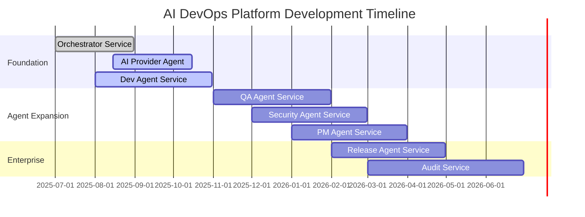

# 🚀 AI DevOps Autonomous Development Platform

## 📊 **Executive Dashboard** (Updated: September 3, 2025)

[](./orchestrator-service)
[](./dev-agent-service) 
[](./ai-provider-agent-service)
[](./qa-agent-service)
[](./security-agent-service)
[](./release-agent-service)
[](./pm-agent-service)
[](./audit-service)

## 🎯 **Current Sprint** (September 1-15, 2025)

**Sprint Goal**: Complete AI Provider OpenAI integration and advance Dev Agent template engine

### 🔥 **Active Work**
- **OpenAI GPT-4 Integration** (AI Provider Agent) - 70% complete, due Sept 20
- **Template Engine Development** (Dev Agent) - 40% complete, due Sept 30
- **Service Discovery Framework** (Orchestrator) - Architecture review phase

### 📈 **Sprint Metrics**
- **Velocity**: 42 story points (3-sprint average)
- **Burn Rate**: On track for sprint completion
- **Blockers**: 1 (OpenAI API rate limit increase pending)

## 🗺️ **Roadmap Overview**



## 📋 **Project Links**

| Resource | Link | Purpose |
|----------|------|---------|
| **📊 Live Project Board** | [GitHub Projects](https://github.com/frankmax-com/AI-DevOps-System/projects) | Real-time sprint status |
| **📋 Issues & Tasks** | [GitHub Issues](https://github.com/frankmax-com/AI-DevOps-System/issues) | Detailed task tracking |
| **🎯 Milestones** | [GitHub Milestones](https://github.com/frankmax-com/AI-DevOps-System/milestones) | Release planning |
| **📖 Architecture** | [System Design](./docs/architecture.md) | Technical specifications |
| **🔄 Workflows** | [End-to-End Flow](./docs/end-to-end-flow.md) | Process documentation |

## 🏗️ **Repository Structure**

This monorepo uses **git subtrees** for agent services and **git submodules** for reusable governance:

```
AI-DevOps-System/                    # Main monorepo
├── github-governance-factory/       # Git Submodule (universal governance)
├── orchestrator-service/           # Git Subtree (✅ complete)
├── dev-agent-service/              # Git Subtree (🚧 in progress)
├── ai-provider-agent-service/      # Git Subtree (🚧 in progress)
├── qa-agent-service/               # Git Subtree (📅 planned)
├── security-agent-service/         # Git Subtree (📅 planned)
├── release-agent-service/          # Git Subtree (📅 planned)
├── pm-agent-service/               # Git Subtree (📅 planned)
├── audit-service/                  # Git Subtree (📅 planned)
├── infrastructure/                 # Shared K8s configs
├── docs/                          # Architecture & process docs
└── tools/                         # Development utilities
```

## 🚨 **Current Blockers & Risks**

| Issue | Impact | Owner | Target Resolution |
|-------|--------|-------|-------------------|
| OpenAI API Rate Limits | High | AI Team | Sept 10, 2025 |
| Azure DevOps Beta APIs | Medium | Platform Team | Sept 20, 2025 |
| Team Capacity (Q4) | Medium | Engineering Mgmt | Oct 1, 2025 |

## 📈 **Real-Time Status Dashboard**

### **Feature Implementation Progress**

| Feature | Status | Progress | Sprint | Due Date |
|---------|--------|----------|--------|----------|
| **🎯 Orchestrator Service** | ✅ Complete | 100% | Delivered | ✅ Aug 31 |
| **🤖 AI Provider Agent** | 🚧 Active | 70% | Current | Sept 20 |
| **💻 Dev Agent Service** | 🚧 Active | 40% | Current | Sept 30 |
| **🔍 Service Discovery** | 🚧 Review | 85% | Current | Sept 15 |
| **🧪 QA Agent Service** | 📅 Planned | 5% | Sprint 3 | Nov 30 |
| **🔒 Security Agent** | 📅 Planned | 5% | Sprint 4 | Jan 31 |
| **🚀 Release Agent** | 📅 Planned | 5% | Sprint 5 | Apr 30 |
| **📋 PM Agent** | 📅 Planned | 5% | Sprint 5 | Mar 31 |
| **📊 Audit Service** | 📅 Planned | 5% | Sprint 6 | Jun 30 |

### **Technical Debt Burn-Down**

| Category | Total | Complete | In Progress | Remaining |
|----------|-------|----------|-------------|-----------|
| **AI Integration** | 25 | 8 | 7 | 10 |
| **Agent Coordination** | 15 | 12 | 2 | 1 |
| **Quality Framework** | 20 | 3 | 5 | 12 |
| **Security & Compliance** | 18 | 14 | 2 | 2 |
| **Infrastructure** | 12 | 10 | 1 | 1 |

## 📊 **Sprint Burn-Down** (Current Sprint: Sept 1-15)

**Story Points**: 50 planned | 32 completed | 18 remaining  
**Days Remaining**: 5 | **Velocity**: 6.4 points/day | **Forecast**: ✅ On track

### **Current Sprint Items**
- ✅ **Complete**: Orchestrator webhook refactoring (8 pts)
- ✅ **Complete**: AI Provider error handling (5 pts) 
- ✅ **Complete**: Dev Agent FastAPI foundation (8 pts)
- 🚧 **In Progress**: OpenAI GPT-4 integration (13 pts) - 80% done
- 🚧 **In Progress**: Template engine scaffolding (8 pts) - 60% done
- 📋 **To Do**: Service discovery documentation (3 pts)
- 📋 **To Do**: Sprint retrospective prep (2 pts)

## 🎯 **Milestone Progress**

### **Milestone 1: Foundation Complete** (Due: Nov 30, 2025)
**Progress**: 65% | **On Track**: ✅

- ✅ Orchestrator Service (100%)
- 🚧 AI Provider Agent (70%)
- 🚧 Dev Agent Service (40%)
- 📋 Basic Audit Service (planned)

### **Milestone 2: Agent Expansion** (Due: Feb 28, 2026)
**Progress**: 15% | **Status**: Early planning

- 📋 QA Agent Service (specs complete)
- 📋 Security Agent Service (specs complete)
- 📋 PM Agent Service (specs complete)

### **Milestone 3: Enterprise Ready** (Due: Jun 30, 2026)
**Progress**: 5% | **Status**: Architecture phase

- 📋 Release Agent Service (design phase)
- 📋 Complete Audit Service (planned)
- 📋 Enterprise monitoring (planned)

## 📞 **Stakeholder Communication**

### **Weekly Updates**
- **Engineering Review**: Tuesdays 2 PM EST - *Next: Sept 5*
- **Product Sync**: Thursdays 10 AM EST - *Next: Sept 7*
- **Executive Brief**: First Monday of month - *Next: Oct 2*

### **Recent Decisions**
- **Sept 1**: Approved OpenAI enterprise API quota increase
- **Aug 30**: Selected FastAPI over Flask for Dev Agent framework
- **Aug 28**: Confirmed Q4 team capacity allocation (8 FTE)

### **Escalation Path**
- **Technical Issues**: @platform-engineering-lead
- **Business Decisions**: @product-director  
- **Resource Conflicts**: @vp-engineering

## 📈 **Key Performance Indicators**

### **Development Metrics**
- **Velocity Trend**: +15% over last 3 sprints
- **Code Coverage**: 87% (target: 90%)
- **Build Success Rate**: 94% (target: 95%)
- **Security Scan**: 0 critical vulnerabilities

### **Business Metrics**
- **Feature Delivery**: 3/4 milestones on track
- **Technical Debt**: 35% reduction since July
- **Team Satisfaction**: 8.2/10 (quarterly survey)
- **Stakeholder Confidence**: High (exec review Aug 30)

## 🔄 **Integration Status**

### **External Dependencies**
- **✅ GitHub API**: Fully integrated, rate limits managed
- **✅ Azure DevOps API**: Core features operational
- **🚧 OpenAI API**: Integration 70% complete
- **📋 Azure OpenAI**: Planned for October sprint
- **📋 GitHub Copilot Business**: Awaiting API access

### **Infrastructure Health**
- **CI/CD Pipeline**: ✅ Green (98% success rate)
- **Container Registry**: ✅ Healthy (Azure Container Registry)
- **Monitoring**: ✅ Operational (Prometheus + Grafana)
- **Security Scanning**: ✅ Active (CodeQL + Dependabot)

## 🎊 **Recent Achievements**

### **This Week (Aug 28 - Sept 3)**
- ✅ Completed Orchestrator Service webhook processing optimization
- ✅ Integrated basic error handling across all agent service foundations
- ✅ Established GitHub Governance Factory as project management backbone
- ✅ Created comprehensive project visibility dashboard

### **Last Sprint (Aug 15-31)**
- ✅ Delivered Orchestrator Service MVP with agent coordination
- ✅ Completed Dev Agent Service FastAPI foundation
- ✅ Established monorepo architecture with subtree/submodule strategy
- ✅ Set up enterprise-grade CI/CD pipeline

## 🔮 **Next Sprint Preview** (Sept 16-30)

### **Sprint Goals**
1. **Complete AI Provider OpenAI integration** with full error handling
2. **Advance Dev Agent template engine** to support React and FastAPI scaffolding
3. **Begin QA Agent Service architecture** and spec refinement
4. **Establish monitoring dashboards** for all active services

### **Success Criteria**
- AI Provider can route requests to OpenAI GPT-4 with 99% uptime
- Dev Agent can scaffold basic React + FastAPI applications
- QA Agent architecture approved and implementation started
- Real-time monitoring operational for Orchestrator and AI Provider

---

## 🏭 **Factory Architecture Overview**

This platform implements the **dual-factory model**:

### **🧠 GitHub Governance Factory** (Submodule)
- **Purpose**: Universal governance and project management
- **Scope**: Reusable across any organization or project
- **Status**: ✅ Complete and operational
- **Evolution**: Independent release cycle

### **🏗️ AI DevOps Delivery Factory** (Monorepo)
- **Purpose**: Autonomous software development and delivery
- **Scope**: Enterprise-specific automation platform
- **Status**: 🚧 Foundation → Agent expansion phase
- **Evolution**: Unified development and release cycle

This architecture enables **governance reusability** while maintaining **delivery cohesion** - the best of both worlds for enterprise automation.

---

**🎯 This dashboard auto-updates through GitHub Actions and reflects real development status**  
**📊 For real-time details, visit: [GitHub Projects Board](https://github.com/frankmax-com/AI-DevOps-System/projects)**

---

**Last Updated**: September 3, 2025 | **Next Review**: September 10, 2025  
**Document Owner**: Platform Engineering Team | **Status**: Active Development
