# AI DevOps Ecosystem - Complete Implementation Roadmap

## 🎯 Executive Summary

Following comprehensive feasibility analysis, we are proceeding with full development of the AI Agent Startup Creation System. This document outlines the complete implementation strategy across all ecosystem components.

**Status**: ✅ **APPROVED FOR FULL DEVELOPMENT**  
**Budget**: $2.5M over 9 months  
**Success Probability**: 80% with proper security implementation  
**Expected ROI**: $27M ARR by Year 3

## 🚀 Implementation Strategy

### Phase 1: Foundation (Months 1-3) - **IN PROGRESS**
- ✅ Documentation update across all projects
- 🔄 Controller Service implementation (Critical Path)
- 🔄 Agent persona development (Founder, Dev, Ops, Sec, Finance)
- 🔄 Multi-tenant architecture with security isolation

### Phase 2: Integration (Months 4-6)
- End-to-end orchestration workflows
- GitHub → Azure DevOps automation
- Governance policy enforcement
- Business intelligence dashboards

### Phase 3: Production (Months 7-9)
- Enterprise hardening and security certification
- Multi-region deployment capabilities
- Advanced analytics and AI-powered insights
- 24/7 monitoring and support

## 🏗️ Architecture Overview

```mermaid
graph TB
    subgraph "Control Plane"
        CTRL[Controller Service - NEW]
        VAULT[Azure Key Vault]
        AUDIT[Audit Service]
        UI[Approval UI - NEW]
    end
    
    subgraph "Governance Factories - READY"
        GHF[GitHub Governance Factory ✅]
        AZGF[Azure DevOps Governance Factory ✅]
        AIGF[AI Provider Factory ✅]
        DBGF[Database Governance Factory ✅]
    end
    
    subgraph "Agent Runtime - DEVELOPMENT"
        GBA[GitHub Bootstrap Agent]
        FOUND[Founder Agent - NEW]
        DEV[Dev Agent - ENHANCED]
        OPS[Ops Agent - NEW]
        SEC[Security Agent - ENHANCED]
        FIN[Finance Agent - NEW]
    end
    
    subgraph "Tenant Infrastructure - NEW"
        T1[Startup Alpha]
        T2[Startup Beta]
        T3[Startup Gamma]
    end
    
    CTRL --> VAULT
    CTRL --> AUDIT
    CTRL --> UI
    CTRL --> GHF
    CTRL --> AZGF
    CTRL --> AIGF
    CTRL --> DBGF
    
    GBA --> GHF
    FOUND --> AIGF
    DEV --> AZGF
    OPS --> AZGF
    SEC --> AZGF
    FIN --> DBGF
```



## 📋 Development Priorities

### Immediate Development (Next 30 Days)
1. **Controller Service Architecture** - Token delegation and policy enforcement
2. **Multi-Tenant Security Model** - Cryptographic isolation and resource boundaries
3. **Agent Persona Implementation** - Roleplay capabilities with business logic
4. **Approval Workflow System** - Human oversight for critical operations

### Critical Success Factors
- **Security-First Implementation**: No compromises on token lifecycle or tenant isolation
- **Governance Factory Integration**: Exclusive use of factory APIs, no CLI dependencies
- **Immutable Audit Trails**: Hash-chained logs with cryptographic integrity
- **Human Approval Gates**: Mandatory oversight for destructive operations

## 🎯 Success Metrics

### Technical Metrics
- ✅ Controller service operational with token delegation
- ✅ All 5 roleplay agents implemented and tested
- ✅ Single startup creation end-to-end in <30 minutes
- ✅ Complete audit trail with cryptographic integrity

### Business Metrics
- 📈 100+ concurrent startup creations by Month 9
- 💰 $1.8M ARR by Year 1, $27M ARR by Year 3
- 🎯 95% time reduction in startup setup (weeks → minutes)
- 📊 88% cost reduction in governance compliance

## 🔐 Security Implementation

### Token Lifecycle Architecture
```python
class EphemeralToken:
    token_id: str                    # Unique identifier
    expires_at: datetime             # TTL (15-60 minutes)
    scopes: List[str]                # Limited API scopes
    tenant_id: str                   # Isolation boundary
    parent_token_id: Optional[str]   # Lineage tracking
    revoked: bool = False            # Revocation status
```

### Multi-Tenant Isolation
- Cryptographic tenant boundaries with unique encryption keys
- Resource prefix isolation (`startup-{tenant_id}`)
- Encrypted data storage with tenant-specific keys
- Network-level isolation with Kubernetes namespaces

## 📊 Investment Summary

### Development Team (12-15 people, 9 months)
- **Total Effort**: 108 person-months
- **Development Cost**: $1.6M - $2.4M
- **Infrastructure**: $372K/year production environment
- **Total Investment**: $2.5M for complete platform

### Expected Returns
- **Year 1**: $1.8M ARR (100 customers)
- **Year 2**: $9M ARR (500 customers)  
- **Year 3**: $27M ARR (1,500 customers)
- **Customer Savings**: $100K-300K annually per startup

## 🚦 Risk Mitigation

### Critical Risks and Mitigations
1. **Token Sprawl**: Short TTL + automatic revocation + SIEM monitoring
2. **Tenant Data Leakage**: Cryptographic isolation + audit trails + validation testing
3. **Agent Runaway**: Rate limits + timeouts + approval gates + circuit breakers
4. **Scaling Complexity**: Kubernetes + auto-scaling + predictive analytics

## 📈 Next Steps

### Immediate Actions (Week 1)
1. ✅ Complete documentation updates across all projects
2. 🔄 Initialize Controller Service repository and architecture
3. 🔄 Design multi-tenant security model
4. 🔄 Create agent persona specifications

### Week 2-4 Deliverables
- Controller Service MVP with token minting
- Founder Agent implementation with business strategy
- Multi-tenant proof of concept
- Security architecture review

## 🎉 Conclusion

The AI Agent Startup Creation System represents a paradigm shift in how startups are created and managed. With our production-ready Governance Factory infrastructure and this comprehensive implementation plan, we are positioned to revolutionize the startup ecosystem while generating significant returns.

**Status**: 🚀 **FULL DEVELOPMENT APPROVED - IMPLEMENTATION IN PROGRESS**

---

**Document Version**: 1.0  
**Last Updated**: September 7, 2025  
**Status**: ✅ Approved for Implementation  
**Next Review**: Weekly Sprint Reviews
