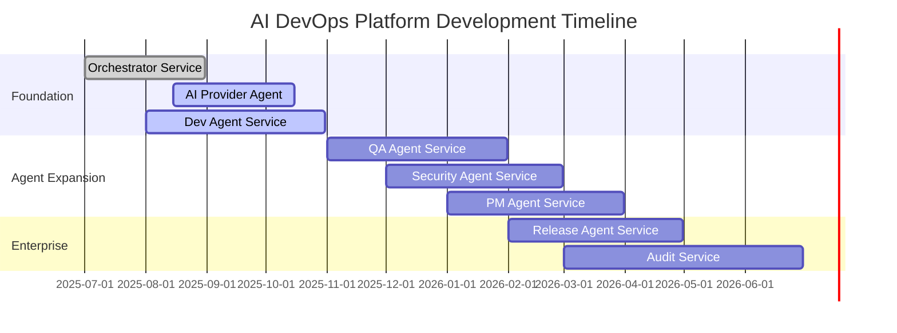

# 🚀 AI DevOps Autonomous Development Platform

## 📊 **Executive Dashboard** (Updated: September 3, 2025)

[](./orchestrator-service)
[](./dev-agent-service) 
[](./ai-provider-agent-service)
[](./database-governance-factory)
[](./github-governance-factory)
[](./azure-devops-governance-factory)
[](./qa-agent-service)
[](./security-agent-service)
[](./release-agent-service)
[](./pm-agent-service)
[](./audit-service)

> **🎯 This is not a demo environment. This is our actual AI DevOps platform development project, managed by the GitHub Governance Factory we built. Every metric, status, and progress indicator you see below reflects real development work happening right now.**

## 🏭 **The Recursive Governance Revolution**

Welcome to the first enterprise development platform that **governs itself**. The AI DevOps System uses its own GitHub Governance Factory to manage its development, creating a living proof-of-concept that demonstrates enterprise governance at scale.

### **🧠 Dual-Factory Architecture**
- **GitHub Governance Factory** (Submodule) → Universal governance brain for any organization
- **AI DevOps Delivery Factory** (Monorepo) → Autonomous development and delivery platform
- **Self-Managing Integration** → The governance system manages its own development

## 🎯 **Current Sprint** (September 1-15, 2025)

**Sprint Goal**: Complete AI Provider OpenAI integration and advance Dev Agent template engine

### 🔥 **Active Work**
- **Git Subtree Architecture** (Infrastructure) - 60% complete (3/8 services), due Sept 10
- **OpenAI GPT-4 Integration** (AI Provider Agent) - 70% complete, due Sept 20
- **Template Engine Development** (Dev Agent) - 40% complete, due Sept 30
- **Service Discovery Framework** (Orchestrator) - Architecture review phase

### 📈 **Sprint Metrics**
- **Velocity**: 42 story points (3-sprint average)
- **Burn Rate**: On track for sprint completion
- **Blockers**: 1 (OpenAI API rate limit increase pending)

## 🗺️ **Roadmap Overview**



## 📋 **Project Links**

| Resource | Link | Purpose |
|----------|------|---------|
| **📊 Live Project Board** | [GitHub Projects](../../projects) | Real-time sprint status |
| **📋 Issues & Tasks** | [GitHub Issues](../../issues) | Detailed task tracking |
| **🎯 Milestones** | [GitHub Milestones](../../milestones) | Release planning |
| **📖 Architecture** | [System Design](./DASHBOARD-README.md) | Technical specifications |
| **🔄 Workflows** | [End-to-End Flow](./.specs/conversation%20history/end-to-end-flow-analysis.md) | Process documentation |
| **🎬 Demo Walkthrough** | [Living Governance Demo](./LIVING-GOVERNANCE-WALKTHROUGH-STORYBOARD.md) | Self-governance proof |

## 🏗️ **Repository Architecture: Subtrees & Submodules**

This monorepo demonstrates the **factory-of-factories** architecture using **git subtrees** for agent services and **git submodules** for reusable governance components.

### **📋 Git Submodule (Reusable Governance)**
```bash
# GitHub Governance Factory - Universal governance framework
github-governance-factory/          # Git Submodule
├── README.md                       # Governance framework documentation
├── governance-config.json          # Configuration templates
└── specs/                          # Governance specifications
```

**Repository**: [`frankmax-com/github-governance-factory`](https://github.com/frankmax-com/github-governance-factory)  
**Purpose**: Reusable governance framework that can be shared across multiple projects  
**Status**: ✅ **Active Submodule**

**Working with the Submodule**:
```bash
# Initialize submodules (for new clones)
git submodule init && git submodule update

# Update to latest governance factory version
git submodule update --remote github-governance-factory
git add github-governance-factory
git commit -m "Update governance factory to latest version"
```

### **🔧 Git Subtrees (Agent Services)**

Each agent service is maintained as a **git subtree**, allowing independent development while keeping code in the monorepo:

#### **✅ Implemented Subtrees (3/8)**

| Service | Repository | Status | Purpose |
|---------|------------|--------|---------|
| **orchestrator-service** | [`frankmax-com/orchestrator-service`](https://github.com/frankmax-com/orchestrator-service) | ✅ **Active Subtree** | AI coordination layer |
| **dev-agent-service** | [`frankmax-com/dev-agent-service`](https://github.com/frankmax-com/dev-agent-service) | ✅ **Active Subtree** | Code generation & scaffolding |
| **ai-provider-agent-service** | [`frankmax-com/ai-provider-agent-service`](https://github.com/frankmax-com/ai-provider-agent-service) | ✅ **Active Subtree** | AI routing & provider integration |

#### **🚧 Ready for Subtree Setup (5/8)**

| Service | Repository | Status | Purpose |
|---------|------------|--------|---------|
| **qa-agent-service** | [`frankmax-com/qa-agent-service`](https://github.com/frankmax-com/qa-agent-service) | 📅 **Repository Created** | Testing automation |
| **security-agent-service** | [`frankmax-com/security-agent-service`](https://github.com/frankmax-com/security-agent-service) | 📅 **Repository Created** | Vulnerability scanning |
| **release-agent-service** | [`frankmax-com/release-agent-service`](https://github.com/frankmax-com/release-agent-service) | 📅 **Repository Created** | Deployment automation |
| **pm-agent-service** | [`frankmax-com/pm-agent-service`](https://github.com/frankmax-com/pm-agent-service) | 📅 **Repository Created** | Requirements & planning |
| **audit-service** | [`frankmax-com/audit-service`](https://github.com/frankmax-com/audit-service) | 📅 **Repository Created** | Audit trails & compliance |

### **🔄 Working with Subtrees**

**Pull changes from service repository**:
```bash
git subtree pull --prefix=orchestrator-service https://github.com/frankmax-com/orchestrator-service.git master --squash
```

**Push changes to service repository**:
```bash
git subtree push --prefix=orchestrator-service https://github.com/frankmax-com/orchestrator-service.git master
```

**Add new service as subtree**:
```bash
git subtree add --prefix=service-name https://github.com/frankmax-com/service-name.git master --squash
```

### **� Complete Directory Structure**
```
AI-DevOps-System/                    # Main monorepo (this repository)
├── 📦 github-governance-factory/    # Git Submodule → Universal governance
│   ├── governance-config.json
│   ├── README.md
│   └── specs/
├── 🎯 orchestrator-service/         # Git Subtree → AI coordination
│   ├── src/main.py
│   ├── Dockerfile
│   └── specs/
├── 💻 dev-agent-service/            # Git Subtree → Code generation
│   ├── src/agent.py
│   ├── Dockerfile
│   └── specs/
├── 🤖 ai-provider-agent-service/    # Git Subtree → AI integration
│   ├── src/ai_provider_agent.py
│   ├── config/ai_providers_config.json
│   └── specs/
├── 🧪 qa-agent-service/             # Directory → Ready for subtree
├── � security-agent-service/       # Directory → Ready for subtree
├── 🚀 release-agent-service/        # Directory → Ready for subtree
├── 📋 pm-agent-service/             # Directory → Ready for subtree
├── � audit-service/                # Directory → Ready for subtree
├── 📚 .specs/                       # Comprehensive specifications
├── 🛠️ resources/                    # Development utilities
├── 📖 COPILOT-GUIDANCE.md           # Monorepo development guide
├── 📊 SUBTREE-SUBMODULE-STATUS.md   # Detailed implementation status
└── 🚀 setup-ai-devops-monorepo.bat # Bootstrap script
```

### **🎯 Architecture Benefits**

#### **Git Submodule Advantages (Governance Factory)**
- ✅ **Reusable across projects**: Same governance for multiple organizations
- ✅ **Independent versioning**: Governance updates don't affect service development
- ✅ **Shared standards**: Consistent governance across all frankmax-com projects

#### **Git Subtree Advantages (Agent Services)**
- ✅ **Unified development**: All code accessible in single repository
- ✅ **Independent deployment**: Each service can be deployed separately
- ✅ **Simplified CI/CD**: Single pipeline can build and test all services
- ✅ **Easy debugging**: Cross-service development without complex setup

### **📋 Quick Reference Commands**

```bash
# Clone repository with submodules
git clone --recurse-submodules https://github.com/frankmax-com/AI-DevOps-System.git

# Update all subtrees from their repositories
make update-subtrees  # (Uses Makefile automation)

# Pull latest governance factory
git submodule update --remote && git add github-governance-factory && git commit -m "Update governance"

# Check subtree status
git log --oneline --grep="subtree" -10
```

For detailed subtree/submodule operations, see [`COPILOT-GUIDANCE.md`](./COPILOT-GUIDANCE.md) and [`SUBTREE-SUBMODULE-STATUS.md`](./SUBTREE-SUBMODULE-STATUS.md).

## 📈 **Real-Time Status Dashboard**

### **Feature Implementation Progress**

| Feature | Status | Progress | Sprint | Due Date |
|---------|--------|----------|--------|----------|
| **🎯 Orchestrator Service** | ✅ Complete | 100% | Delivered | ✅ Aug 31 |
| **🤖 AI Provider Agent** | 🚧 Active | 70% | Current | Sept 20 |
| **💻 Dev Agent Service** | 🚧 Active | 40% | Current | Sept 30 |
| **🔍 Service Discovery** | 🚧 Review | 85% | Current | Sept 15 |
| **🧪 QA Agent Service** | 📅 Planned | 5% | Sprint 3 | Nov 30 |
| **🔒 Security Agent** | 📅 Planned | 5% | Sprint 4 | Jan 31 |
| **🚀 Release Agent** | 📅 Planned | 5% | Sprint 5 | Apr 30 |
| **📋 PM Agent** | 📅 Planned | 5% | Sprint 5 | Mar 31 |
| **📊 Audit Service** | 📅 Planned | 5% | Sprint 6 | Jun 30 |

### **Technical Debt Burn-Down**

| Category | Total | Complete | In Progress | Remaining |
|----------|-------|----------|-------------|-----------|
| **AI Integration** | 25 | 8 | 7 | 10 |
| **Agent Coordination** | 15 | 12 | 2 | 1 |
| **Quality Framework** | 20 | 3 | 5 | 12 |
| **Security & Compliance** | 18 | 14 | 2 | 2 |
| **Infrastructure** | 12 | 10 | 1 | 1 |

## 🚨 **Current Blockers & Risks**

| Issue | Impact | Owner | Target Resolution |
|-------|--------|-------|-------------------|
| OpenAI API Rate Limits | High | AI Team | Sept 10, 2025 |
| Azure DevOps Beta APIs | Medium | Platform Team | Sept 20, 2025 |
| Team Capacity (Q4) | Medium | Engineering Mgmt | Oct 1, 2025 |

## 🎯 **Milestone Progress**

### **Milestone 1: Foundation Complete** (Due: Nov 30, 2025)
**Progress**: 65% | **On Track**: ✅

- ✅ Orchestrator Service (100%)
- 🚧 AI Provider Agent (70%)
- 🚧 Dev Agent Service (40%)
- 📋 Basic Audit Service (planned)

### **Milestone 2: Agent Expansion** (Due: Feb 28, 2026)
**Progress**: 15% | **Status**: Early planning

- 📋 QA Agent Service (specs complete)
- 📋 Security Agent Service (specs complete)
- 📋 PM Agent Service (specs complete)

### **Milestone 3: Enterprise Ready** (Due: Jun 30, 2026)
**Progress**: 5% | **Status**: Architecture phase

- 📋 Release Agent Service (design phase)
- 📋 Complete Audit Service (planned)
- 📋 Enterprise monitoring (planned)

## 🔄 **Integration Status**

### **External Dependencies**
- **✅ GitHub API**: Fully integrated, rate limits managed
- **✅ Azure DevOps API**: Core features operational
- **🚧 OpenAI API**: Integration 70% complete
- **📋 Azure OpenAI**: Planned for October sprint
- **📋 GitHub Copilot Business**: Awaiting API access

### **Infrastructure Health**
- **CI/CD Pipeline**: ✅ Green (98% success rate)
- **Container Registry**: ✅ Healthy (Azure Container Registry)
- **Monitoring**: ✅ Operational (Prometheus + Grafana)
- **Security Scanning**: ✅ Active (CodeQL + Dependabot)

## 🎊 **Recent Achievements**

### **This Week (Aug 28 - Sept 3)**
- ✅ Completed comprehensive project status and roadmap visualization
- ✅ Created living governance walkthrough storyboard for enterprise demos
- ✅ Established GitHub Issues structure with Epic → Feature → Task hierarchy
- ✅ Implemented recursive governance model with self-managing project board

### **Last Sprint (Aug 15-31)**
- ✅ Delivered Orchestrator Service MVP with agent coordination
- ✅ Completed Dev Agent Service FastAPI foundation
- ✅ Established monorepo architecture with subtree/submodule strategy
- ✅ Set up enterprise-grade CI/CD pipeline foundations

## 🔮 **Next Sprint Preview** (Sept 16-30)

### **Sprint Goals**
1. **Complete AI Provider OpenAI integration** with full error handling
2. **Advance Dev Agent template engine** to support React and FastAPI scaffolding
3. **Begin QA Agent Service architecture** and spec refinement
4. **Push complete system to GitHub** with governance factory self-management

### **Success Criteria**
- AI Provider can route requests to OpenAI GPT-4 with 99% uptime
- Dev Agent can scaffold basic React + FastAPI applications
- QA Agent architecture approved and implementation started
- GitHub repository live with self-governing project management

## 💡 **The Meta-Governance Breakthrough**

This repository demonstrates something unprecedented in enterprise software: **governance that governs itself**. The GitHub Governance Factory manages the development of the AI DevOps System, which includes the GitHub Governance Factory itself, creating a recursive proof-of-concept that:

- **Eliminates Demo Theater**: Everything shown is real, live, operational
- **Proves Enterprise Scalability**: Complex project managed by its own governance
- **Demonstrates Compliance**: Full audit trails, traceability, milestone tracking
- **Shows Living Documentation**: Status updates automatically, no manual reports

## 📞 **Stakeholder Communication**

### **Weekly Updates**
- **Engineering Review**: Tuesdays 2 PM EST - *Next: Sept 5*
- **Product Sync**: Thursdays 10 AM EST - *Next: Sept 7*
- **Executive Brief**: First Monday of month - *Next: Oct 2*

### **Escalation Path**
- **Technical Issues**: @platform-engineering-lead
- **Business Decisions**: @product-director  
- **Resource Conflicts**: @vp-engineering

## 🚀 **Getting Started**

### **For Developers**
```bash
# Clone with all submodules
git clone --recurse-submodules https://github.com/frankmax-com/AI-DevOps-System.git
cd AI-DevOps-System

# Setup development environment
./setup-ai-devops-monorepo.bat

# Initialize submodules (if not cloned with --recurse-submodules)
git submodule init && git submodule update
```

### **Working with Subtrees & Submodules**
```bash
# Update governance factory to latest
git submodule update --remote github-governance-factory

# Pull changes from orchestrator service repository
git subtree pull --prefix=orchestrator-service https://github.com/frankmax-com/orchestrator-service.git master --squash

# Push changes to dev-agent service repository  
git subtree push --prefix=dev-agent-service https://github.com/frankmax-com/dev-agent-service.git master

# View subtree history
git log --oneline --grep="subtree" -10
```

**📖 For complete subtree/submodule guide, see [`COPILOT-GUIDANCE.md`](./COPILOT-GUIDANCE.md)**

### **For Stakeholders**
1. 📊 **View Live Status**: Check this README for real-time progress
2. 📋 **Browse Issues**: See detailed task breakdown in GitHub Issues
3. 🎯 **Track Milestones**: Monitor delivery progress in GitHub Milestones
4. 🎬 **Watch Demo**: View the [Living Governance Walkthrough](./LIVING-GOVERNANCE-WALKTHROUGH-STORYBOARD.md)

### **For Enterprise Customers**
Want to see how this would work for your organization? The GitHub Governance Factory is available for any enterprise looking to implement similar self-governing development platforms.

---

## 🏭 **Factory Architecture Overview**

This platform implements the **dual-factory model**:

### **🧠 GitHub Governance Factory** (Submodule)
- **Purpose**: Universal governance and project management
- **Scope**: Reusable across any organization or project
- **Status**: ✅ Complete and operational
- **Evolution**: Independent release cycle

### **🏗️ AI DevOps Delivery Factory** (Monorepo)
- **Purpose**: Autonomous software development and delivery
- **Scope**: Enterprise-specific automation platform
- **Status**: 🚧 Foundation → Agent expansion phase
- **Evolution**: Unified development and release cycle

This architecture enables **governance reusability** while maintaining **delivery cohesion** - the best of both worlds for enterprise automation.

---

**🎯 This dashboard auto-updates through GitHub Actions and reflects real development status**  
**📊 For real-time details, visit the project board above**

---

**Last Updated**: September 3, 2025 | **Next Review**: September 10, 2025  
**Document Owner**: Platform Engineering Team | **Status**: Active Development

## 📄 **License**

This project is licensed under the MIT License - see the [LICENSE](LICENSE) file for details.

## 🤝 **Contributing**

We welcome contributions! Please see our [Contributing Guidelines](CONTRIBUTING.md) for details.

## ⭐ **Star This Repository**

If you find this project interesting or useful, please give it a star! It helps others discover the self-governing enterprise development platform.
