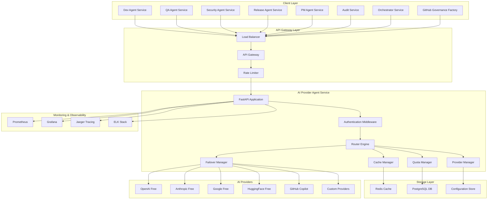
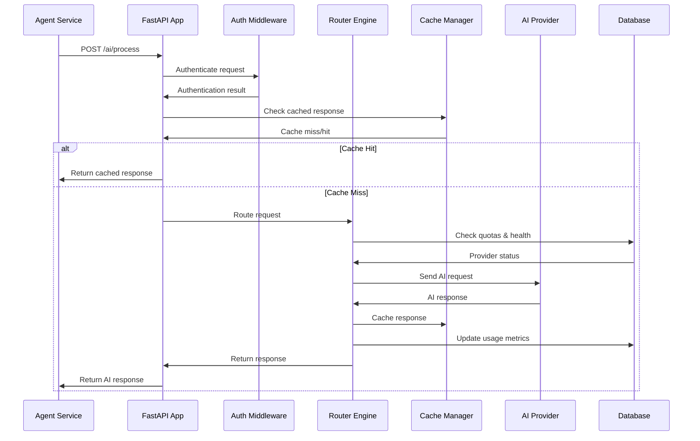
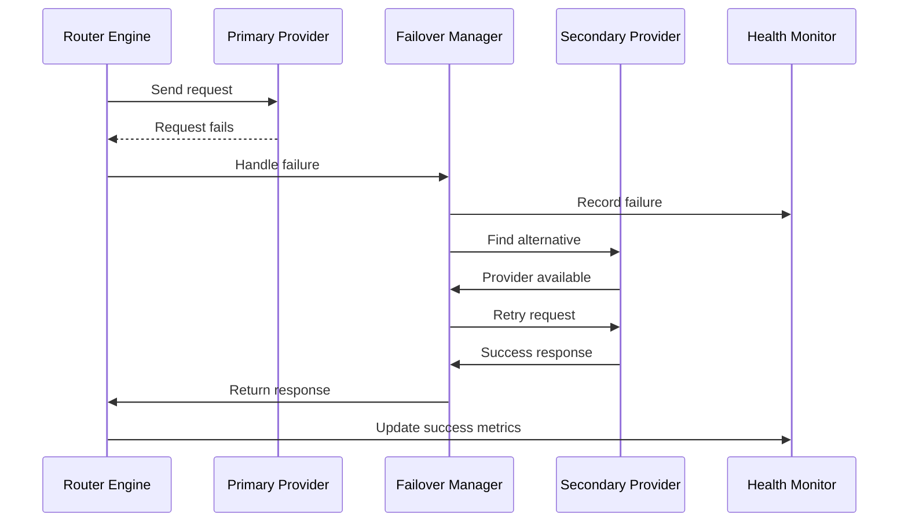
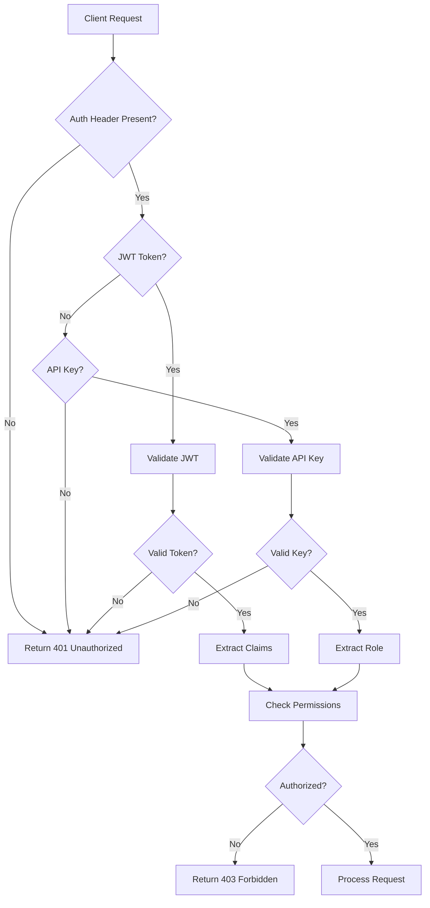

# System Architecture - AI Provider Agent Service

## 📋 **Executive Summary**

The AI Provider Agent Service is designed as a centralized, intelligent routing layer that provides unified access to multiple AI providers while optimizing for cost, performance, and reliability. The architecture follows microservices principles with a focus on scalability, observability, and fault tolerance.

## 🏗️ **High-Level Architecture**



## 🎯 **Core Components**

### **1. FastAPI Application (Entry Point)**
**Purpose:** Main application server and request handler  
**Responsibilities:**
- HTTP request/response handling
- API endpoint routing
- Middleware orchestration
- Health check management
- Graceful shutdown handling

**Key Features:**
- Async request processing
- OpenAPI documentation generation
- Automatic request validation
- Error handling and logging
- CORS and security headers

### **2. Authentication Middleware**
**Purpose:** Security and access control  
**Responsibilities:**
- JWT token validation
- API key authentication
- Role-based authorization
- Rate limiting enforcement
- Security audit logging

**Implementation Details:**
```python
class AuthenticationMiddleware:
    async def authenticate_request(self, request):
        # JWT validation logic
        # API key verification
        # Role permission checking
        # Rate limit validation
```

### **3. Router Engine (Core Intelligence)**
**Purpose:** Intelligent request routing and provider selection  
**Responsibilities:**
- Task-based provider selection
- Load balancing algorithms
- Performance optimization
- Cost-based routing decisions
- Model capability matching

**Routing Algorithm:**
```python
class RouterEngine:
    async def select_provider(self, request: AIRequest) -> Provider:
        # 1. Filter by task type compatibility
        # 2. Apply cost optimization (free first)
        # 3. Check quota availability
        # 4. Evaluate provider health
        # 5. Apply load balancing
        # 6. Return optimal provider
```

### **4. Failover Manager**
**Purpose:** Reliability and fault tolerance  
**Responsibilities:**
- Provider failure detection
- Automatic retry logic
- Circuit breaker pattern
- Graceful degradation
- Recovery management

**Failover Strategy:**
```python
class FailoverManager:
    async def handle_failure(self, provider, request):
        # 1. Record failure in circuit breaker
        # 2. Find alternative provider
        # 3. Retry request with backoff
        # 4. Update provider health status
        # 5. Log failover event
```

### **5. Quota Manager**
**Purpose:** Usage tracking and cost control  
**Responsibilities:**
- Real-time quota tracking
- Usage analytics
- Cost calculation
- Budget enforcement
- Alert generation

**Quota Tracking:**
```python
class QuotaManager:
    async def track_usage(self, provider, tokens):
        # 1. Update daily/monthly counters
        # 2. Calculate cost impact
        # 3. Check budget limits
        # 4. Generate alerts if needed
        # 5. Update analytics
```

### **6. Provider Manager**
**Purpose:** AI provider lifecycle management  
**Responsibilities:**
- Provider registration and configuration
- Health monitoring
- API client management
- Credential handling
- Model catalog maintenance

**Provider Interface:**
```python
class BaseProvider(ABC):
    @abstractmethod
    async def process_request(self, request: AIRequest) -> AIResponse:
        pass
    
    @abstractmethod
    async def health_check(self) -> bool:
        pass
    
    @abstractmethod
    def get_models(self) -> List[str]:
        pass
```

### **7. Cache Manager**
**Purpose:** Performance optimization through caching  
**Responsibilities:**
- Response caching strategy
- Cache invalidation
- TTL management
- Cache hit analytics
- Memory optimization

**Caching Strategy:**
```python
class CacheManager:
    async def get_cached_response(self, request_hash):
        # 1. Generate cache key from request
        # 2. Check Redis for existing response
        # 3. Validate TTL and freshness
        # 4. Return cached response or None
    
    async def cache_response(self, request, response):
        # 1. Calculate cache TTL based on request type
        # 2. Store response in Redis
        # 3. Update cache metrics
        # 4. Implement LRU eviction if needed
```

## 🔄 **Data Flow Architecture**

### **Request Processing Flow**



### **Failover Flow**



## 💾 **Data Architecture**

### **Database Schema (PostgreSQL)**

```sql
-- Provider configurations
CREATE TABLE providers (
    id UUID PRIMARY KEY DEFAULT gen_random_uuid(),
    type VARCHAR(50) NOT NULL,
    name VARCHAR(100) NOT NULL,
    config JSONB NOT NULL,
    enabled BOOLEAN DEFAULT true,
    created_at TIMESTAMP DEFAULT NOW(),
    updated_at TIMESTAMP DEFAULT NOW()
);

-- Usage tracking
CREATE TABLE usage_metrics (
    id UUID PRIMARY KEY DEFAULT gen_random_uuid(),
    provider_id UUID REFERENCES providers(id),
    task_type VARCHAR(50),
    model_name VARCHAR(100),
    tokens_used INTEGER,
    cost_cents INTEGER,
    response_time_ms INTEGER,
    success BOOLEAN,
    created_at TIMESTAMP DEFAULT NOW()
);

-- Quota management
CREATE TABLE quotas (
    id UUID PRIMARY KEY DEFAULT gen_random_uuid(),
    provider_id UUID REFERENCES providers(id),
    quota_type VARCHAR(20), -- daily, weekly, monthly
    limit_value INTEGER,
    used_value INTEGER DEFAULT 0,
    reset_at TIMESTAMP,
    created_at TIMESTAMP DEFAULT NOW()
);

-- Authentication
CREATE TABLE api_keys (
    id UUID PRIMARY KEY DEFAULT gen_random_uuid(),
    key_hash VARCHAR(255) UNIQUE NOT NULL,
    name VARCHAR(100),
    role VARCHAR(50) DEFAULT 'user',
    enabled BOOLEAN DEFAULT true,
    last_used_at TIMESTAMP,
    created_at TIMESTAMP DEFAULT NOW()
);
```

### **Redis Cache Structure**

```
# Response cache
ai_cache:{request_hash} -> {
    "response": "...",
    "provider": "openai",
    "model": "gpt-3.5-turbo",
    "tokens": 150,
    "cost": 0.0003,
    "cached_at": "2025-09-02T10:30:00Z"
}

# Rate limiting
rate_limit:{client_id}:{window} -> {
    "count": 45,
    "window_start": "2025-09-02T10:00:00Z"
}

# Provider health
provider_health:{provider_id} -> {
    "status": "healthy|degraded|down",
    "last_check": "2025-09-02T10:30:00Z",
    "consecutive_failures": 0
}

# Circuit breaker state
circuit:{provider_id} -> {
    "state": "closed|open|half_open",
    "failure_count": 0,
    "last_failure": "2025-09-02T10:25:00Z",
    "next_retry": "2025-09-02T10:35:00Z"
}
```

## 🔧 **Technology Stack**

### **Core Technologies**
- **Runtime:** Python 3.11+
- **Web Framework:** FastAPI 0.104+
- **ASGI Server:** Uvicorn with Gunicorn
- **Database:** PostgreSQL 15+
- **Cache:** Redis 7+
- **HTTP Client:** aiohttp + httpx

### **AI Provider SDKs**
- **OpenAI:** openai 1.3+
- **Anthropic:** anthropic 0.7+
- **Google:** google-generativeai 0.3+
- **HuggingFace:** transformers 4.36+
- **Custom:** HTTP REST clients

### **Monitoring & Observability**
- **Metrics:** Prometheus + prometheus-client
- **Logging:** structlog + Python logging
- **Tracing:** OpenTelemetry + Jaeger
- **Dashboards:** Grafana
- **Alerting:** Prometheus Alertmanager

### **Infrastructure**
- **Containerization:** Docker + Docker Compose
- **Orchestration:** Kubernetes (optional)
- **Load Balancing:** NGINX or cloud LB
- **Service Discovery:** DNS or Kubernetes
- **Configuration:** Environment variables + JSON/YAML

## 🔒 **Security Architecture**

### **Authentication Flow**



### **Security Layers**
1. **Transport Security:** TLS 1.3 encryption
2. **Authentication:** JWT tokens and API keys
3. **Authorization:** Role-based access control
4. **Rate Limiting:** Per-client and global limits
5. **Input Validation:** Request sanitization
6. **Data Protection:** Credential encryption at rest
7. **Audit Logging:** Security event tracking
8. **Network Security:** VPC/firewall rules

## 📈 **Scalability Design**

### **Horizontal Scaling**
- **Stateless Design:** No server-side session state
- **Load Balancing:** Round-robin or weighted distribution
- **Auto-scaling:** Based on CPU/memory/request metrics
- **Database Scaling:** Read replicas and connection pooling

### **Vertical Scaling**
- **Resource Optimization:** Efficient memory usage
- **Connection Pooling:** Reuse HTTP connections
- **Async Processing:** Non-blocking I/O operations
- **Cache Optimization:** Intelligent caching strategies

### **Performance Targets**
- **Latency:** <500ms 95th percentile
- **Throughput:** 1000+ RPS per instance
- **Concurrency:** 1000+ simultaneous connections
- **Cache Hit Rate:** >30% for typical workloads

## 🔍 **Monitoring Architecture**

### **Metrics Collection**

```python
# Custom metrics
provider_requests_total = Counter(
    'ai_provider_requests_total',
    'Total AI provider requests',
    ['provider', 'task_type', 'model', 'status']
)

provider_response_duration = Histogram(
    'ai_provider_response_duration_seconds',
    'Provider response time',
    ['provider', 'model']
)

quota_usage_ratio = Gauge(
    'ai_provider_quota_usage_ratio',
    'Quota usage ratio',
    ['provider', 'quota_type']
)
```

### **Observability Stack**
- **Application Metrics:** Custom Prometheus metrics
- **Infrastructure Metrics:** Node exporter, cAdvisor
- **Log Aggregation:** ELK Stack or cloud logging
- **Distributed Tracing:** Jaeger with OpenTelemetry
- **Alerting:** Prometheus Alertmanager
- **Dashboards:** Grafana with custom panels

## 🔄 **Deployment Architecture**

### **Container Strategy**
```dockerfile
# Multi-stage build for optimization
FROM python:3.11-slim as builder
COPY requirements.txt .
RUN pip install --no-cache-dir -r requirements.txt

FROM python:3.11-slim
COPY --from=builder /usr/local/lib/python3.11/site-packages /usr/local/lib/python3.11/site-packages
COPY src/ ./src/
HEALTHCHECK --interval=30s --timeout=10s --retries=3 \
    CMD curl -f http://localhost:8080/health || exit 1
```

### **Kubernetes Deployment**
```yaml
apiVersion: apps/v1
kind: Deployment
metadata:
  name: ai-provider-agent
spec:
  replicas: 3
  template:
    spec:
      containers:
      - name: ai-provider-agent
        image: ai-provider-agent:latest
        ports:
        - containerPort: 8080
        env:
        - name: DATABASE_URL
          valueFrom:
            secretKeyRef:
              name: db-credentials
              key: url
        resources:
          requests:
            memory: "512Mi"
            cpu: "250m"
          limits:
            memory: "2Gi"
            cpu: "1000m"
        livenessProbe:
          httpGet:
            path: /health
            port: 8080
          initialDelaySeconds: 30
          periodSeconds: 10
```

## 🎯 **Design Patterns and Principles**

### **Architectural Patterns**
- **Microservices:** Single responsibility per service
- **Circuit Breaker:** Fault tolerance for external dependencies
- **Retry Pattern:** Automatic retry with exponential backoff
- **Cache-Aside:** Explicit cache management
- **Observer Pattern:** Event-driven monitoring and alerting

### **Design Principles**
- **Single Responsibility:** Each component has one clear purpose
- **Open/Closed:** Extensible for new providers, closed for modification
- **Dependency Inversion:** Depend on abstractions, not concretions
- **Fail Fast:** Early validation and error detection
- **Graceful Degradation:** Continue operating with reduced functionality

### **Quality Attributes**
- **Reliability:** 99.9% uptime with automatic recovery
- **Performance:** Sub-second response times
- **Security:** Defense in depth with multiple security layers
- **Maintainability:** Clear separation of concerns and comprehensive testing
- **Scalability:** Linear scaling with load increases

---

*Document Owner: Architecture Team*
*Last Updated: September 2, 2025*
*Status: Approved*
*Version: 1.0*
