# Audit Service - Master Specification

## 1. Executive Summary

### 1.1 Service Overview

The **Audit Service** is a foundational component of the AI DevOps ecosystem that provides comprehensive **usage logging** and **compliance reporting** capabilities. Operating as the **governance intelligence hub**, this service transforms traditional reactive compliance monitoring into a proactive, AI-powered audit orchestration platform that delivers predictive compliance intelligence, automated regulatory validation, and continuous governance assurance across the entire software development lifecycle.

**Strategic Positioning**: The Audit Service serves as the **compliance guardian** of the AI DevOps ecosystem, ensuring that every operation, every transaction, and every business process meets the highest governance standards while enabling rapid, compliant software delivery that protects business interests and stakeholder trust.

### 1.2 Core Value Proposition

**Governance Excellence Foundation**:
- **AI-Powered Compliance Intelligence**: Advanced machine learning algorithms for identifying compliance patterns, regulatory violations, and emerging governance risks
- **Comprehensive Usage Logging**: Multi-dimensional audit trail collection covering user activities, system operations, business processes, and regulatory compliance events
- **Proactive Compliance Monitoring**: Predictive compliance intelligence with automated violation detection and priority-based remediation planning
- **Regulatory Automation**: Automated compliance validation with comprehensive reporting for SOX, GDPR, HIPAA, PCI-DSS, and industry-specific frameworks

**Business Impact**: $4.2M annual value through **compliance risk elimination** (99.8% reduction in regulatory violations), **audit automation** (100% audit readiness), **operational efficiency** (90% reduction in manual compliance tasks), and **competitive advantage** (governance-first culture enabling stakeholder trust and market leadership).

### 1.3 Technical Architecture

**Intelligent Audit Platform**:
- **Audit Intelligence Engine**: AI-powered analysis of usage patterns, compliance violations, and governance landscapes for comprehensive audit insights
- **Usage Logging Framework**: Multi-source event collection with intelligent correlation and compliance-focused data warehousing
- **Compliance Reporting Platform**: Real-time compliance monitoring and analysis with behavioral analytics and violation detection for proactive governance
- **Business Intelligence Hub**: Automated compliance assessment with gap analysis and strategic governance planning

**AI DevOps Integration**: Native integration with Dev Agent Service (development compliance), QA Agent Service (testing governance), Security Agent Service (security compliance), Release Agent Service (deployment governance), and PM Agent Service (business compliance) for holistic governance orchestration.

### 1.4 Business Value Framework

#### 1.4.1 Financial Investment

**Total Investment**: $1,600,000 over 12 months
- **Core Platform Development**: $960,000 (60% - AI engine, audit tools integration, compliance intelligence)
- **Integration and Infrastructure**: $320,000 (20% - Azure Monitor, compliance frameworks, reporting tools)
- **Training and Adoption**: $160,000 (10% - compliance training, process optimization, change management)
- **Operations and Support**: $160,000 (10% - ongoing operations, maintenance, compliance updates)

**Annual Operating Costs**: $400,000
- **Platform Operations**: $200,000 (infrastructure, licensing, audit tool subscriptions, monitoring)
- **Continuous Enhancement**: $120,000 (compliance intelligence updates, AI model improvement, tool integration)
- **Training and Development**: $80,000 (ongoing compliance training, certification, best practices)

#### 1.4.2 Return on Investment Analysis

**Annual Business Value**: $4,600,000

**Direct Cost Savings** ($2,400,000):
- **Compliance Violation Prevention**: $1,000,000 (99.8% reduction in regulatory violations preventing fines and remediation costs)
- **Manual Compliance Task Automation**: $800,000 (90% automation of manual compliance monitoring and reporting)
- **Audit Preparation Automation**: $600,000 (automated audit readiness reducing preparation costs and time)

**Revenue Protection and Enhancement** ($1,600,000):
- **Regulatory Penalty Prevention**: $800,000 (prevention of regulatory fines including penalties, legal fees, and reputation damage)
- **Stakeholder Trust and Confidence**: $500,000 (governance excellence driving stakeholder confidence and investment)
- **Competitive Advantage**: $300,000 (compliance-first positioning enabling premium partnerships and market differentiation)

**Strategic Value** ($600,000):
- **Risk Mitigation**: $300,000 (comprehensive risk reduction preventing business disruption and regulatory penalties)
- **Innovation Enablement**: $200,000 (compliance automation enabling team focus on strategic initiatives)
- **Market Leadership**: $100,000 (governance thought leadership and industry recognition)

**ROI Calculation**:
- **Net Annual Benefit**: $4,600,000 - $400,000 = $4,200,000
- **Return on Investment**: ($4,200,000 ÷ $1,600,000) × 100 = **263% ROI**
- **Payback Period**: $1,600,000 ÷ $4,200,000 ≈ **4.6 months**
- **Net Present Value (3 years)**: $10,950,000 (assuming 10% discount rate)

### 1.5 Success Metrics and KPIs

#### 1.5.1 Compliance Excellence Metrics

**Compliance Management**:
- **Compliance Violation Detection Rate**: 99.8% detection of compliance violations with zero false negatives
- **Mean Time to Detection (MTTD)**: <10 minutes for critical compliance violations through real-time monitoring
- **Mean Time to Remediation (MTTR)**: <2 hours for critical compliance violations with automated prioritization
- **Compliance Violation Recurrence Rate**: <0.5% for previously identified and remediated violations

**Audit Readiness**:
- **Audit Preparation Time**: 95% reduction in audit preparation time through automated evidence collection
- **Audit Finding Rate**: <1% audit findings through proactive compliance monitoring and validation
- **Audit Evidence Completeness**: 100% complete audit trails with immutable evidence storage
- **Regulatory Response Time**: <24 hours for regulatory inquiry responses with comprehensive documentation

#### 1.5.2 Business Impact Metrics

**Operational Excellence**:
- **Manual Task Automation**: 90% reduction in manual compliance monitoring and reporting activities
- **Audit Readiness**: 100% continuous audit readiness with real-time compliance validation
- **Compliance Team Productivity**: 95% improvement in compliance team effectiveness and strategic focus
- **Governance Knowledge Transfer**: 98% improvement in governance awareness and capability across development teams

**Strategic Performance**:
- **Stakeholder Confidence**: 99% stakeholder satisfaction with governance transparency and communication
- **Regulatory Compliance**: 100% compliance with all applicable regulatory frameworks
- **Governance Culture Maturity**: 98% adoption of compliance-first development practices across teams
- **Business Risk Reduction**: 98% reduction in compliance-related business risks and potential impact

## 2. Service Architecture

### 2.1 High-Level Architecture

**Audit Service Architecture**:

```mermaid
graph TB
    subgraph "Audit Intelligence Layer"
        AIE[Audit Intelligence Engine]
        ULF[Usage Logging Framework]
        CRP[Compliance Reporting Platform]
        BIH[Business Intelligence Hub]
    end
    
    subgraph "AI DevOps Integration"
        DAS[Dev Agent Service]
        QAS[QA Agent Service]
        SAS[Security Agent Service]
        RAS[Release Agent Service]
        PAS[PM Agent Service]
        OS[Orchestrator Service]
    end
    
    subgraph "Audit Data Sources"
        AL[Application Logs]
        SL[System Logs]
        UL[User Logs]
        BL[Business Logs]
    end
    
    subgraph "Azure Compliance Platform"
        AM[Azure Monitor]
        ALA[Azure Log Analytics]
        ASC[Azure Security Center]
        AIP[Azure Information Protection]
    end
    
    subgraph "Compliance Frameworks"
        SOX[SOX Compliance]
        GDPR[GDPR Compliance]
        HIPAA[HIPAA Compliance]
        PCI[PCI-DSS Compliance]
        ISO[ISO 27001]
        CMMI[CMMI Process]
    end
    
    AIE --> DAS
    AIE --> QAS
    AIE --> SAS
    AIE --> RAS
    AIE --> PAS
    AIE --> OS
    
    ULF --> AL
    ULF --> SL
    ULF --> UL
    ULF --> BL
    
    CRP --> AM
    CRP --> ALA
    CRP --> ASC
    
    BIH --> SOX
    BIH --> GDPR
    BIH --> HIPAA
    BIH --> PCI
    BIH --> ISO
    BIH --> CMMI
    
    AIE --> AIP
    ULF --> AM
```

### 2.2 Core Components

#### 2.2.1 Audit Intelligence Engine

**Purpose**: AI-powered audit analysis and intelligence generation for comprehensive compliance assessment

**Key Capabilities**:
- **Usage Pattern Analysis**: Deep learning analysis of usage patterns for compliance violation identification and governance validation
- **Compliance Intelligence Integration**: Real-time compliance feeds with correlation and context-aware analysis
- **Behavioral Analytics**: Machine learning models for detecting anomalous compliance behavior and potential violations
- **Risk Scoring and Prioritization**: Intelligent risk assessment with business impact correlation and priority-based action planning

**Technology Stack**:
- **AI/ML Framework**: Azure Machine Learning with custom compliance models for violation detection and risk assessment
- **Natural Language Processing**: Advanced NLP for compliance documentation analysis and regulatory validation
- **Graph Analysis**: Neo4j for audit trail mapping and compliance dependency analysis
- **Real-Time Processing**: Apache Kafka for streaming audit event processing and analysis

#### 2.2.2 Usage Logging Framework

**Purpose**: Comprehensive usage logging and audit trail collection with intelligent correlation and compliance focus

**Key Capabilities**:
- **Multi-Source Integration**: Seamless integration with application logs, system logs, user activities, and business processes
- **Event Correlation**: Intelligent correlation of events across multiple systems with deduplication and compliance analysis
- **Automated Classification**: AI-powered event classification based on compliance relevance, business impact, and regulatory requirements
- **Immutable Storage**: Blockchain-inspired audit trail storage with cryptographic integrity and tamper detection

**Technology Stack**:
- **Log Collection**: Azure Monitor, Fluentd, Logstash for comprehensive log aggregation
- **Event Processing**: Apache Kafka, Azure Event Hubs for real-time event streaming and processing
- **Data Storage**: Azure Data Lake, Azure SQL Database for scalable audit data storage
- **Blockchain Integration**: Hyperledger Fabric for immutable audit trail verification and integrity

#### 2.2.3 Compliance Reporting Platform

**Purpose**: Real-time compliance monitoring and reporting with proactive violation detection

**Key Capabilities**:
- **Continuous Monitoring**: 24/7 monitoring of compliance status across all systems and processes
- **Violation Detection**: Machine learning algorithms for identifying compliance violations and potential risks
- **Automated Reporting**: Automated generation of compliance reports with stakeholder-specific formatting and distribution
- **Regulatory Intelligence**: Integration with regulatory updates and compliance requirement changes

**Technology Stack**:
- **Monitoring Integration**: Azure Monitor and Log Analytics for comprehensive compliance event correlation
- **Reporting Engine**: Power BI, Tableau for advanced compliance reporting and visualization
- **Regulatory Intelligence**: Integration with regulatory databases and compliance intelligence feeds
- **Notification System**: Azure Logic Apps for automated notification and escalation workflows

#### 2.2.4 Business Intelligence Hub

**Purpose**: Automated compliance assessment with comprehensive analytics and strategic governance planning

**Key Capabilities**:
- **Multi-Framework Support**: Comprehensive support for SOX, GDPR, HIPAA, PCI-DSS, ISO 27001, CMMI, and industry-specific regulations
- **Predictive Analytics**: AI-powered prediction of compliance risks and violation patterns
- **Strategic Planning**: Compliance roadmap planning with resource allocation and timeline optimization
- **Stakeholder Intelligence**: Business intelligence for compliance stakeholders with executive-level insights

**Technology Stack**:
- **Analytics Engines**: Azure Synapse Analytics for large-scale compliance data analysis
- **Business Intelligence**: Power BI for compliance dashboards and executive reporting
- **Predictive Modeling**: Azure Machine Learning for compliance risk prediction and planning
- **Data Warehousing**: Azure SQL Data Warehouse for comprehensive compliance data management

### 2.3 Integration Architecture

#### 2.3.1 AI DevOps Ecosystem Integration

**Dev Agent Service Integration**:
- **Development Compliance**: Real-time monitoring of development activities for compliance violations and policy adherence
- **Code Audit Integration**: Automated audit trail generation for development workflows with compliance validation
- **Secure Development Monitoring**: Comprehensive monitoring of secure development practices and compliance requirements

**QA Agent Service Integration**:
- **Testing Compliance**: Integration with testing frameworks for comprehensive compliance validation
- **Quality Audit Coverage**: Compliance audit coverage assessment with gap identification and improvement recommendations
- **Quality Compliance Correlation**: Analysis of quality metrics impact on compliance posture and risk assessment

**Security Agent Service Integration**:
- **Security Compliance Monitoring**: Automated compliance validation for security processes and controls
- **Security Audit Integration**: Integration of security audit events with comprehensive compliance reporting
- **Compliance Security Validation**: Continuous validation of security compliance with regulatory requirements

**Release Agent Service Integration**:
- **Deployment Compliance Gates**: Automated compliance validation before production deployments with risk assessment
- **Release Compliance Documentation**: Integration of compliance validation in release documentation
- **Production Compliance Monitoring**: Continuous compliance monitoring of deployed applications with violation detection

**PM Agent Service Integration**:
- **Business Compliance Impact**: Assessment of compliance risks in business context with stakeholder communication
- **Compliance Roadmap Planning**: Integration of compliance initiatives with project planning and resource allocation
- **Stakeholder Compliance Reporting**: Compliance metrics and insights for business stakeholders and executive leadership

#### 2.3.2 Azure Compliance Platform Integration

**Azure Monitor Integration**:
- **Comprehensive Monitoring**: Centralized monitoring of all Azure resources with compliance-focused alerting
- **Log Analytics**: Advanced log analysis with compliance-specific queries and violation detection
- **Compliance Dashboards**: Real-time compliance monitoring dashboards with executive-level visibility

**Azure Security Center Integration**:
- **Compliance Posture Management**: Comprehensive compliance posture assessment with continuous monitoring
- **Regulatory Compliance**: Automated regulatory compliance assessment with gap analysis and remediation
- **Security Compliance**: Integration of security compliance with comprehensive audit trail management

**Azure Information Protection Integration**:
- **Data Classification**: Automated data classification with compliance-driven labeling and protection
- **Data Loss Prevention**: Comprehensive data loss prevention with compliance violation detection
- **Information Governance**: Automated information governance with regulatory compliance validation

### 2.4 Data Architecture

#### 2.4.1 Audit Data Models

**Audit Event Entity**:
- **Event ID**: Unique identifier with correlation mapping and internal tracking
- **Event Details**: Source system, event type, timestamp, and user context
- **Compliance Context**: Regulatory framework relevance, compliance impact, and violation indicators
- **Business Context**: Asset criticality, business impact, and stakeholder notification requirements
- **Audit Trail**: Immutable audit trail with cryptographic integrity and tamper detection

**Compliance Violation Entity**:
- **Violation ID**: Unique identifier with regulatory framework correlation
- **Violation Details**: Description, severity, regulatory impact, and remediation requirements
- **Detection Information**: Detection source, detection timestamp, and validation status
- **Remediation Data**: Remediation strategies, effort estimation, and implementation status
- **Business Impact**: Asset criticality, business impact, and stakeholder notification requirements

**Usage Metrics Entity**:
- **Metric ID**: Unique identifier with system correlation and usage tracking
- **Usage Details**: System usage, user activities, and business process metrics
- **Compliance Correlation**: Compliance framework relevance and regulatory impact assessment
- **Trend Analysis**: Historical trends, predictive analysis, and optimization recommendations
- **Business Intelligence**: Business impact analysis and strategic planning insights

#### 2.4.2 Data Storage Strategy

**Operational Data Storage**:
- **Azure SQL Database**: Relational data for compliance tracking, audit records, and violation management
- **Azure Cosmos DB**: Document storage for audit events, compliance configurations, and investigation data
- **Azure Data Lake**: Large-scale data storage for audit logs, compliance evidence, and analytical datasets
- **Azure Synapse Analytics**: Data warehousing for comprehensive compliance analytics and business intelligence

**Compliance-Specific Storage**:
- **Immutable Storage**: Write-once, read-many storage for audit trails and compliance evidence
- **Encrypted Storage**: AES-256 encryption for all sensitive compliance data with key management via Azure Key Vault
- **Geo-Redundant Storage**: Multi-region replication for business continuity and disaster recovery
- **Retention Policies**: Automated data retention with compliance-driven lifecycle management

## 3. Functional Capabilities

### 3.1 Usage Logging and Audit Trail Management

#### 3.1.1 Comprehensive Event Collection

**Multi-Source Log Aggregation**:
- **Application Logs**: Comprehensive collection of application-level events including user actions, system operations, and business processes
- **System Logs**: Infrastructure and platform logs covering server operations, network activities, and security events
- **User Activity Logs**: Complete user activity tracking including authentication, authorization, and data access patterns
- **Business Process Logs**: Business-specific events including workflow progress, approval processes, and decision points

**Real-Time Event Processing**:
- **Stream Processing**: Real-time processing of audit events with <1-minute processing latency
- **Event Correlation**: Intelligent correlation of related events across systems and timeframes
- **Automated Classification**: AI-powered classification of events by compliance relevance and business impact
- **Deduplication Logic**: Advanced deduplication algorithms to eliminate redundant events and optimize storage

#### 3.1.2 Audit Trail Integrity

**Immutable Audit Storage**:
- **Blockchain-Inspired Architecture**: Cryptographic hash chaining for tamper-evident audit trails
- **Digital Signatures**: Cryptographic signing of audit events for authenticity and non-repudiation
- **Integrity Validation**: Continuous validation of audit trail integrity with anomaly detection
- **Chain of Custody**: Comprehensive chain of custody maintenance for legal and regulatory requirements

**Compliance-Driven Retention**:
- **Regulatory Retention**: Automated retention policies based on regulatory requirements (7 years for SOX, indefinite for some GDPR)
- **Legal Hold Management**: Automated legal hold procedures for litigation and investigation support
- **Data Archival**: Intelligent data archival with cost optimization and compliance maintenance
- **Secure Deletion**: Secure deletion procedures meeting regulatory requirements and data protection standards

#### 3.1.3 Advanced Analytics and Intelligence

**Usage Pattern Analysis**:
- **Behavioral Analytics**: Machine learning analysis of user and system behavior patterns
- **Anomaly Detection**: AI-powered detection of unusual patterns and potential compliance violations
- **Trend Analysis**: Historical trend analysis with predictive modeling for future usage patterns
- **Optimization Recommendations**: AI-generated recommendations for system and process optimization

**Business Intelligence**:
- **Executive Dashboards**: Real-time dashboards for executive leadership with key compliance and usage metrics
- **Operational Metrics**: Comprehensive operational metrics for system performance and user productivity
- **Compliance Scorecard**: Dynamic compliance scoring with trend analysis and improvement recommendations
- **Predictive Analytics**: Machine learning models for predicting compliance risks and usage trends

### 3.2 Compliance Reporting and Validation

#### 3.2.1 Multi-Framework Compliance Reporting

**SOX Compliance Reporting**:
- **Financial Controls Validation**: Automated validation of IT general controls and application controls
- **Segregation of Duties**: Comprehensive analysis of role assignments and access privileges
- **Change Management Compliance**: Validation of change management processes with complete audit trails
- **Financial Reporting Integrity**: Monitoring of financial data access and modification with compliance validation

**GDPR Compliance Reporting**:
- **Data Processing Compliance**: Automated monitoring of personal data processing activities
- **Consent Management Validation**: Comprehensive validation of consent mechanisms and data subject rights
- **Data Breach Monitoring**: Real-time monitoring for potential data breaches with automated notification
- **Privacy Impact Assessment**: Automated privacy impact assessments for data processing activities

**HIPAA Compliance Reporting**:
- **PHI Access Monitoring**: Comprehensive monitoring of protected health information access and usage
- **Security Controls Validation**: Automated validation of HIPAA security controls and safeguards
- **Audit Log Analysis**: Advanced analysis of HIPAA-required audit logs with violation detection
- **Business Associate Compliance**: Monitoring of business associate agreements and compliance validation

**PCI-DSS Compliance Reporting**:
- **Cardholder Data Monitoring**: Comprehensive monitoring of cardholder data environment activities
- **Payment Processing Compliance**: Validation of payment processing compliance with PCI requirements
- **Network Security Monitoring**: Monitoring of network security controls and access restrictions
- **Vulnerability Management**: Integration with vulnerability management for PCI compliance validation

#### 3.2.2 Automated Compliance Validation

**Real-Time Compliance Monitoring**:
- **Continuous Assessment**: 24/7 monitoring of compliance status across all systems and processes
- **Violation Detection**: AI-powered detection of compliance violations with severity assessment
- **Automated Alerts**: Real-time alerts for compliance violations with stakeholder notification
- **Remediation Tracking**: Comprehensive tracking of violation remediation with progress monitoring

**Compliance Reporting Automation**:
- **Automated Report Generation**: Scheduled and on-demand generation of compliance reports
- **Stakeholder Distribution**: Automated distribution of compliance reports to relevant stakeholders
- **Executive Summaries**: AI-generated executive summaries with key insights and recommendations
- **Regulatory Submission**: Automated preparation of regulatory submissions with compliance validation

#### 3.2.3 Regulatory Intelligence and Updates

**Regulatory Change Management**:
- **Regulatory Monitoring**: Continuous monitoring of regulatory changes and updates
- **Impact Assessment**: Automated assessment of regulatory changes on organizational compliance
- **Gap Analysis**: Comprehensive gap analysis for new regulatory requirements
- **Implementation Planning**: Automated generation of implementation plans for regulatory compliance

**Compliance Framework Management**:
- **Framework Updates**: Automated updates to compliance frameworks and validation rules
- **Cross-Framework Analysis**: Analysis of compliance requirements across multiple frameworks
- **Optimization Recommendations**: AI-powered recommendations for compliance process optimization
- **Best Practice Integration**: Integration of industry best practices and compliance benchmarks

### 3.3 Business Intelligence and Analytics

#### 3.3.1 Executive Reporting and Dashboards

**Real-Time Executive Dashboards**:
- **Compliance Status Overview**: Real-time overview of organizational compliance status across all frameworks
- **Risk Assessment Dashboard**: Comprehensive risk assessment with business impact analysis
- **Performance Metrics**: Key performance indicators for compliance and audit effectiveness
- **Trend Analysis**: Historical trends with predictive analytics for future compliance performance

**Business Intelligence Reports**:
- **Strategic Compliance Reports**: Strategic-level reports for board and executive leadership
- **Operational Compliance Reports**: Operational reports for compliance teams and managers
- **Departmental Reports**: Department-specific compliance reports with relevant metrics and insights
- **Project-Specific Reports**: Project-level compliance reports for development and deployment activities

#### 3.3.2 Predictive Analytics and Optimization

**Compliance Risk Prediction**:
- **Machine Learning Models**: Advanced ML models for predicting compliance risks and violations
- **Early Warning Systems**: Automated early warning systems for potential compliance issues
- **Risk Scoring**: Dynamic risk scoring with business impact correlation and prioritization
- **Mitigation Recommendations**: AI-powered recommendations for risk mitigation and prevention

**Process Optimization**:
- **Efficiency Analysis**: Analysis of compliance processes for efficiency improvements
- **Resource Optimization**: Optimization recommendations for compliance resource allocation
- **Automation Opportunities**: Identification of additional automation opportunities
- **Best Practice Recommendations**: AI-generated recommendations based on industry best practices

### 3.4 Integration and Orchestration

#### 3.4.1 AI DevOps Ecosystem Integration

**Orchestrator Service Integration**:
- **Workflow Audit Integration**: Comprehensive audit trail generation for all orchestrator workflows
- **Cross-Service Correlation**: Correlation of audit events across all AI DevOps services
- **Compliance Gate Integration**: Integration with workflow gates for compliance validation
- **Strategic Reporting**: Ecosystem-wide compliance reporting with strategic insights

**Agent Service Integration**:
- **Development Compliance**: Integration with development workflows for compliance monitoring
- **Testing Compliance**: Integration with testing processes for compliance validation
- **Security Compliance**: Integration with security processes for comprehensive compliance assessment
- **Release Compliance**: Integration with release processes for deployment compliance validation

#### 3.4.2 External System Integration

**Enterprise System Integration**:
- **ERP Integration**: Integration with enterprise resource planning systems for business process compliance
- **ITSM Integration**: Integration with IT service management systems for incident and change compliance
- **Identity Management**: Integration with identity and access management systems for access compliance
- **Business Intelligence**: Integration with enterprise business intelligence platforms for comprehensive analytics

**Regulatory System Integration**:
- **Regulatory Databases**: Integration with regulatory databases for compliance requirement updates
- **Compliance Platforms**: Integration with third-party compliance platforms and tools
- **Audit Systems**: Integration with external audit systems and platforms
- **Legal Systems**: Integration with legal hold and litigation support systems

## 4. Technology Stack

### 4.1 Core Audit Platform

**Programming Languages and Frameworks**:
- **Python 3.11+**: Core service development with asyncio for high-performance audit operations
- **FastAPI**: REST API framework with automatic OpenAPI documentation and audit validation
- **Celery**: Distributed task queue for long-running audit analysis and compliance reporting operations
- **Django**: Audit-focused web framework for administrative interfaces and compliance dashboards

**Audit-Specific Libraries**:
- **Structlog**: Structured logging with audit trail integration and compliance formatting
- **SQLAlchemy**: Database ORM with audit trail support and compliance data modeling
- **Pandas**: Data analysis and manipulation for compliance analytics and reporting
- **Cryptography**: Comprehensive cryptographic library for audit trail integrity and data protection

### 4.2 AI and Machine Learning

**Machine Learning Frameworks**:
- **Scikit-learn**: Classical machine learning for compliance pattern recognition and anomaly detection
- **TensorFlow**: Deep learning framework for advanced compliance violation detection and behavioral analysis
- **PyTorch**: Research-oriented ML framework for experimental compliance algorithms and model development
- **Azure Machine Learning**: Cloud-native ML platform for compliance model deployment and management

**Natural Language Processing**:
- **spaCy**: Industrial-strength NLP for compliance document analysis and regulatory text processing
- **NLTK**: Natural language toolkit for compliance report generation and text analysis
- **Transformers**: State-of-the-art NLP models for compliance content analysis and automated reporting
- **Azure Cognitive Services**: Cloud-based NLP services for compliance text analytics and language understanding

### 4.3 Data and Analytics Platform

**Data Storage and Processing**:
- **Azure SQL Database**: Relational database for compliance data with audit trail support
- **Azure Cosmos DB**: NoSQL database for flexible audit event storage and real-time processing
- **Azure Data Lake**: Scalable data lake for large-scale audit data storage and analytics
- **Azure Synapse Analytics**: Data warehousing and analytics platform for comprehensive compliance analysis

**Business Intelligence and Reporting**:
- **Power BI**: Business intelligence platform for compliance dashboards and executive reporting
- **Tableau**: Advanced data visualization for compliance analytics and stakeholder reporting
- **Azure Analysis Services**: OLAP services for complex compliance data analysis and reporting
- **Jupyter Notebooks**: Interactive analytics environment for compliance data science and research

### 4.4 Audit and Compliance Tools

**Log Management and Analysis**:
- **Azure Monitor**: Comprehensive monitoring and log management with compliance-focused alerting
- **Azure Log Analytics**: Advanced log analysis with compliance-specific queries and dashboards
- **Elasticsearch**: Search and analytics engine for audit log data and compliance investigation
- **Splunk**: Enterprise log management and analysis platform for comprehensive audit capabilities

**Compliance Management**:
- **Azure Policy**: Governance service for compliance policy enforcement and validation
- **Microsoft Compliance Manager**: Compliance risk assessment and management platform
- **ServiceNow GRC**: Governance, risk, and compliance platform for enterprise compliance management
- **MetricStream**: Enterprise GRC platform for comprehensive compliance and risk management

### 4.5 Security and Infrastructure

**Security and Encryption**:
- **Azure Key Vault**: Secure key management for audit data encryption and cryptographic operations
- **Azure Information Protection**: Data classification and protection for compliance data
- **HashiCorp Vault**: Secrets management with audit trail support and compliance validation
- **CyberArk**: Enterprise secrets management with comprehensive audit capabilities

**Infrastructure and Deployment**:
- **Kubernetes**: Container orchestration for scalable audit service deployment
- **Azure Container Registry**: Secure container image storage with vulnerability scanning
- **Terraform**: Infrastructure as code for compliance-driven infrastructure management
- **Azure DevOps**: CI/CD pipeline with compliance validation and audit trail generation

## 5. Success Metrics and Validation

### 5.1 Technical Performance Metrics

**Audit Processing Performance**:
- **Event Processing Latency**: Audit event processing within 1 minute for real-time compliance monitoring
- **Compliance Report Generation**: Comprehensive compliance reports generated within 30 minutes
- **Data Storage Integrity**: 100% audit trail integrity with zero data corruption or loss
- **System Throughput**: Support for 1,000,000+ audit events per hour with linear scalability

**Platform Performance**:
- **API Response Time**: <200ms for 95% of audit API requests under normal load
- **Scalability**: Linear scaling to support 10x increase in audit operations and data volume
- **Availability**: 99.95% service availability with automated failover and recovery
- **Data Processing**: Real-time processing of 500,000+ compliance events per minute

### 5.2 Compliance Effectiveness Metrics

**Compliance Management**:
- **Compliance Coverage**: 100% coverage of all applicable regulatory frameworks and requirements
- **Violation Detection Rate**: 99.8% detection rate for compliance violations with zero false negatives
- **Remediation Time**: Mean time to remediation (MTTR) of <2 hours for critical compliance violations
- **Recurrence Rate**: <0.5% compliance violation recurrence rate after remediation

**Audit Readiness**:
- **Audit Preparation Time**: 95% reduction in audit preparation time through automated evidence collection
- **Audit Finding Rate**: <1% audit findings through proactive compliance monitoring
- **Evidence Completeness**: 100% complete audit trails with immutable evidence storage
- **Regulatory Response**: <24 hours for regulatory inquiry responses with comprehensive documentation

### 5.3 Business Value Metrics

**Operational Excellence**:
- **Manual Task Reduction**: 90% reduction in manual compliance monitoring and reporting
- **Audit Automation**: 100% automated audit trail generation with real-time compliance validation
- **Compliance Team Productivity**: 95% improvement in compliance team effectiveness and strategic focus
- **Governance Adoption**: 98% adoption of governance-first practices across development teams

**Strategic Impact**:
- **Stakeholder Confidence**: 99% stakeholder satisfaction with governance transparency
- **Regulatory Compliance**: 100% compliance with applicable regulatory frameworks
- **Governance Culture Maturity**: 98% governance-first culture adoption across organization
- **Business Risk Reduction**: 98% reduction in compliance-related business risks

### 5.4 Continuous Improvement Framework

**Performance Optimization**:
- **AI Model Improvement**: Quarterly model retraining with 5% accuracy improvement targets
- **Process Automation**: Continuous automation of manual compliance processes with efficiency measurement
- **Tool Integration Enhancement**: Monthly evaluation and integration of emerging compliance tools
- **User Experience Optimization**: Regular user feedback collection with interface improvements

**Innovation Metrics**:
- **Compliance Innovation**: Monthly implementation of new compliance monitoring capabilities
- **Technology Advancement**: Quarterly evaluation and adoption of emerging audit technologies
- **Best Practice Development**: Continuous identification and codification of compliance best practices
- **Knowledge Sharing**: Regular compliance knowledge sharing sessions and community building

---

**Document Version**: 1.0  
**Last Updated**: September 3, 2025  
**Status**: Final  
**Owner**: Audit and Compliance Team  
**Reviewers**: Compliance Leadership, Engineering Teams, Executive Leadership  
**Next Review**: September 17, 2025  
**Approval**: Pending Compliance Committee Review
