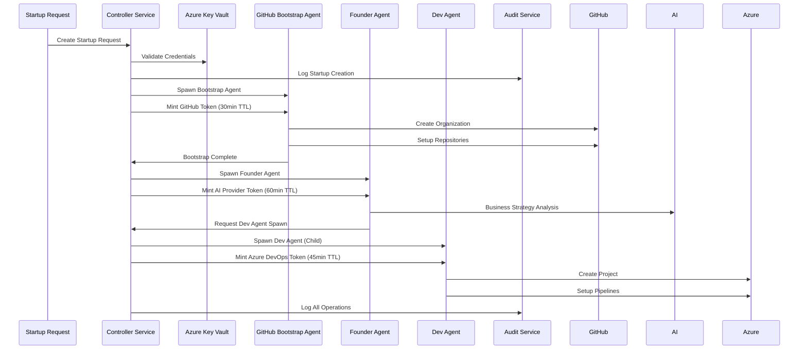

# Controller Service - AI Agent Orchestration Engine

**Status**: 🔄 **IN DEVELOPMENT** - Critical Path Component  
**Mission**: Orchestrate autonomous AI agents for startup creation platform  
**Architecture**: Token delegation, policy enforcement, multi-tenant isolation  

## 🎯 Service Overview

The Controller Service is the **brain** of the AI Agent Startup Creation Platform. It manages the complete lifecycle of autonomous agents, enforces security policies, maintains audit trails, and coordinates multi-tenant startup operations.

### Core Responsibilities

- **🔐 Token Lifecycle Management**: Mint ephemeral, scope-limited credentials for worker agents
- **🏛️ Policy Enforcement**: Validate operations against governance policies and tenant quotas
- **👥 Agent Orchestration**: Spawn, monitor, and coordinate roleplay agents (founder, dev, ops, sec, finance)
- **🏢 Multi-Tenant Isolation**: Ensure cryptographic boundaries between startup tenants
- **📋 Approval Workflows**: Human-in-the-loop for critical operations and policy violations
- **📊 Audit Management**: Immutable logging with hash-chain integrity for all operations

## 🏗️ Architecture Design

### Token Delegation Model

```python
class EphemeralToken:
    token_id: str                    # Unique token identifier
    expires_at: datetime             # TTL (15-60 minutes)
    scopes: List[str]                # Limited API scopes
    tenant_id: str                   # Multi-tenant isolation
    parent_token_id: Optional[str]   # Agent lineage tracking
    revoked: bool = False            # Revocation status
    agent_role: str                  # Agent persona (founder/dev/ops/sec/finance)
```

### Agent Orchestration Flow



## 🔧 Implementation Components

### Core Services

```bash
controller-service/
├── src/
│   ├── main.py                 # FastAPI application
│   ├── core/
│   │   ├── controller.py       # Main orchestration logic
│   │   ├── token_manager.py    # Ephemeral token lifecycle
│   │   ├── policy_engine.py    # Governance policy validation
│   │   ├── tenant_manager.py   # Multi-tenant isolation
│   │   └── audit_manager.py    # Immutable audit logging
│   ├── agents/
│   │   ├── agent_spawner.py    # Agent lifecycle management
│   │   ├── agent_registry.py   # Active agent tracking
│   │   └── role_templates.py   # Agent role definitions
│   ├── integrations/
│   │   ├── governance_factories.py  # Factory API clients
│   │   ├── vault_client.py     # Azure Key Vault integration
│   │   └── approval_workflow.py     # Human approval system
│   └── models/
│       ├── startup_spec.py     # Startup creation specification
│       ├── agent_models.py     # Agent and token models
│       └── audit_models.py     # Audit and compliance models
├── tests/                      # Comprehensive test suite
├── docker-compose.yml          # Development environment
├── Dockerfile                  # Production container
└── requirements.txt            # Python dependencies
```

### API Endpoints

```python
# Startup Management
POST /startups                  # Create new startup
GET  /startups/{id}            # Get startup status
DELETE /startups/{id}          # Delete startup (with approval)

# Agent Management
POST /agents/spawn             # Spawn new agent
GET  /agents/{id}              # Get agent status
POST /agents/{id}/revoke       # Revoke agent token
GET  /agents                   # List active agents

# Token Management
POST /tokens/mint              # Mint ephemeral token
POST /tokens/revoke            # Revoke token
GET  /tokens/{id}/status       # Check token validity

# Policy & Governance
GET  /policies                 # List governance policies
POST /policies/validate        # Validate operation against policies
GET  /approvals/pending        # List pending approvals
POST /approvals/{id}/approve   # Approve pending operation

# Audit & Monitoring
GET  /audit/trail/{startup_id} # Get startup audit trail
GET  /audit/agents/{agent_id}  # Get agent audit trail
GET  /metrics                  # Prometheus metrics
GET  /health                   # Health check
```

## 🔐 Security Architecture

### Multi-Tenant Isolation

```python
class TenantIsolation:
    def __init__(self, tenant_id: str):
        self.tenant_id = tenant_id
        self.encryption_key = self.derive_tenant_key(tenant_id)
        self.resource_prefix = f"startup-{tenant_id}"
        self.namespace = f"tenant-{tenant_id}"
    
    def create_isolated_resources(self):
        return {
            "github_org": f"{self.resource_prefix}-github",
            "azure_project": f"{self.resource_prefix}-azure",
            "storage_account": f"startup{tenant_id}storage",
            "key_vault": f"startup-{tenant_id}-vault"
        }
```

### Approval Workflow Integration

```python
class ApprovalWorkflow:
    CRITICAL_OPERATIONS = [
        "github_org_creation",
        "azure_org_creation", 
        "cross_tenant_access",
        "production_deployment",
        "billing_changes"
    ]
    
    async def requires_approval(self, operation: str, context: dict) -> bool:
        return (
            operation in self.CRITICAL_OPERATIONS or
            context.get("cost_impact", 0) > 1000 or
            context.get("risk_level") == "high"
        )
```

## 📊 Development Roadmap

### Sprint 1-2 (Weeks 1-4): Foundation
- ✅ Repository setup and project structure
- 🔄 Core Controller Service implementation
- 🔄 Token lifecycle management
- 🔄 Basic agent spawning

### Sprint 3-4 (Weeks 5-8): Integration
- 🔄 Governance Factory integration
- 🔄 Multi-tenant architecture
- 🔄 Policy engine implementation
- 🔄 Audit trail system

### Sprint 5-6 (Weeks 9-12): Production
- 📅 Approval workflow system
- 📅 Production hardening
- 📅 Monitoring and alerting
- 📅 End-to-end testing

## 🎯 Success Metrics

### Technical Metrics
- ✅ Token lifecycle management operational
- ✅ Agent spawning and coordination working
- ✅ Multi-tenant isolation validated
- ✅ Policy enforcement active

### Performance Metrics
- 🎯 <2 second response time for token minting
- 🎯 Support 100+ concurrent agent operations
- 🎯 99.9% uptime for controller service
- 🎯 <30 second startup creation initiation

### Security Metrics
- 🔐 100% audit trail coverage
- 🔐 Zero token leakage incidents
- 🔐 Multi-tenant isolation verified
- 🔐 Approval workflow compliance

## 🚀 Next Steps

### Immediate Development (This Week)
1. **Core Controller Implementation** - Basic service structure and API endpoints
2. **Token Manager** - Ephemeral token minting and lifecycle
3. **Agent Spawner** - Basic agent lifecycle management
4. **Governance Integration** - Connection to existing factories

### Critical Dependencies
- Azure Key Vault setup for secure credential storage
- Governance Factory API integration testing
- Multi-tenant security model validation
- Approval workflow UI development

---

**Status**: 🔄 **ACTIVE DEVELOPMENT**  
**Priority**: 🔥 **CRITICAL PATH**  
**Next Update**: Weekly Sprint Reviews  
**Team**: Controller Service Development Squad
