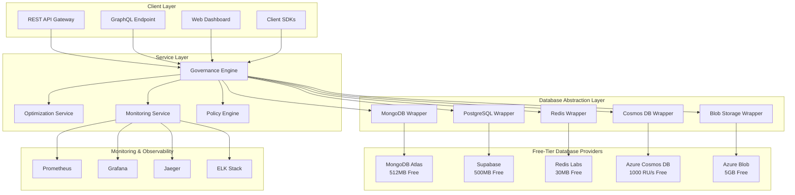

# Database Governance Factory - Technical Design Specifications

## 1. System Architecture Overview

### 1.1 High-Level Architecture
The Database Governance Factory implements a **cloud-native microservices architecture** optimized for free-tier database utilization while providing enterprise-grade governance capabilities for modern applications.



### 1.2 Architectural Principles
- **Free-Tier First**: Architecture optimized for maximum free-tier utilization
- **Provider Agnostic**: Database operations abstracted through unified interfaces
- **Horizontal Scaling**: Multi-instance distribution across free-tier limits
- **Event-Driven**: Asynchronous processing for optimal performance
- **Container Native**: Docker and Kubernetes first deployment strategy

### 1.3 Core Design Patterns
- **Adapter Pattern**: Database provider abstraction and unified interface
- **Circuit Breaker**: Fault tolerance for external database dependencies
- **CQRS**: Command Query Responsibility Segregation for read/write optimization
- **Event Sourcing**: Complete audit trail and state reconstruction
- **Repository Pattern**: Data access abstraction with caching strategies

## 2. Database Provider Wrapper Architecture

### 2.1 Unified Database Interface Design

```python
# Core Database Abstraction Interface
from abc import ABC, abstractmethod
from typing import Dict, List, Any, Optional, Union
from dataclasses import dataclass
from enum import Enum
import asyncio

class DatabaseProvider(Enum):
    MONGODB_ATLAS = "mongodb_atlas"
    SUPABASE = "supabase"
    REDIS_LABS = "redis_labs"
    AZURE_COSMOS_DB = "azure_cosmos_db"
    AZURE_BLOB_STORAGE = "azure_blob_storage"

@dataclass
class DatabaseOperation:
    """Unified database operation specification"""
    operation_type: str
    provider: DatabaseProvider
    collection: str
    data: Optional[Dict[str, Any]] = None
    query: Optional[Dict[str, Any]] = None
    options: Optional[Dict[str, Any]] = None
    timeout: Optional[int] = 30

@dataclass
class OperationResult:
    """Standardized operation result"""
    success: bool
    data: Optional[Union[Dict, List]] = None
    error: Optional[str] = None
    execution_time: Optional[float] = None
    resource_usage: Optional[Dict[str, Any]] = None
    provider_metadata: Optional[Dict[str, Any]] = None

class DatabaseWrapper(ABC):
    """Abstract base class for all database wrappers"""
    
    @abstractmethod
    async def connect(self, connection_config: Dict[str, Any]) -> bool:
        """Establish connection to database provider"""
        pass
    
    @abstractmethod
    async def disconnect(self) -> bool:
        """Close connection to database provider"""
        pass
    
    @abstractmethod
    async def create(self, operation: DatabaseOperation) -> OperationResult:
        """Create/Insert operation"""
        pass
    
    @abstractmethod
    async def read(self, operation: DatabaseOperation) -> OperationResult:
        """Read/Query operation"""
        pass
    
    @abstractmethod
    async def update(self, operation: DatabaseOperation) -> OperationResult:
        """Update operation"""
        pass
    
    @abstractmethod
    async def delete(self, operation: DatabaseOperation) -> OperationResult:
        """Delete operation"""
        pass
    
    @abstractmethod
    async def execute_raw(self, operation: DatabaseOperation) -> OperationResult:
        """Execute raw database-specific query"""
        pass
    
    @abstractmethod
    async def health_check(self) -> Dict[str, Any]:
        """Database provider health status"""
        pass
    
    @abstractmethod
    async def get_metrics(self) -> Dict[str, Any]:
        """Database provider performance metrics"""
        pass
```

### 2.2 MongoDB Atlas Free-Tier Wrapper

```pseudocode
MONGODB_ATLAS_WRAPPER:
  PURPOSE: Optimized wrapper for MongoDB Atlas free-tier with governance

  CONFIGURATION:
    - connection_pool_size: 10 connections (optimized for 100 limit)
    - idle_timeout: 30 seconds for efficient resource usage
    - storage_limit: 512MB monitoring and optimization
    - connection_timeout: 5 seconds for responsive failures

  CONNECT_TO_ATLAS:
    INPUT: connection_configuration
    
    CREATE optimized_connection with:
      - maximum_pool_size = 10 connections
      - idle_timeout = 30 seconds
      - server_selection_timeout = 5 seconds
      - automatic_retry_writes = enabled
    
    VERIFY connection by sending ping command
    SETUP governance_indexes for efficient queries
    ENABLE connection_monitoring for health tracking
    
    IF connection_successful:
      LOG "Connected to MongoDB Atlas successfully"
      RETURN true
    ELSE:
      LOG "MongoDB Atlas connection failed"
      RETURN false

  CREATE_DOCUMENT:
    INPUT: collection_name, document_data, governance_options
    
    STEP 1: Validate document against governance_policies
    STEP 2: Check current_storage_usage against 512MB limit
    STEP 3: Add governance_metadata (timestamps, audit info)
    STEP 4: Execute insert_operation with optimized settings
    STEP 5: Update storage_usage_metrics
    STEP 6: Log operation for compliance_audit
    
    RETURN operation_result with document_identifier

  QUERY_DOCUMENTS:
    INPUT: collection_name, query_filters, projection_fields, options
    
    STEP 1: Apply governance_access_filters automatically
    STEP 2: Optimize query using available_indexes
    STEP 3: Execute query with connection_pooling
    STEP 4: Apply data_masking for sensitive fields
    STEP 5: Cache results if frequently_accessed
    STEP 6: Record query_performance_metrics
    
    RETURN filtered_and_masked_results

  UPDATE_DOCUMENTS:
    INPUT: collection_name, filter_criteria, update_operations
    
    STEP 1: Validate update_permissions against governance
    STEP 2: Backup existing_data for audit_trail
    STEP 3: Execute atomic_update with proper consistency
    STEP 4: Update change_history for compliance
    STEP 5: Invalidate related_cache_entries
    
    RETURN update_statistics and affected_document_count

  STORAGE_OPTIMIZATION:
    MONITOR_USAGE:
      TRACK current_storage_usage against 512MB limit
      ALERT when approaching 80% capacity (410MB)
      RECOMMEND data_archival or compression
      
    COMPRESS_DATA:
      IDENTIFY large_documents for compression
      APPLY document_compression algorithms
      MOVE old_data to cheaper_storage_tiers
      
    INDEX_OPTIMIZATION:
      ANALYZE query_patterns for index_recommendations
      CREATE compound_indexes for multi-field queries
      REMOVE unused_indexes to save storage
      USE sparse_indexes for optional fields
```
            
        except PyMongoError as e:
            self.logger.error(f"MongoDB Atlas connection failed: {str(e)}")
            return False
    
    async def create(self, operation: DatabaseOperation) -> OperationResult:
        """Optimized create operation with validation"""
        start_time = time.time()
        
        try:
            collection = self.database[operation.collection]
            
            # Optimize for free-tier storage limits
            if isinstance(operation.data, list):
                # Bulk insert with batch optimization
                result = await collection.insert_many(
                    operation.data,
                    ordered=False,  # Faster unordered inserts
                    bypass_document_validation=False
                )
                inserted_ids = result.inserted_ids
            else:
                # Single document insert
                result = await collection.insert_one(operation.data)
                inserted_ids = [result.inserted_id]
            
            execution_time = time.time() - start_time
            
            return OperationResult(
                success=True,
                data={"inserted_ids": [str(id) for id in inserted_ids]},
                execution_time=execution_time,
                provider_metadata={"operation": "insert", "count": len(inserted_ids)}
            )
            
        except PyMongoError as e:
            execution_time = time.time() - start_time
            self.logger.error(f"MongoDB create operation failed: {str(e)}")
            
            return OperationResult(
                success=False,
                error=str(e),
                execution_time=execution_time
            )
    
    async def optimize_indexes(self, collection_name: str, usage_patterns: Dict[str, Any]):
        """AI-powered index optimization for free-tier efficiency"""
        collection = self.database[collection_name]
        
        # Analyze query patterns and create optimal indexes
        recommended_indexes = []
        
        # Single field indexes for frequent queries
        for field, frequency in usage_patterns.get('single_field_queries', {}).items():
            if frequency > 100:  # High-frequency threshold
                recommended_indexes.append(IndexModel([(field, 1)]))
        
        # Compound indexes for multi-field queries
        for fields, frequency in usage_patterns.get('compound_queries', {}).items():
            if frequency > 50:  # Medium-frequency threshold
                index_spec = [(field, 1) for field in fields]
                recommended_indexes.append(IndexModel(index_spec))
        
        # Create indexes efficiently
        if recommended_indexes:
            await collection.create_indexes(recommended_indexes)
            self.logger.info(f"Created {len(recommended_indexes)} optimized indexes for {collection_name}")
    
    async def get_free_tier_usage(self) -> Dict[str, Any]:
        """Monitor free-tier usage and limits"""
        try:
            # Get database statistics
            stats = await self.database.command("dbStats")
            
            # Calculate usage percentages
            storage_used_mb = stats.get('dataSize', 0) / (1024 * 1024)
            storage_limit_mb = 512  # Free tier limit
            storage_usage_percent = (storage_used_mb / storage_limit_mb) * 100
            
            # Get connection count
            server_status = await self.database.command("serverStatus")
            current_connections = server_status.get('connections', {}).get('current', 0)
            connection_limit = 100  # Free tier limit
            connection_usage_percent = (current_connections / connection_limit) * 100
            
            return {
                "storage": {
                    "used_mb": storage_used_mb,
                    "limit_mb": storage_limit_mb,
                    "usage_percent": storage_usage_percent
                },
                "connections": {
                    "current": current_connections,
                    "limit": connection_limit,
                    "usage_percent": connection_usage_percent
                },
                "collections": stats.get('collections', 0),
                "indexes": stats.get('indexes', 0)
            }
            
        except PyMongoError as e:
            self.logger.error(f"Failed to get MongoDB usage stats: {str(e)}")
            return {}
```

### 2.3 Supabase PostgreSQL Wrapper

```pseudocode
SUPABASE_WRAPPER:
  PURPOSE: Optimized PostgreSQL wrapper for Supabase free-tier

  CONFIGURATION:
    - max_connections: 2 (free-tier limit)
    - storage_limit: 500MB monitoring
    - connection_timeout: 30 seconds
    - authentication: Built-in Supabase auth integration

  CONNECT_TO_SUPABASE:
    INPUT: supabase_configuration
    
    STEP 1: Initialize Supabase client for authentication and real-time features
    STEP 2: Create direct PostgreSQL connection pool:
      - minimum_connections = 1
      - maximum_connections = 2 (free-tier limit)
      - connection_timeout = 30 seconds
      - keepalive_settings for stable connections
    
    STEP 3: Test connection with simple query
    STEP 4: Setup RLS (Row Level Security) policies
    STEP 5: Initialize audit table structure
    
    IF connection_successful:
      LOG "Connected to Supabase PostgreSQL"
      RETURN true
    ELSE:
      LOG "Supabase connection failed"
      RETURN false

  CREATE_RECORD:
    INPUT: table_name, record_data, governance_options
    
    STEP 1: Validate record against table_schema
    STEP 2: Apply RLS (Row Level Security) policies
    STEP 3: Add governance_metadata (created_at, audit_info)
    STEP 4: Check storage_quota against 500MB limit
    STEP 5: Execute INSERT with returning clause
    STEP 6: Update storage_usage_tracking
    STEP 7: Trigger real-time_notifications if configured
    
    RETURN record_id and creation_timestamp

  QUERY_RECORDS:
    INPUT: table_name, filter_conditions, select_columns, options
    
    STEP 1: Apply automatic RLS filtering based on user context
    STEP 2: Optimize query with available indexes
    STEP 3: Add governance filters for data classification
    STEP 4: Execute query with connection pooling
    STEP 5: Apply data masking for sensitive fields
    STEP 6: Cache results for frequently accessed data
    
    RETURN filtered_and_secured_results

  UPDATE_RECORDS:
    INPUT: table_name, filter_conditions, update_data, options
    
    STEP 1: Verify update permissions with RLS
    STEP 2: Backup current values for audit trail
    STEP 3: Execute atomic UPDATE with optimistic locking
    STEP 4: Log changes to audit_history table
    STEP 5: Trigger real-time updates for subscribed clients
    STEP 6: Update cache invalidation
    
    RETURN affected_record_count and update_timestamp

  FREE_TIER_OPTIMIZATION:
    CONNECTION_MANAGEMENT:
      MONITOR active_connection_count against limit of 2
      IMPLEMENT connection_sharing for multiple operations
      USE connection_pooling for efficient resource usage
      CLOSE idle_connections proactively
    
    STORAGE_OPTIMIZATION:
      TRACK storage_usage against 500MB limit
      COMPRESS large_text_fields automatically
      ARCHIVE old_records to cheaper storage
      OPTIMIZE table_indexes for space efficiency
    
    PERFORMANCE_OPTIMIZATION:
      USE materialized_views for complex analytics
      IMPLEMENT query_result_caching
      BATCH multiple_operations for efficiency
      OPTIMIZE queries with EXPLAIN ANALYZE

  REAL_TIME_FEATURES:
    SETUP_SUBSCRIPTIONS:
      CONFIGURE real-time subscriptions for data changes
      IMPLEMENT filtered_subscriptions based on RLS
      MANAGE subscription_limits for free tier
      
    BROADCAST_CHANGES:
      SEND real-time updates to subscribed clients
      FILTER updates based on user permissions
      BATCH updates for efficiency
            )
            
            # Verify connection
            async with self.connection_pool.acquire() as conn:
                await conn.execute('SELECT 1')
            
            self.logger.info("Connected to Supabase PostgreSQL")
            return True
            
        except Exception as e:
            self.logger.error(f"Supabase connection failed: {str(e)}")
            return False
    
    async def create(self, operation: DatabaseOperation) -> OperationResult:
        """Optimized PostgreSQL insert with UPSERT support"""
        start_time = time.time()
        
        try:
            async with self.connection_pool.acquire() as conn:
                if isinstance(operation.data, list):
                    # Bulk insert optimization
                    columns = list(operation.data[0].keys())
                    values = [list(row.values()) for row in operation.data]
                    
                    query = f"""
                        INSERT INTO {operation.collection} ({', '.join(columns)})
                        VALUES {', '.join(['(' + ', '.join(['$' + str(i*len(columns) + j + 1) 
                                                           for j in range(len(columns))]) + ')'
                                          for i in range(len(values))])}
                        RETURNING id
                    """
                    
                    flat_values = [item for sublist in values for item in sublist]
                    result = await conn.fetch(query, *flat_values)
                    inserted_ids = [row['id'] for row in result]
                    
                else:
                    # Single insert
                    columns = list(operation.data.keys())
                    placeholders = ', '.join([f'${i+1}' for i in range(len(columns))])
                    
                    query = f"""
                        INSERT INTO {operation.collection} ({', '.join(columns)})
                        VALUES ({placeholders})
                        RETURNING id
                    """
                    
                    result = await conn.fetchrow(query, *operation.data.values())
                    inserted_ids = [result['id']]
            
            execution_time = time.time() - start_time
            
            return OperationResult(
                success=True,
                data={"inserted_ids": inserted_ids},
                execution_time=execution_time,
                provider_metadata={"operation": "insert", "count": len(inserted_ids)}
            )
            
        except Exception as e:
            execution_time = time.time() - start_time
            self.logger.error(f"Supabase create operation failed: {str(e)}")
            
            return OperationResult(
                success=False,
                error=str(e),
                execution_time=execution_time
            )
    
    async def optimize_query_performance(self, table_name: str, query_patterns: Dict[str, Any]):
        """PostgreSQL query optimization for free-tier efficiency"""
        async with self.connection_pool.acquire() as conn:
            # Analyze table statistics
            stats_query = f"""
                SELECT 
                    schemaname,
                    tablename,
                    attname,
                    n_distinct,
                    correlation
                FROM pg_stats 
                WHERE tablename = '{table_name}'
            """
            
            stats = await conn.fetch(stats_query)
            
            # Create optimized indexes based on query patterns
            for query_type, fields in query_patterns.items():
                if query_type == 'frequent_where_clauses':
                    for field, frequency in fields.items():
                        if frequency > 100:  # High frequency
                            index_name = f"idx_{table_name}_{field}"
                            create_index_query = f"""
                                CREATE INDEX CONCURRENTLY IF NOT EXISTS {index_name}
                                ON {table_name} ({field})
                            """
                            await conn.execute(create_index_query)
                
                elif query_type == 'range_queries':
                    for field, frequency in fields.items():
                        if frequency > 50:  # Medium frequency
                            index_name = f"idx_{table_name}_{field}_btree"
                            create_index_query = f"""
                                CREATE INDEX CONCURRENTLY IF NOT EXISTS {index_name}
                                ON {table_name} USING BTREE ({field})
                            """
                            await conn.execute(create_index_query)
    
    async def get_free_tier_usage(self) -> Dict[str, Any]:
        """Monitor Supabase free-tier usage"""
        try:
            async with self.connection_pool.acquire() as conn:
                # Database size
                size_query = """
                    SELECT pg_size_pretty(pg_database_size(current_database())) as size,
                           pg_database_size(current_database()) as size_bytes
                """
                size_result = await conn.fetchrow(size_query)
                
                # Connection count
                conn_query = """
                    SELECT count(*) as connection_count
                    FROM pg_stat_activity
                    WHERE state = 'active'
                """
                conn_result = await conn.fetchrow(conn_query)
                
                # Table statistics
                tables_query = """
                    SELECT 
                        schemaname,
                        tablename,
                        n_tup_ins as inserts,
                        n_tup_upd as updates,
                        n_tup_del as deletes
                    FROM pg_stat_user_tables
                """
                tables = await conn.fetch(tables_query)
                
                storage_used_mb = size_result['size_bytes'] / (1024 * 1024)
                storage_limit_mb = 500  # Free tier limit
                storage_usage_percent = (storage_used_mb / storage_limit_mb) * 100
                
                connection_usage_percent = (conn_result['connection_count'] / 2) * 100
                
                return {
                    "storage": {
                        "used_mb": storage_used_mb,
                        "limit_mb": storage_limit_mb,
                        "usage_percent": storage_usage_percent,
                        "size_pretty": size_result['size']
                    },
                    "connections": {
                        "current": conn_result['connection_count'],
                        "limit": 2,
                        "usage_percent": connection_usage_percent
                    },
                    "tables": [dict(row) for row in tables]
                }
                
        except Exception as e:
            self.logger.error(f"Failed to get Supabase usage stats: {str(e)}")
            return {}
```

### 2.4 Redis Labs Free-Tier Wrapper

```python
# Redis Labs Optimized Wrapper
import aioredis
import json
import pickle
import gzip
from typing import Dict, List, Any, Union
import time

class RedisLabsWrapper(DatabaseWrapper):
    """Optimized Redis Labs wrapper for 30MB free-tier"""
    
    def __init__(self):
        self.client = None
        self.max_connections = 30  # Free tier limit
        self.memory_limit_mb = 30  # Free tier limit
        self.logger = logging.getLogger(__name__)
    
    async def connect(self, connection_config: Dict[str, Any]) -> bool:
        """Optimized Redis connection with memory efficiency"""
        try:
            self.client = aioredis.from_url(
                connection_config['redis_url'],
                max_connections=self.max_connections,
                retry_on_timeout=True,
                socket_keepalive=True,
                socket_keepalive_options={
                    'TCP_KEEPIDLE': 1,
                    'TCP_KEEPINTVL': 3,
                    'TCP_KEEPCNT': 5
                },
                encoding='utf-8',
                decode_responses=True
            )
            
            # Verify connection
            await self.client.ping()
            
            # Set memory optimization policies
            await self.client.config_set('maxmemory-policy', 'allkeys-lru')
            await self.client.config_set('save', '900 1 300 10 60 10000')  # Persistence optimization
            
            self.logger.info("Connected to Redis Labs")
            return True
            
        except Exception as e:
            self.logger.error(f"Redis Labs connection failed: {str(e)}")
            return False
    
    async def create(self, operation: DatabaseOperation) -> OperationResult:
        """Memory-optimized Redis operations"""
        start_time = time.time()
        
        try:
            key = operation.query.get('key') if operation.query else operation.collection
            value = operation.data
            
            # Optimize data storage based on type and size
            if isinstance(value, (dict, list)):
                # Compress large objects to save memory
                serialized = json.dumps(value)
                if len(serialized) > 1024:  # Compress if > 1KB
                    compressed = gzip.compress(serialized.encode('utf-8'))
                    await self.client.set(f"compressed:{key}", compressed)
                    metadata = {"compressed": True, "original_size": len(serialized)}
                else:
                    await self.client.set(key, serialized)
                    metadata = {"compressed": False}
            else:
                await self.client.set(key, str(value))
                metadata = {"compressed": False}
            
            # Set TTL based on operation options
            ttl = operation.options.get('ttl', 3600) if operation.options else 3600
            await self.client.expire(key, ttl)
            
            execution_time = time.time() - start_time
            
            return OperationResult(
                success=True,
                data={"key": key, "ttl": ttl},
                execution_time=execution_time,
                provider_metadata=metadata
            )
            
        except Exception as e:
            execution_time = time.time() - start_time
            self.logger.error(f"Redis create operation failed: {str(e)}")
            
            return OperationResult(
                success=False,
                error=str(e),
                execution_time=execution_time
            )
    
    async def intelligent_caching(self, cache_key: str, data: Any, access_pattern: str):
        """Intelligent caching with memory optimization"""
        try:
            # Determine optimal TTL based on access pattern
            ttl_mapping = {
                'frequent': 3600,      # 1 hour
                'moderate': 1800,      # 30 minutes
                'infrequent': 600,     # 10 minutes
                'rare': 300            # 5 minutes
            }
            
            ttl = ttl_mapping.get(access_pattern, 1800)
            
            # Implement LRU-like behavior with memory monitoring
            memory_info = await self.get_memory_usage()
            if memory_info['usage_percent'] > 80:  # Near memory limit
                # Reduce TTL for new entries
                ttl = min(ttl, 300)
                
                # Proactively expire some keys
                await self.cleanup_expired_keys()
            
            # Store with optimized serialization
            if isinstance(data, (dict, list)):
                serialized = json.dumps(data, separators=(',', ':'))  # Compact JSON
                if len(serialized) > 512:  # Compress larger data
                    compressed = gzip.compress(serialized.encode('utf-8'))
                    await self.client.setex(f"c:{cache_key}", ttl, compressed)
                else:
                    await self.client.setex(cache_key, ttl, serialized)
            else:
                await self.client.setex(cache_key, ttl, str(data))
            
            self.logger.debug(f"Cached {cache_key} with TTL {ttl}s, pattern: {access_pattern}")
            
        except Exception as e:
            self.logger.error(f"Intelligent caching failed: {str(e)}")
    
    async def get_memory_usage(self) -> Dict[str, Any]:
        """Monitor Redis memory usage for free-tier optimization"""
        try:
            info = await self.client.info('memory')
            
            used_memory = info.get('used_memory', 0)
            used_memory_mb = used_memory / (1024 * 1024)
            usage_percent = (used_memory_mb / self.memory_limit_mb) * 100
            
            return {
                "used_memory_mb": used_memory_mb,
                "limit_mb": self.memory_limit_mb,
                "usage_percent": usage_percent,
                "used_memory_peak_mb": info.get('used_memory_peak', 0) / (1024 * 1024),
                "mem_fragmentation_ratio": info.get('mem_fragmentation_ratio', 1.0),
                "keyspace_hits": info.get('keyspace_hits', 0),
                "keyspace_misses": info.get('keyspace_misses', 0)
            }
            
        except Exception as e:
            self.logger.error(f"Failed to get Redis memory usage: {str(e)}")
            return {}
    
    async def cleanup_expired_keys(self):
        """Proactive cleanup to maintain memory efficiency"""
        try:
            # Get all keys with TTL information
            cursor = 0
            cleaned_count = 0
            
            while True:
                cursor, keys = await self.client.scan(cursor, count=100)
                
                for key in keys:
                    ttl = await self.client.ttl(key)
                    if ttl == -1:  # No expiration set
                        # Set default expiration for orphaned keys
                        await self.client.expire(key, 1800)  # 30 minutes
                    elif ttl < 60:  # Expiring soon
                        # Let it expire naturally
                        continue
                
                if cursor == 0:
                    break
            
            self.logger.info(f"Cleaned up expired keys, processed {cleaned_count} keys")
            
        except Exception as e:
            self.logger.error(f"Key cleanup failed: {str(e)}")
```

## 3. Docker Deployment Architecture

### 3.1 Development Environment Stack

```yaml
# docker-compose.dev.yml - Complete Development Stack
version: '3.8'

services:
  # Database Governance API
  database-governance-api:
    build:
      context: .
      dockerfile: Dockerfile
    ports:
      - "8000:8000"
    environment:
      - ENVIRONMENT=development
      - LOG_LEVEL=DEBUG
    volumes:
      - ./src:/app/src
      - ./config:/app/config
    depends_on:
      - mongodb
      - postgres
      - redis
    networks:
      - governance-network

  # Local MongoDB for Development
  mongodb:
    image: mongo:7.0
    ports:
      - "27017:27017"
    environment:
      MONGO_INITDB_ROOT_USERNAME: admin
      MONGO_INITDB_ROOT_PASSWORD: password
      MONGO_INITDB_DATABASE: governance_dev
    volumes:
      - mongodb_data:/data/db
      - ./scripts/mongo-init.js:/docker-entrypoint-initdb.d/mongo-init.js:ro
    networks:
      - governance-network

  # Local PostgreSQL for Development
  postgres:
    image: postgres:15-alpine
    ports:
      - "5432:5432"
    environment:
      POSTGRES_DB: governance_dev
      POSTGRES_USER: postgres
      POSTGRES_PASSWORD: password
    volumes:
      - postgres_data:/var/lib/postgresql/data
      - ./scripts/postgres-init.sql:/docker-entrypoint-initdb.d/init.sql:ro
    networks:
      - governance-network

  # Local Redis for Development
  redis:
    image: redis:7-alpine
    ports:
      - "6379:6379"
    command: redis-server --appendonly yes --maxmemory 256mb --maxmemory-policy allkeys-lru
    volumes:
      - redis_data:/data
    networks:
      - governance-network

  # Monitoring Stack
  prometheus:
    image: prom/prometheus:latest
    ports:
      - "9090:9090"
    volumes:
      - ./monitoring/prometheus.yml:/etc/prometheus/prometheus.yml:ro
      - prometheus_data:/prometheus
    command:
      - '--config.file=/etc/prometheus/prometheus.yml'
      - '--storage.tsdb.path=/prometheus'
      - '--web.console.libraries=/etc/prometheus/console_libraries'
      - '--web.console.templates=/etc/prometheus/consoles'
      - '--storage.tsdb.retention.time=200h'
      - '--web.enable-lifecycle'
    networks:
      - governance-network

  grafana:
    image: grafana/grafana:latest
    ports:
      - "3000:3000"
    environment:
      - GF_SECURITY_ADMIN_USER=admin
      - GF_SECURITY_ADMIN_PASSWORD=admin
    volumes:
      - grafana_data:/var/lib/grafana
      - ./monitoring/grafana/dashboards:/etc/grafana/provisioning/dashboards:ro
      - ./monitoring/grafana/datasources:/etc/grafana/provisioning/datasources:ro
    networks:
      - governance-network

  jaeger:
    image: jaegertracing/all-in-one:latest
    ports:
      - "16686:16686"
      - "14268:14268"
    environment:
      - COLLECTOR_OTLP_ENABLED=true
    networks:
      - governance-network

volumes:
  mongodb_data:
  postgres_data:
  redis_data:
  prometheus_data:
  grafana_data:

networks:
  governance-network:
    driver: bridge
```

### 3.2 Production Kubernetes Deployment

```yaml
# k8s/production/deployment.yaml
apiVersion: apps/v1
kind: Deployment
metadata:
  name: database-governance-factory
  namespace: enterprise-platform
  labels:
    app: database-governance-factory
    version: v1.0
spec:
  replicas: 3
  selector:
    matchLabels:
      app: database-governance-factory
  template:
    metadata:
      labels:
        app: database-governance-factory
        version: v1.0
    spec:
      containers:
      - name: database-governance-api
        image: frankmax/database-governance-factory:latest
        ports:
        - containerPort: 8000
        env:
        - name: ENVIRONMENT
          value: "production"
        - name: MONGODB_CONNECTION_STRING
          valueFrom:
            secretKeyRef:
              name: database-credentials
              key: mongodb-connection-string
        - name: SUPABASE_URL
          valueFrom:
            secretKeyRef:
              name: database-credentials
              key: supabase-url
        - name: REDIS_URL
          valueFrom:
            secretKeyRef:
              name: database-credentials
              key: redis-url
        - name: AZURE_COSMOS_CONNECTION
          valueFrom:
            secretKeyRef:
              name: database-credentials
              key: cosmos-connection
        resources:
          requests:
            memory: "256Mi"
            cpu: "250m"
          limits:
            memory: "512Mi"
            cpu: "500m"
        livenessProbe:
          httpGet:
            path: /health
            port: 8000
          initialDelaySeconds: 30
          periodSeconds: 10
        readinessProbe:
          httpGet:
            path: /ready
            port: 8000
          initialDelaySeconds: 5
          periodSeconds: 5

---
apiVersion: v1
kind: Service
metadata:
  name: database-governance-service
  namespace: enterprise-platform
spec:
  selector:
    app: database-governance-factory
  ports:
  - protocol: TCP
    port: 80
    targetPort: 8000
  type: ClusterIP

---
apiVersion: networking.k8s.io/v1
kind: Ingress
metadata:
  name: database-governance-ingress
  namespace: enterprise-platform
  annotations:
    kubernetes.io/ingress.class: nginx
    cert-manager.io/cluster-issuer: letsencrypt-prod
    nginx.ingress.kubernetes.io/rate-limit: "100"
spec:
  tls:
  - hosts:
    - database-governance.enterprise.com
    secretName: database-governance-tls
  rules:
  - host: database-governance.enterprise.com
    http:
      paths:
      - path: /
        pathType: Prefix
        backend:
          service:
            name: database-governance-service
            port:
              number: 80
```

### 3.3 Helm Chart Configuration

```yaml
# helm/database-governance-factory/values.yaml
# Default values for database-governance-factory

replicaCount: 3

image:
  repository: frankmax/database-governance-factory
  pullPolicy: IfNotPresent
  tag: "latest"

service:
  type: ClusterIP
  port: 80
  targetPort: 8000

ingress:
  enabled: true
  className: "nginx"
  annotations:
    cert-manager.io/cluster-issuer: letsencrypt-prod
    nginx.ingress.kubernetes.io/rate-limit: "100"
  hosts:
    - host: database-governance.enterprise.com
      paths:
        - path: /
          pathType: Prefix
  tls:
    - secretName: database-governance-tls
      hosts:
        - database-governance.enterprise.com

resources:
  limits:
    cpu: 500m
    memory: 512Mi
  requests:
    cpu: 250m
    memory: 256Mi

autoscaling:
  enabled: true
  minReplicas: 2
  maxReplicas: 10
  targetCPUUtilizationPercentage: 80
  targetMemoryUtilizationPercentage: 80

# Database configuration
databases:
  mongodb:
    enabled: true
    connectionStringSecret: "mongodb-connection-string"
  supabase:
    enabled: true
    urlSecret: "supabase-url"
    keySecret: "supabase-key"
  redis:
    enabled: true
    urlSecret: "redis-url"
  cosmosdb:
    enabled: true
    connectionSecret: "cosmos-connection"
  azureblob:
    enabled: true
    connectionSecret: "azure-blob-connection"

# Monitoring configuration
monitoring:
  prometheus:
    enabled: true
    namespace: monitoring
  grafana:
    enabled: true
    namespace: monitoring
  jaeger:
    enabled: true
    namespace: monitoring

# Security configuration
security:
  networkPolicies:
    enabled: true
  podSecurityPolicy:
    enabled: true
  rbac:
    enabled: true
```

## 4. Performance Optimization Strategies

### 4.1 Free-Tier Optimization Patterns

```python
# Free-Tier Optimization Manager
class FreeTierOptimizer:
    """Intelligent optimization for free-tier database usage"""
    
    def __init__(self):
        self.providers = {}
        self.usage_monitors = {}
        self.optimization_strategies = {}
    
    async def register_provider(self, provider_name: str, wrapper: DatabaseWrapper):
        """Register database provider for optimization"""
        self.providers[provider_name] = wrapper
        self.usage_monitors[provider_name] = await self.create_usage_monitor(provider_name)
        self.optimization_strategies[provider_name] = self.get_optimization_strategy(provider_name)
    
    def get_optimization_strategy(self, provider_name: str) -> Dict[str, Any]:
        """Get provider-specific optimization strategies"""
        strategies = {
            'mongodb_atlas': {
                'connection_pooling': {'max_pool_size': 10, 'idle_timeout': 30000},
                'query_optimization': {'use_indexes': True, 'limit_results': 1000},
                'storage_optimization': {'compress_large_docs': True, 'archive_old_data': True},
                'scaling_strategy': 'multi_cluster_distribution'
            },
            'supabase': {
                'connection_pooling': {'max_connections': 2, 'pool_timeout': 30},
                'query_optimization': {'use_prepared_statements': True, 'batch_operations': True},
                'storage_optimization': {'vacuum_schedule': 'daily', 'analyze_stats': True},
                'scaling_strategy': 'read_replica_distribution'
            },
            'redis_labs': {
                'memory_optimization': {'compression': True, 'ttl_management': True},
                'connection_pooling': {'max_connections': 30, 'keepalive': True},
                'data_structures': {'use_efficient_types': True, 'optimize_keys': True},
                'scaling_strategy': 'multi_instance_sharding'
            },
            'azure_cosmos_db': {
                'request_unit_optimization': {'minimize_ru_usage': True, 'batch_operations': True},
                'partition_strategy': {'optimal_partition_keys': True, 'cross_partition_queries': False},
                'consistency_optimization': {'use_session_consistency': True},
                'scaling_strategy': 'global_distribution'
            },
            'azure_blob_storage': {
                'lifecycle_management': {'auto_tier_transition': True, 'cleanup_old_blobs': True},
                'compression': {'compress_uploads': True, 'deduplicate': True},
                'access_optimization': {'cache_frequently_accessed': True},
                'scaling_strategy': 'geo_replication'
            }
        }
        return strategies.get(provider_name, {})
    
    async def optimize_operations(self, provider_name: str, operation: DatabaseOperation) -> DatabaseOperation:
        """Apply optimization to database operations"""
        strategy = self.optimization_strategies.get(provider_name, {})
        optimized_operation = operation
        
        # Apply provider-specific optimizations
        if provider_name == 'mongodb_atlas':
            optimized_operation = await self.optimize_mongodb_operation(operation, strategy)
        elif provider_name == 'supabase':
            optimized_operation = await self.optimize_supabase_operation(operation, strategy)
        elif provider_name == 'redis_labs':
            optimized_operation = await self.optimize_redis_operation(operation, strategy)
        elif provider_name == 'azure_cosmos_db':
            optimized_operation = await self.optimize_cosmos_operation(operation, strategy)
        elif provider_name == 'azure_blob_storage':
            optimized_operation = await self.optimize_blob_operation(operation, strategy)
        
        return optimized_operation
    
    async def monitor_and_scale(self):
        """Continuous monitoring and intelligent scaling"""
        while True:
            for provider_name, wrapper in self.providers.items():
                try:
                    # Get current usage metrics
                    usage = await wrapper.get_free_tier_usage()
                    
                    # Check if approaching limits
                    if self.is_approaching_limits(usage):
                        await self.implement_scaling_strategy(provider_name, usage)
                    
                    # Optimize based on usage patterns
                    await self.optimize_based_on_patterns(provider_name, usage)
                    
                except Exception as e:
                    logger.error(f"Monitoring failed for {provider_name}: {str(e)}")
            
            # Wait before next monitoring cycle
            await asyncio.sleep(60)  # Monitor every minute
    
    def is_approaching_limits(self, usage: Dict[str, Any]) -> bool:
        """Check if usage is approaching free-tier limits"""
        thresholds = {
            'storage_warning': 80,      # 80% of storage limit
            'connection_warning': 75,   # 75% of connection limit
            'memory_warning': 85,       # 85% of memory limit
            'request_warning': 80       # 80% of request limit
        }
        
        for metric, data in usage.items():
            if isinstance(data, dict) and 'usage_percent' in data:
                if data['usage_percent'] > thresholds.get(f'{metric}_warning', 80):
                    return True
        
        return False
    
    async def implement_scaling_strategy(self, provider_name: str, usage: Dict[str, Any]):
        """Implement intelligent scaling strategies"""
        strategy = self.optimization_strategies[provider_name].get('scaling_strategy')
        
        if strategy == 'multi_cluster_distribution':
            await self.distribute_across_clusters(provider_name)
        elif strategy == 'read_replica_distribution':
            await self.setup_read_replicas(provider_name)
        elif strategy == 'multi_instance_sharding':
            await self.implement_sharding(provider_name)
        elif strategy == 'global_distribution':
            await self.setup_global_distribution(provider_name)
        elif strategy == 'geo_replication':
            await self.setup_geo_replication(provider_name)
```

## 5. API Design and Integration Patterns

### 5.1 RESTful API Specification

```yaml
# OpenAPI 3.0 Specification
openapi: 3.0.3
info:
  title: Database Governance Factory API
  description: Enterprise-grade database governance with free-tier optimization
  version: 1.0.0
  contact:
    name: Database Governance Factory Team
    email: support@ai-devops.com
  license:
    name: MIT
    url: https://opensource.org/licenses/MIT

servers:
  - url: https://database-governance.ai-devops.com/api/v1
    description: Production server
  - url: http://localhost:8000/api/v1
    description: Development server

paths:
  /databases/{provider}/collections/{collection}/documents:
    post:
      summary: Create document(s) in database
      description: Create one or more documents with enterprise-grade validation
      parameters:
        - name: provider
          in: path
          required: true
          schema:
            type: string
            enum: [mongodb_atlas, supabase, redis_labs, azure_cosmos_db, azure_blob_storage]
        - name: collection
          in: path
          required: true
          schema:
            type: string
      requestBody:
        required: true
        content:
          application/json:
            schema:
              oneOf:
                - $ref: '#/components/schemas/SingleDocument'
                - $ref: '#/components/schemas/BulkDocuments'
      responses:
        '201':
          description: Document(s) created successfully
          content:
            application/json:
              schema:
                $ref: '#/components/schemas/CreateResponse'
        '400':
          description: Invalid request data
          content:
            application/json:
              schema:
                $ref: '#/components/schemas/ErrorResponse'
        '409':
          description: Document already exists
          content:
            application/json:
              schema:
                $ref: '#/components/schemas/ErrorResponse'

  /databases/{provider}/collections/{collection}/documents:
    get:
      summary: Query documents from database
      description: Query documents with advanced filtering and optimization
      parameters:
        - name: provider
          in: path
          required: true
          schema:
            type: string
            enum: [mongodb_atlas, supabase, redis_labs, azure_cosmos_db, azure_blob_storage]
        - name: collection
          in: path
          required: true
          schema:
            type: string
        - name: query
          in: query
          schema:
            type: string
          description: JSON query object
        - name: limit
          in: query
          schema:
            type: integer
            minimum: 1
            maximum: 1000
            default: 100
        - name: offset
          in: query
          schema:
            type: integer
            minimum: 0
            default: 0
        - name: sort
          in: query
          schema:
            type: string
          description: Sort specification
      responses:
        '200':
          description: Documents retrieved successfully
          content:
            application/json:
              schema:
                $ref: '#/components/schemas/QueryResponse'

  /governance/compliance/validate:
    post:
      summary: Validate compliance policies
      description: Validate data and operations against compliance frameworks
      requestBody:
        required: true
        content:
          application/json:
            schema:
              $ref: '#/components/schemas/ComplianceValidationRequest'
      responses:
        '200':
          description: Compliance validation completed
          content:
            application/json:
              schema:
                $ref: '#/components/schemas/ComplianceValidationResponse'

  /governance/policies:
    get:
      summary: List governance policies
      description: Get all active governance policies
      responses:
        '200':
          description: Policies retrieved successfully
          content:
            application/json:
              schema:
                $ref: '#/components/schemas/PoliciesResponse'
    
    post:
      summary: Create governance policy
      description: Create new governance policy with validation
      requestBody:
        required: true
        content:
          application/json:
            schema:
              $ref: '#/components/schemas/PolicyDefinition'
      responses:
        '201':
          description: Policy created successfully
          content:
            application/json:
              schema:
                $ref: '#/components/schemas/PolicyResponse'

  /monitoring/metrics:
    get:
      summary: Get system metrics
      description: Retrieve comprehensive system and database metrics
      parameters:
        - name: provider
          in: query
          schema:
            type: string
          description: Filter by specific database provider
        - name: timeframe
          in: query
          schema:
            type: string
            enum: [1h, 6h, 24h, 7d, 30d]
            default: 1h
      responses:
        '200':
          description: Metrics retrieved successfully
          content:
            application/json:
              schema:
                $ref: '#/components/schemas/MetricsResponse'

components:
  schemas:
    SingleDocument:
      type: object
      additionalProperties: true
      
    BulkDocuments:
      type: array
      items:
        type: object
        additionalProperties: true
      minItems: 1
      maxItems: 1000
      
    CreateResponse:
      type: object
      properties:
        success:
          type: boolean
        inserted_ids:
          type: array
          items:
            type: string
        execution_time:
          type: number
        provider_metadata:
          type: object
          
    QueryResponse:
      type: object
      properties:
        success:
          type: boolean
        data:
          type: array
          items:
            type: object
        total_count:
          type: integer
        execution_time:
          type: number
        
    ComplianceValidationRequest:
      type: object
      properties:
        framework:
          type: string
          enum: [sox, gdpr, hipaa, iso27001]
        provider:
          type: string
        collection:
          type: string
        data:
          type: object
      required:
        - framework
        - provider
        - collection
        
    ComplianceValidationResponse:
      type: object
      properties:
        compliant:
          type: boolean
        violations:
          type: array
          items:
            type: object
            properties:
              rule:
                type: string
              severity:
                type: string
                enum: [low, medium, high, critical]
              message:
                type: string
              remediation:
                type: string
                
    ErrorResponse:
      type: object
      properties:
        error:
          type: string
        message:
          type: string
        details:
          type: object
        timestamp:
          type: string
          format: date-time

  securitySchemes:
    bearerAuth:
      type: http
      scheme: bearer
      bearerFormat: JWT
    apiKeyAuth:
      type: apiKey
      in: header
      name: X-API-Key

security:
  - bearerAuth: []
  - apiKeyAuth: []
```

---

**Document Version**: 1.0  
**Last Updated**: September 5, 2025  
**Status**: Draft  
**Reviewers**: Technical Architecture Team, Database Engineering  
**Next Review**: September 12, 2025
