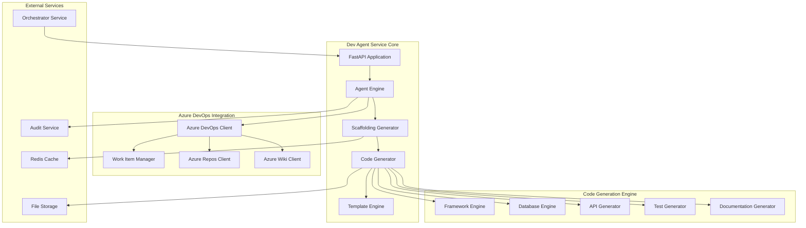

# Dev Agent Service - Comprehensive Specifications

## 🚀 Service Overview

The **Dev Agent Service** is the intelligent code generation and development automation engine of the AI DevOps platform, designed to transform work item requirements into production-ready applications with comprehensive scaffolding, version control integration, and automated documentation generation.

### 🎯 Mission Statement

Transform development workflows through intelligent automation that bridges the gap between business requirements and production-ready code, delivering enterprise-grade applications with best practices built-in, comprehensive testing frameworks, and seamless integration with Azure DevOps and Azure Repos.

## 📊 Business Vision

### Value Proposition
- **90% Reduction** in project setup and initial development time
- **Intelligent Code Generation** with multi-framework support and best practices
- **Seamless Azure Integration** with automatic work item linking and progress tracking
- **Enterprise-Grade Quality** with built-in testing, documentation, and compliance

### Market Position
The Dev Agent Service positions the AI DevOps platform as the premier enterprise development automation solution, combining the intelligence of AI-driven code generation with the governance and compliance requirements of enterprise software development.

## 🏗️ Architecture Paradigm

### Service Architecture

### Core Capabilities
1. **Intelligent Scaffolding**: Multi-framework project generation with best practices
2. **Code Generation**: AI-powered code creation based on requirements analysis
3. **Azure Repos Integration**: Seamless version control with automated workflows
4. **Documentation Automation**: Comprehensive documentation generation and wiki updates
5. **Testing Framework**: Automated test suite generation and integration
6. **Quality Assurance**: Built-in code quality checks and optimization

## 💼 Business Value Framework

### Strategic Objectives
- **Developer Productivity**: Eliminate repetitive setup and boilerplate code creation
- **Quality Consistency**: Ensure consistent application architecture and best practices
- **Time-to-Market**: Accelerate delivery through intelligent automation
- **Enterprise Governance**: Maintain audit trails and compliance throughout development

### Key Performance Indicators
- **Setup Time Reduction**: From days to minutes for new project creation
- **Code Quality Score**: 95%+ code quality metrics across generated applications
- **Developer Satisfaction**: 4.5+ out of 5 satisfaction rating
- **Integration Success**: 99%+ successful Azure DevOps integration rate

### Return on Investment
- **Development Cost Savings**: 70% reduction in initial development effort
- **Quality Improvement**: 80% reduction in post-deployment defects
- **Compliance Efficiency**: 95% automated compliance validation
- **Scalability Benefits**: Linear scaling of development capacity

## 🔧 Technical Foundation

### Technology Stack
- **Runtime**: Python 3.11+ with FastAPI framework
- **Code Generation**: Jinja2 templating with custom generators
- **Azure Integration**: Azure DevOps REST API and Azure Repos Git API
- **Database**: PostgreSQL with SQLAlchemy ORM
- **Caching**: Redis for template and metadata caching
- **Containerization**: Docker with multi-stage builds
- **Orchestration**: Kubernetes with Helm charts

### Supported Frameworks
- **Backend**: FastAPI, Flask, Django, Express.js, ASP.NET Core
- **Frontend**: React, Vue.js, Angular, Blazor
- **Database**: PostgreSQL, SQL Server, MongoDB, Redis
- **Testing**: pytest, Jest, Cypress, Playwright
- **Documentation**: OpenAPI/Swagger, MkDocs, Sphinx

### Integration Capabilities
- **Azure DevOps**: Work item management, repository operations, wiki updates
- **Version Control**: Git operations with automatic branching and tagging
- **CI/CD**: Pipeline generation and integration
- **Quality Gates**: Automated code review and quality checks
- **Monitoring**: Application insights and performance tracking

## 📋 Service Specifications Summary

### Business Requirements (6 Core Areas)
1. **Code Generation Engine** - Multi-framework scaffolding and intelligent code creation
2. **Azure DevOps Integration** - Seamless work item and repository management
3. **Template Management** - Extensible template system with best practices
4. **Quality Assurance** - Automated testing and code quality validation
5. **Documentation Automation** - Comprehensive documentation generation
6. **Performance & Scalability** - Enterprise-grade performance and scaling

### Functional Requirements (20+ Detailed Features)
- Real-time work item processing with sub-30 second response times
- Multi-framework scaffolding with 15+ supported technology stacks
- Intelligent code generation based on requirements analysis
- Automated Git operations with work item linking and progress tracking
- Comprehensive testing framework generation
- API documentation automation with OpenAPI/Swagger

### User Stories (25+ Stories, 150+ Story Points)
- **Developer Personas**: Senior developers, junior developers, architects
- **Business Personas**: Product managers, business analysts, stakeholders
- **Operations Personas**: DevOps engineers, platform engineers, release managers

### Implementation Architecture
- **Microservice Design**: Event-driven architecture with horizontal scaling
- **Security Framework**: Azure AD integration with role-based access control
- **Performance Targets**: 1000+ concurrent operations with 99.9% availability
- **Integration Patterns**: RESTful APIs with comprehensive error handling

### Task Breakdown (18-Month Implementation)
- **Phase 1**: Core scaffolding and code generation (Months 1-4)
- **Phase 2**: Azure integration and automation (Months 5-8)
- **Phase 3**: Advanced features and optimization (Months 9-12)
- **Phase 4**: Enterprise deployment and scaling (Months 13-18)

## 🎯 Success Criteria

### Technical Excellence
- **Response Time**: Sub-30 second code generation for standard applications
- **Quality Score**: 95%+ automated code quality metrics
- **Test Coverage**: 90%+ test coverage for generated applications
- **Integration Rate**: 99%+ successful Azure DevOps integration

### Business Impact
- **Productivity Gain**: 70% reduction in initial development time
- **Quality Improvement**: 80% reduction in post-deployment defects
- **Developer Satisfaction**: 4.5+ out of 5 satisfaction rating
- **ROI Achievement**: 300%+ return on investment within 24 months

### Enterprise Readiness
- **Scalability**: Support for 100+ concurrent development teams
- **Compliance**: 100% audit trail coverage for all operations
- **Security**: Zero security vulnerabilities in generated code
- **Availability**: 99.9% service uptime with graceful degradation

## 📚 Documentation Structure

This comprehensive specification includes:

### 📄 **Business Requirements** (`business/requirements.md`)
Detailed business context, stakeholder analysis, market positioning, and ROI projections for the Dev Agent Service

### ⚙️ **Functional Requirements** (`functional/requirements.md`)
Complete technical specifications covering code generation, Azure integration, template management, and quality assurance

### 📖 **User Stories** (`functional/user-stories.md`)
Comprehensive user stories across developer, business, and operations personas with detailed acceptance criteria

### 🏛️ **System Architecture** (`implementation/architecture.md`)
Technical architecture, component design, integration patterns, and deployment strategies

### 📅 **Implementation Tasks** (`implementation/task-breakdown.md`)
Detailed 18-month implementation plan with tasks, timelines, resources, and risk management

---

**Next Steps**: 
1. **Review Business Requirements** for alignment with organizational objectives
2. **Validate Technical Architecture** with development and platform teams  
3. **Approve Implementation Plan** and resource allocation
4. **Initiate Development** with Phase 1 core scaffolding and code generation

**Document Version**: 1.0  
**Created**: September 2, 2025  
**Owner**: AI DevOps Platform Team  
**Status**: Specification Phase  
**Next Review**: September 15, 2025
