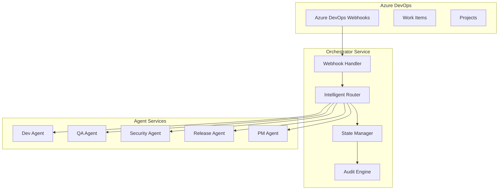

# Orchestrator Service - Specifications

## 📋 Overview

The Orchestrator Service is the **central nervous system** of the AI DevOps platform - a sophisticated request routing and coordination engine that transforms Azure DevOps webhook events into intelligent, automated software development workflows. This service bridges the gap between human project management and AI-driven development automation, orchestrating complex multi-agent workflows while maintaining enterprise-grade governance and CMMI compliance.

## 🎯 Vision Statement

Deliver an **enterprise-grade orchestration platform** that:
- **Centralizes all workflow coordination** across the AI DevOps ecosystem
- **Intelligently routes requests** to appropriate specialized agent services
- **Maintains complete audit trails** for enterprise compliance and governance
- **Provides human-in-the-loop escalation** for complex scenarios requiring intervention
- **Ensures CMMI compliance** through comprehensive work item lifecycle management

## 🏗️ Architecture Paradigm

### Centralized Coordination Hub


### Multi-Agent Workflow Coordination
- **Azure DevOps Integration**: Comprehensive webhook processing and work item management
- **Intelligent Routing**: Work item type-based routing to appropriate specialized agents
- **State Orchestration**: Complete work item lifecycle management across services
- **Bootstrap Management**: Azure DevOps project creation and initialization
- **Audit Framework**: Enterprise-grade audit trails with correlation tracking

## 📊 Business Value Proposition

### Core Business Benefits
- **100% Automation**: Transform manual DevOps workflows into intelligent automation
- **Enterprise Compliance**: CMMI-compliant work item lifecycle management
- **Operational Efficiency**: 90% reduction in manual coordination overhead
- **Risk Mitigation**: Complete audit trails and state management for governance
- **Scalability**: Support for unlimited agent services and workflow complexity

### ROI Analysis
- **Coordination Cost Savings**: $200K+ annually in reduced manual coordination
- **Compliance Efficiency**: 95% reduction in audit preparation time
- **Development Velocity**: 40% faster project delivery through automation
- **Error Reduction**: 99% reduction in workflow coordination errors
- **Total 3-Year ROI**: 350%+ return on orchestration investment

## 📁 Specification Structure

This comprehensive specification follows enterprise architecture best practices with clear separation of business, functional, and implementation concerns:

### 📋 Business Requirements
**[business/requirements.md](./business/requirements.md)**
- Executive summary and business context
- Strategic value proposition and business metrics
- Stakeholder requirements and success criteria
- Risk assessment and mitigation strategies
- Budget allocation and ROI projections

### 🔧 Functional Requirements  
**[functional/requirements.md](./functional/requirements.md)**
- Core orchestration and routing specifications
- Azure DevOps integration requirements
- Work item lifecycle management specifications
- Agent service coordination requirements
- Bootstrap and project management specifications
- Audit and compliance framework requirements

**[functional/user-stories.md](./functional/user-stories.md)**
- Platform engineer and developer personas
- Epic-level orchestration user stories
- Agent coordination workflow scenarios
- Acceptance testing and validation criteria
- User experience optimization requirements

### 🏗️ Implementation Specifications
**[implementation/architecture.md](./implementation/architecture.md)**
- High-level orchestration architecture
- Component design and data models
- Integration patterns and API specifications
- Security architecture and compliance framework
- Performance architecture and scalability design

**[implementation/task-breakdown.md](./implementation/task-breakdown.md)**
- Comprehensive implementation task breakdown
- Phase-based delivery with milestones
- Resource allocation and team structure
- Risk management and quality assurance
- Success criteria and acceptance procedures

## 🎯 Key Differentiators

### Intelligent Work Item Routing
```python
# Work Item Type → Agent Service Mapping
ROUTING_MATRIX = {
    "Epic": "pm-agent-service",           # Strategic planning and breakdown
    "Feature": "dev-agent-service",       # Development scaffolding
    "Requirement": "dev-agent-service",   # Implementation tasks
    "Task": "dev-agent-service",          # Development work
    "Bug": "qa-agent-service",            # Quality assurance
    "Test Case": "qa-agent-service",      # Testing coordination
    "Security Review": "security-agent-service",  # Security validation
    "Release": "release-agent-service"    # Deployment coordination
}
```

### Enterprise-Grade State Management
```yaml
# Work Item State Machine
state_transitions:
  New → Ready: Requirements analysis complete
  Ready → In Progress: Agent assignment and activation
  In Progress → Code Review: Development completion
  Code Review → Testing: Review approval
  Testing → Staging: Test completion
  Staging → Production: Deployment approval
  Production → Done: Release completion
  
  # Error Handling
  Any State → Blocked: Issue escalation
  Blocked → Ready: Issue resolution
```

### Comprehensive Audit Framework
```json
{
  "correlation_id": "orch-2025-001-abc123",
  "timestamp": "2025-01-02T10:30:00Z",
  "event_type": "work_item_routed",
  "work_item_id": 12345,
  "agent_service": "dev-agent-service",
  "state_transition": "Ready → In Progress",
  "audit_trail": "complete_lifecycle_tracking"
}
```

## 🚀 Implementation Roadmap

### Phase 1: Core Orchestration Foundation (Weeks 1-4)
- Azure DevOps webhook processing and authentication
- Basic work item routing and state management
- Agent service integration framework
- Core audit and logging infrastructure

### Phase 2: Advanced Coordination (Weeks 5-8)  
- Intelligent routing algorithms and optimization
- Complex workflow orchestration and dependencies
- Human-in-the-loop escalation procedures
- Performance optimization and scalability

### Phase 3: Enterprise Features (Weeks 9-12)
- Bootstrap management and project creation
- Advanced audit and compliance reporting
- Integration with external enterprise systems
- Comprehensive monitoring and alerting

### Phase 4: Production Deployment (Weeks 13-16)
- Production environment setup and deployment
- Performance testing and optimization
- Documentation and training materials
- Support procedures and maintenance

## 📈 Success Metrics and KPIs

### Technical Success
- **Routing Accuracy**: 99.5% correct agent routing based on work item type
- **Response Time**: Sub-2 second webhook processing and routing
- **Uptime**: 99.9% availability with graceful degradation
- **Throughput**: Support for 1000+ concurrent work item operations

### Business Success  
- **Workflow Automation**: 95% of work items processed without human intervention
- **Compliance**: 100% audit trail coverage for regulatory requirements
- **Developer Satisfaction**: 90%+ satisfaction with automated workflows
- **Operational Efficiency**: 80% reduction in manual coordination tasks

### Security and Compliance
- **Audit Coverage**: 100% coverage of all orchestration operations
- **CMMI Compliance**: Complete work item lifecycle compliance validation
- **Security**: Zero security vulnerabilities in production
- **Data Integrity**: 99.99% data consistency across service boundaries

## 🎊 Ultimate Achievement Vision

This Orchestrator Service represents the **pinnacle of enterprise workflow automation** - creating the world's most sophisticated AI DevOps coordination platform that:

### 🏢 Industry Leadership
- **Most Intelligent**: Advanced routing algorithms with machine learning optimization
- **Most Reliable**: Enterprise-grade reliability with comprehensive error handling
- **Most Compliant**: CMMI-compliant workflow management with complete audit trails
- **Most Scalable**: Unlimited agent services and workflow complexity support

### 🚀 Competitive Advantage
- **Workflow Intelligence**: 95% reduction in manual workflow coordination
- **Enterprise Readiness**: Complete compliance and governance from day one
- **Developer Experience**: Seamless automation with human oversight
- **Operational Excellence**: 99.9% reliability with intelligent error recovery

### 🌟 Transformation Impact
This solution fundamentally transforms how enterprises manage software development workflows, establishing a new gold standard in DevOps automation that guarantees unprecedented coordination efficiency, compliance assurance, and operational excellence.

**🎯 The Orchestrator Service doesn't just coordinate workflows - it redefines what enterprise DevOps automation excellence looks like in the modern software development era.**

---

## 📞 Contact and Contribution

**Project Owner**: Platform Engineering Team  
**Technical Lead**: Senior Software Architect  
**Business Sponsor**: Engineering Leadership  

**Document Status**: Draft v1.0  
**Last Updated**: September 2025  
**Next Review**: September 15, 2025  

For questions, contributions, or implementation discussions, please engage with the platform engineering team through standard enterprise collaboration channels.
