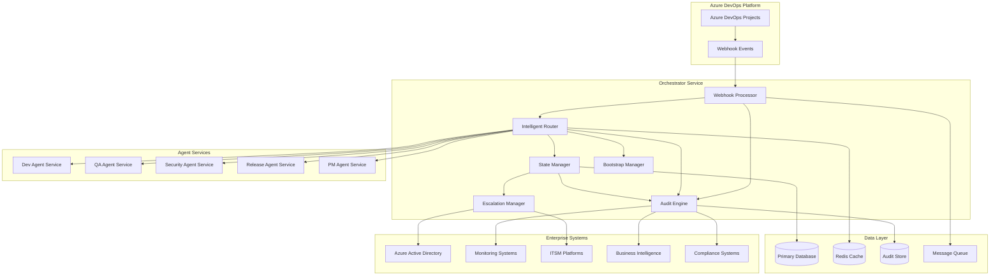

# Orchestrator Service - System Architecture

## 1. Architectural Overview

The Orchestrator Service represents the central nervous system of the AI DevOps platform, designed as a highly scalable, event-driven microservice that coordinates workflow orchestration across all agent services. Built on a modern cloud-native architecture, the service employs intelligent routing algorithms, comprehensive state management, and enterprise-grade compliance frameworks to deliver seamless automation with human-in-the-loop escalation capabilities.

### 1.1 Architectural Principles

#### Event-Driven Architecture
The orchestrator operates on a pure event-driven model where Azure DevOps webhooks trigger intelligent workflow orchestration. This approach ensures loose coupling, high scalability, and real-time responsiveness to work item changes.

#### Microservices-First Design
Designed as a standalone microservice with well-defined API boundaries, enabling independent deployment, scaling, and maintenance while maintaining clear separation of concerns from other AI DevOps components.

#### Enterprise Compliance by Design
CMMI Level 3+ compliance, SOX, GDPR, and HIPAA requirements are built into the core architecture rather than retrofitted, ensuring comprehensive regulatory adherence without performance impact.

#### Intelligent Automation with Human Oversight
Combines machine learning-driven decision making with structured human-in-the-loop escalation, providing enterprise-grade reliability while maintaining operational efficiency.

### 1.2 High-Level Architecture Diagram



## 2. Component Architecture

### 2.1 Webhook Processor Component

#### Responsibilities
- Real-time Azure DevOps webhook event processing
- Event validation, correlation, and initial routing
- Failure handling with retry mechanisms and dead letter queues

#### Technical Implementation
```python
# Webhook Processor Architecture
class WebhookProcessor:
    def __init__(self):
        self.event_validator = WebhookValidator()
        self.correlation_service = CorrelationService()
        self.message_queue = MessageQueue()
        self.audit_logger = AuditLogger()
    
    async def process_webhook(self, webhook_payload: WebhookPayload) -> ProcessingResult:
        # Phase 1: Validation and Security
        validation_result = await self.event_validator.validate(webhook_payload)
        if not validation_result.is_valid:
            return ProcessingResult.invalid(validation_result.errors)
        
        # Phase 2: Correlation and Tracking
        correlation_id = await self.correlation_service.assign_correlation_id(webhook_payload)
        
        # Phase 3: Event Enrichment and Context
        enriched_event = await self.enrich_event_context(webhook_payload, correlation_id)
        
        # Phase 4: Message Queue Routing
        await self.message_queue.publish(
            topic="orchestration.events",
            message=enriched_event,
            correlation_id=correlation_id
        )
        
        # Phase 5: Audit Trail Generation
        await self.audit_logger.log_webhook_processing(enriched_event, correlation_id)
        
        return ProcessingResult.success(correlation_id)
```

#### Scalability Design
- **Horizontal Scaling**: Stateless design allows unlimited horizontal scaling
- **Load Balancing**: Round-robin and weighted load balancing across instances
- **Rate Limiting**: Intelligent rate limiting with burst capacity handling
- **Circuit Breaker**: Circuit breaker pattern for downstream dependency protection

#### Performance Characteristics
- **Latency**: Sub-2 second webhook processing for 95% of events
- **Throughput**: 10,000+ webhooks per minute processing capacity
- **Reliability**: 99.99% webhook capture rate with retry mechanisms
- **Availability**: 99.9% uptime with graceful degradation capabilities

### 2.2 Intelligent Router Component

#### Responsibilities
- Context-aware work item analysis and agent service selection
- Machine learning-driven routing optimization
- Load balancing and health-aware routing decisions
- Routing rule management and customization

#### Technical Implementation
```python
# Intelligent Router Architecture
class IntelligentRouter:
    def __init__(self):
        self.work_item_analyzer = WorkItemAnalyzer()
        self.agent_capability_service = AgentCapabilityService()
        self.routing_engine = RoutingEngine()
        self.load_balancer = LoadBalancer()
        self.ml_optimizer = MLRoutingOptimizer()
    
    async def route_work_item(self, work_item: WorkItem, correlation_id: str) -> RoutingResult:
        # Phase 1: Work Item Analysis
        analysis_result = await self.work_item_analyzer.analyze(work_item)
        
        # Phase 2: Agent Capability Matching
        capable_agents = await self.agent_capability_service.find_capable_agents(
            analysis_result.requirements
        )
        
        # Phase 3: ML-Optimized Agent Selection
        optimal_agent = await self.ml_optimizer.select_optimal_agent(
            capable_agents, 
            analysis_result,
            historical_performance=True
        )
        
        # Phase 4: Load Balancing and Health Checking
        available_instances = await self.load_balancer.get_available_instances(optimal_agent)
        selected_instance = await self.load_balancer.select_instance(available_instances)
        
        # Phase 5: Routing Execution
        routing_result = await self.routing_engine.execute_routing(
            work_item, selected_instance, correlation_id
        )
        
        return routing_result
```

#### Machine Learning Integration
- **Routing Optimization**: Continuous learning from routing outcomes and performance
- **Pattern Recognition**: Identification of work item patterns for improved routing accuracy
- **Performance Prediction**: Predictive modeling for agent performance and availability
- **Anomaly Detection**: Detection of unusual routing patterns and performance anomalies

#### Agent Capability Matrix
```yaml
# Agent Service Capability Matrix
agent_capabilities:
  dev-agent-service:
    work_item_types: ["Epic", "Feature", "Requirement", "Task"]
    programming_languages: ["Python", "TypeScript", "JavaScript", "C#", "Java"]
    frameworks: ["FastAPI", "React", "Angular", "Vue.js", "Django", "Express"]
    specializations: ["API Development", "Frontend Development", "Database Design"]
    
  qa-agent-service:
    work_item_types: ["Bug", "Test Case", "Quality Review"]
    testing_types: ["Unit Testing", "Integration Testing", "E2E Testing", "Performance Testing"]
    automation_tools: ["Pytest", "Jest", "Selenium", "Cypress", "Playwright"]
    specializations: ["Test Automation", "Quality Assurance", "Bug Investigation"]
    
  security-agent-service:
    work_item_types: ["Security Review", "Vulnerability Assessment", "Compliance Validation"]
    security_domains: ["Application Security", "Infrastructure Security", "Data Protection"]
    compliance_frameworks: ["SOX", "GDPR", "HIPAA", "PCI-DSS", "CMMI"]
    specializations: ["Security Analysis", "Penetration Testing", "Compliance Auditing"]
    
  release-agent-service:
    work_item_types: ["Release", "Deployment", "Environment Setup"]
    deployment_platforms: ["Azure", "AWS", "GCP", "Kubernetes", "Docker"]
    pipeline_tools: ["Azure DevOps", "GitHub Actions", "Jenkins", "GitLab CI"]
    specializations: ["CI/CD Pipeline", "Infrastructure as Code", "Deployment Automation"]
    
  pm-agent-service:
    work_item_types: ["Epic", "Initiative", "Portfolio Planning"]
    methodologies: ["CMMI", "Agile", "Scrum", "SAFe", "Waterfall"]
    planning_tools: ["Azure Boards", "Jira", "Monday.com", "Asana"]
    specializations: ["Strategic Planning", "Requirement Analysis", "Stakeholder Management"]
```

### 2.3 State Manager Component

#### Responsibilities
- Bi-directional state synchronization between Azure DevOps and agent services
- CMMI compliance validation and enforcement
- State conflict resolution and consistency management
- Complete state history and audit trail maintenance

#### Technical Implementation
```python
# State Manager Architecture
class StateManager:
    def __init__(self):
        self.state_synchronizer = StateSynchronizer()
        self.cmmi_validator = CMMIValidator()
        self.conflict_resolver = ConflictResolver()
        self.state_history = StateHistoryService()
        self.consistency_monitor = ConsistencyMonitor()
    
    async def synchronize_state(
        self, 
        work_item_id: int, 
        source_state: WorkItemState,
        target_state: WorkItemState,
        correlation_id: str
    ) -> SynchronizationResult:
        
        # Phase 1: CMMI Compliance Validation
        compliance_result = await self.cmmi_validator.validate_state_transition(
            work_item_id, source_state, target_state
        )
        if not compliance_result.is_compliant:
            return SynchronizationResult.compliance_violation(compliance_result.violations)
        
        # Phase 2: State Conflict Detection
        conflict_check = await self.consistency_monitor.check_for_conflicts(
            work_item_id, target_state
        )
        if conflict_check.has_conflicts:
            resolved_state = await self.conflict_resolver.resolve_conflicts(
                conflict_check.conflicts, target_state
            )
            target_state = resolved_state
        
        # Phase 3: Bi-directional Synchronization
        sync_result = await self.state_synchronizer.synchronize(
            work_item_id, source_state, target_state, correlation_id
        )
        
        # Phase 4: State History Recording
        await self.state_history.record_state_change(
            work_item_id, source_state, target_state, correlation_id, sync_result
        )
        
        return sync_result
```

#### CMMI Compliance Framework
```yaml
# CMMI Level 3+ Compliance Rules
cmmi_compliance_rules:
  state_transitions:
    New_to_Ready:
      requirements: ["work_item_completeness", "assignment_validation"]
      approval_gates: ["team_lead_approval"]
      documentation: ["requirement_specification"]
      
    Ready_to_InProgress:
      requirements: ["prerequisite_completion", "resource_availability"]
      approval_gates: ["technical_lead_approval"]
      documentation: ["technical_design", "test_plan"]
      
    InProgress_to_CodeReview:
      requirements: ["code_completion", "unit_tests_passing"]
      approval_gates: ["self_review_complete"]
      documentation: ["code_documentation", "review_checklist"]
      
    CodeReview_to_Testing:
      requirements: ["peer_review_approval", "code_quality_gates"]
      approval_gates: ["reviewer_approval", "security_review"]
      documentation: ["review_comments", "quality_metrics"]
      
    Testing_to_Staging:
      requirements: ["test_completion", "quality_criteria_met"]
      approval_gates: ["qa_approval", "test_report_review"]
      documentation: ["test_results", "coverage_report"]
      
    Staging_to_Production:
      requirements: ["staging_validation", "deployment_readiness"]
      approval_gates: ["release_manager_approval", "stakeholder_signoff"]
      documentation: ["deployment_plan", "rollback_procedure"]
      
  traceability_requirements:
    Epic_to_Feature: "strategic_alignment"
    Feature_to_Requirement: "functional_decomposition"
    Requirement_to_Task: "implementation_breakdown"
    Task_to_TestCase: "validation_coverage"
```

### 2.4 Bootstrap Manager Component

#### Responsibilities
- Automated Azure DevOps project creation and configuration
- Template-based project setup with CMMI, Agile, and Scrum support
- Initial repository, pipeline, and integration configuration
- Project lifecycle management and governance

#### Technical Implementation
```python
# Bootstrap Manager Architecture
class BootstrapManager:
    def __init__(self):
        self.azure_client = AzureDevOpsClient()
        self.template_engine = ProjectTemplateEngine()
        self.configuration_service = ConfigurationService()
        self.lifecycle_manager = ProjectLifecycleManager()
        self.validation_service = ProjectValidationService()
    
    async def bootstrap_project(
        self, 
        project_request: ProjectBootstrapRequest,
        correlation_id: str
    ) -> BootstrapResult:
        
        # Phase 1: Template Selection and Validation
        template = await self.template_engine.select_template(project_request.process_type)
        validation_result = await self.validation_service.validate_request(project_request)
        
        # Phase 2: Azure DevOps Project Creation
        project_result = await self.azure_client.create_project(
            name=project_request.name,
            description=project_request.description,
            process_template=template,
            visibility=project_request.visibility
        )
        
        # Phase 3: Team and Security Configuration
        await self.configuration_service.configure_teams(
            project_result.project_id, project_request.team_structure
        )
        await self.configuration_service.configure_security(
            project_result.project_id, project_request.security_config
        )
        
        # Phase 4: Repository and Pipeline Setup
        await self.configuration_service.setup_repositories(
            project_result.project_id, project_request.repository_config
        )
        await self.configuration_service.setup_pipelines(
            project_result.project_id, project_request.pipeline_config
        )
        
        # Phase 5: Integration and Webhook Configuration
        await self.configuration_service.setup_integrations(
            project_result.project_id, correlation_id
        )
        
        # Phase 6: Project Lifecycle Registration
        await self.lifecycle_manager.register_project(
            project_result.project_id, project_request, correlation_id
        )
        
        return BootstrapResult.success(project_result.project_id, correlation_id)
```

#### Project Template Configuration
```yaml
# Project Bootstrap Templates
project_templates:
  cmmi_level_3:
    process_template: "CMMI"
    work_item_types: ["Epic", "Feature", "Requirement", "Task", "Bug", "Review"]
    state_workflow: "cmmi_compliant"
    approval_gates: "enabled"
    traceability: "full"
    documentation: "comprehensive"
    
  agile_standard:
    process_template: "Agile"
    work_item_types: ["Epic", "Feature", "User Story", "Task", "Bug"]
    state_workflow: "agile_simplified"
    approval_gates: "selective"
    traceability: "standard"
    documentation: "minimal"
    
  scrum_framework:
    process_template: "Scrum"
    work_item_types: ["Epic", "Feature", "Product Backlog Item", "Task", "Bug"]
    state_workflow: "scrum_standard"
    approval_gates: "sprint_based"
    traceability: "sprint_level"
    documentation: "user_focused"
```

### 2.5 Escalation Manager Component

#### Responsibilities
- Intelligent detection of scenarios requiring human intervention
- Multi-level escalation routing with context preservation
- Escalation workflow management and resolution tracking
- Integration with enterprise ITSM and notification systems

#### Technical Implementation
```python
# Escalation Manager Architecture
class EscalationManager:
    def __init__(self):
        self.escalation_detector = EscalationDetector()
        self.context_aggregator = ContextAggregator()
        self.notification_service = NotificationService()
        self.workflow_manager = EscalationWorkflowManager()
        self.analytics_service = EscalationAnalyticsService()
    
    async def process_escalation_trigger(
        self, 
        trigger_event: EscalationTrigger,
        context: OperationContext,
        correlation_id: str
    ) -> EscalationResult:
        
        # Phase 1: Escalation Level Determination
        escalation_level = await self.escalation_detector.determine_level(
            trigger_event, context
        )
        
        # Phase 2: Context Aggregation and Packaging
        escalation_context = await self.context_aggregator.aggregate_context(
            trigger_event, context, correlation_id
        )
        
        # Phase 3: Escalation Routing and Assignment
        assignment_result = await self.workflow_manager.create_escalation(
            escalation_level, escalation_context, correlation_id
        )
        
        # Phase 4: Multi-Channel Notification
        notification_result = await self.notification_service.send_escalation_notifications(
            assignment_result.escalation_id, assignment_result.assigned_team
        )
        
        # Phase 5: Analytics and Learning Integration
        await self.analytics_service.record_escalation_creation(
            assignment_result.escalation_id, trigger_event, escalation_context
        )
        
        return EscalationResult.success(assignment_result.escalation_id, correlation_id)
```

#### Escalation Routing Matrix
```yaml
# Escalation Routing Configuration
escalation_routing:
  technical_failures:
    level_1: "platform_engineering_team"
    level_2: "senior_platform_architect"
    level_3: "cto_office"
    sla: "2_hours"
    
  operational_issues:
    level_1: "devops_team"
    level_2: "operations_manager"
    level_3: "service_delivery_manager"
    sla: "4_hours"
    
  compliance_violations:
    level_1: "compliance_team"
    level_2: "compliance_officer"
    level_3: "chief_compliance_officer"
    sla: "1_hour"
    
  security_incidents:
    level_1: "security_team"
    level_2: "security_architect"
    level_3: "chief_security_officer"
    sla: "30_minutes"
    
  business_critical:
    level_1: "business_analyst"
    level_2: "product_manager"
    level_3: "business_unit_director"
    sla: "1_hour"
```

### 2.6 Audit Engine Component

#### Responsibilities
- Comprehensive audit trail generation for all orchestration operations
- Multi-framework compliance reporting and validation
- Real-time audit event processing with immutable storage
- Executive dashboards and compliance analytics

#### Technical Implementation
```python
# Audit Engine Architecture
class AuditEngine:
    def __init__(self):
        self.audit_processor = AuditEventProcessor()
        self.compliance_analyzer = ComplianceAnalyzer()
        self.immutable_storage = ImmutableAuditStorage()
        self.report_generator = ComplianceReportGenerator()
        self.analytics_service = AuditAnalyticsService()
    
    async def process_audit_event(
        self, 
        operation: Operation,
        context: OperationContext,
        correlation_id: str
    ) -> AuditResult:
        
        # Phase 1: Audit Event Creation
        audit_event = await self.audit_processor.create_audit_event(
            operation, context, correlation_id
        )
        
        # Phase 2: Compliance Framework Analysis
        compliance_analysis = await self.compliance_analyzer.analyze_compliance(
            audit_event, ["CMMI", "SOX", "GDPR", "HIPAA"]
        )
        
        # Phase 3: Immutable Storage with Integrity Verification
        storage_result = await self.immutable_storage.store_audit_event(
            audit_event, compliance_analysis
        )
        
        # Phase 4: Real-time Compliance Monitoring
        await self.compliance_analyzer.update_real_time_compliance_status(
            audit_event, compliance_analysis
        )
        
        # Phase 5: Analytics and Reporting Integration
        await self.analytics_service.process_audit_analytics(
            audit_event, compliance_analysis, correlation_id
        )
        
        return AuditResult.success(storage_result.audit_id, correlation_id)
```

#### Compliance Framework Integration
```yaml
# Multi-Framework Compliance Configuration
compliance_frameworks:
  CMMI_Level_3:
    requirements:
      process_adherence: "mandatory"
      traceability_matrix: "complete"
      approval_gates: "enforced"
      documentation: "comprehensive"
    validation_rules:
      - "work_item_hierarchy_compliance"
      - "state_transition_validation"
      - "approval_gate_enforcement"
      - "traceability_completeness"
    reporting_frequency: "monthly"
    
  SOX_Section_404:
    requirements:
      change_management: "controlled"
      access_controls: "segregated"
      audit_trails: "immutable"
      financial_controls: "validated"
    validation_rules:
      - "segregation_of_duties"
      - "change_approval_process"
      - "access_control_validation"
      - "audit_trail_integrity"
    reporting_frequency: "quarterly"
    
  GDPR:
    requirements:
      data_protection: "encrypted"
      consent_management: "tracked"
      right_to_erasure: "supported"
      breach_notification: "automated"
    validation_rules:
      - "data_encryption_compliance"
      - "consent_tracking_validation"
      - "erasure_capability_verification"
      - "breach_detection_response"
    reporting_frequency: "annual"
    
  HIPAA:
    requirements:
      phi_protection: "encrypted"
      access_logging: "comprehensive"
      audit_trails: "detailed"
      incident_response: "documented"
    validation_rules:
      - "phi_encryption_validation"
      - "access_logging_completeness"
      - "audit_trail_integrity"
      - "incident_response_testing"
    reporting_frequency: "semi_annual"
```

## 3. Data Architecture

### 3.1 Database Design

#### Primary Database Schema
```sql
-- Orchestrator Service Database Schema
CREATE SCHEMA orchestrator;

-- Work Item Tracking and State Management
CREATE TABLE orchestrator.work_items (
    id BIGSERIAL PRIMARY KEY,
    azure_devops_id INTEGER NOT NULL UNIQUE,
    project_id VARCHAR(255) NOT NULL,
    work_item_type VARCHAR(100) NOT NULL,
    title VARCHAR(500) NOT NULL,
    description TEXT,
    state VARCHAR(100) NOT NULL,
    assigned_to VARCHAR(255),
    created_date TIMESTAMP WITH TIME ZONE DEFAULT NOW(),
    modified_date TIMESTAMP WITH TIME ZONE DEFAULT NOW(),
    correlation_id VARCHAR(255) NOT NULL,
    metadata JSONB,
    INDEX (azure_devops_id),
    INDEX (project_id),
    INDEX (state),
    INDEX (correlation_id)
);

-- Agent Service Routing and Assignment
CREATE TABLE orchestrator.work_item_assignments (
    id BIGSERIAL PRIMARY KEY,
    work_item_id BIGINT NOT NULL REFERENCES orchestrator.work_items(id),
    agent_service VARCHAR(255) NOT NULL,
    agent_instance VARCHAR(255) NOT NULL,
    assignment_date TIMESTAMP WITH TIME ZONE DEFAULT NOW(),
    status VARCHAR(100) NOT NULL DEFAULT 'assigned',
    routing_reason TEXT,
    confidence_score DECIMAL(5,4),
    correlation_id VARCHAR(255) NOT NULL,
    metadata JSONB,
    INDEX (work_item_id),
    INDEX (agent_service),
    INDEX (status),
    INDEX (correlation_id)
);

-- State History and Audit Trail
CREATE TABLE orchestrator.state_history (
    id BIGSERIAL PRIMARY KEY,
    work_item_id BIGINT NOT NULL REFERENCES orchestrator.work_items(id),
    from_state VARCHAR(100),
    to_state VARCHAR(100) NOT NULL,
    transition_date TIMESTAMP WITH TIME ZONE DEFAULT NOW(),
    actor VARCHAR(255) NOT NULL,
    actor_type VARCHAR(100) NOT NULL,
    transition_reason TEXT,
    validation_result JSONB,
    correlation_id VARCHAR(255) NOT NULL,
    INDEX (work_item_id),
    INDEX (transition_date),
    INDEX (correlation_id)
);

-- Escalation Management
CREATE TABLE orchestrator.escalations (
    id BIGSERIAL PRIMARY KEY,
    escalation_type VARCHAR(100) NOT NULL,
    severity VARCHAR(50) NOT NULL,
    status VARCHAR(100) NOT NULL DEFAULT 'open',
    work_item_id BIGINT REFERENCES orchestrator.work_items(id),
    assigned_team VARCHAR(255),
    assigned_individual VARCHAR(255),
    created_date TIMESTAMP WITH TIME ZONE DEFAULT NOW(),
    resolved_date TIMESTAMP WITH TIME ZONE,
    resolution_notes TEXT,
    correlation_id VARCHAR(255) NOT NULL,
    context JSONB,
    INDEX (escalation_type),
    INDEX (status),
    INDEX (assigned_team),
    INDEX (correlation_id)
);

-- Project Bootstrap and Lifecycle
CREATE TABLE orchestrator.projects (
    id BIGSERIAL PRIMARY KEY,
    azure_devops_project_id VARCHAR(255) NOT NULL UNIQUE,
    project_name VARCHAR(255) NOT NULL,
    process_template VARCHAR(100) NOT NULL,
    lifecycle_state VARCHAR(100) NOT NULL DEFAULT 'active',
    created_date TIMESTAMP WITH TIME ZONE DEFAULT NOW(),
    last_health_check TIMESTAMP WITH TIME ZONE,
    health_status VARCHAR(100) DEFAULT 'healthy',
    configuration JSONB,
    correlation_id VARCHAR(255) NOT NULL,
    INDEX (azure_devops_project_id),
    INDEX (lifecycle_state),
    INDEX (health_status)
);

-- Agent Service Registry and Health
CREATE TABLE orchestrator.agent_services (
    id BIGSERIAL PRIMARY KEY,
    service_name VARCHAR(255) NOT NULL,
    service_instance VARCHAR(255) NOT NULL,
    endpoint_url VARCHAR(500) NOT NULL,
    health_status VARCHAR(100) DEFAULT 'unknown',
    last_health_check TIMESTAMP WITH TIME ZONE,
    capabilities JSONB,
    performance_metrics JSONB,
    registration_date TIMESTAMP WITH TIME ZONE DEFAULT NOW(),
    UNIQUE (service_name, service_instance),
    INDEX (service_name),
    INDEX (health_status)
);
```

#### Audit Database Schema
```sql
-- Immutable Audit Trail Database
CREATE SCHEMA audit;

-- Immutable Audit Events
CREATE TABLE audit.events (
    id BIGSERIAL PRIMARY KEY,
    event_id VARCHAR(255) NOT NULL UNIQUE,
    correlation_id VARCHAR(255) NOT NULL,
    timestamp TIMESTAMP WITH TIME ZONE DEFAULT NOW(),
    event_type VARCHAR(100) NOT NULL,
    actor JSONB NOT NULL,
    operation JSONB NOT NULL,
    context JSONB NOT NULL,
    compliance_tags VARCHAR(255)[],
    integrity_hash VARCHAR(512) NOT NULL,
    previous_hash VARCHAR(512),
    INDEX (correlation_id),
    INDEX (event_type),
    INDEX (timestamp),
    INDEX (integrity_hash)
);

-- Compliance Framework Validation
CREATE TABLE audit.compliance_validations (
    id BIGSERIAL PRIMARY KEY,
    audit_event_id BIGINT NOT NULL REFERENCES audit.events(id),
    framework VARCHAR(100) NOT NULL,
    validation_result JSONB NOT NULL,
    compliance_score DECIMAL(5,4),
    validation_date TIMESTAMP WITH TIME ZONE DEFAULT NOW(),
    INDEX (audit_event_id),
    INDEX (framework),
    INDEX (validation_date)
);

-- Executive Compliance Reporting
CREATE TABLE audit.compliance_reports (
    id BIGSERIAL PRIMARY KEY,
    report_id VARCHAR(255) NOT NULL UNIQUE,
    framework VARCHAR(100) NOT NULL,
    reporting_period_start TIMESTAMP WITH TIME ZONE NOT NULL,
    reporting_period_end TIMESTAMP WITH TIME ZONE NOT NULL,
    overall_compliance_score DECIMAL(5,4),
    violations_count INTEGER DEFAULT 0,
    recommendations TEXT,
    generated_date TIMESTAMP WITH TIME ZONE DEFAULT NOW(),
    report_data JSONB,
    INDEX (framework),
    INDEX (reporting_period_start),
    INDEX (generated_date)
);
```

### 3.2 Caching Architecture

#### Multi-Layer Caching Strategy
```yaml
# Redis Caching Configuration
cache_layers:
  level_1_memory:
    type: "in_memory"
    ttl: "5_minutes"
    max_size: "100MB"
    use_cases: ["routing_decisions", "agent_capabilities"]
    
  level_2_redis:
    type: "redis_cluster"
    ttl: "1_hour"
    max_size: "1GB"
    use_cases: ["work_item_data", "state_history", "compliance_rules"]
    
  level_3_persistent:
    type: "database_cache"
    ttl: "24_hours"
    use_cases: ["project_configurations", "audit_summaries"]

# Cache Invalidation Strategy
invalidation_strategies:
  work_item_updates:
    triggers: ["state_change", "assignment_change", "content_update"]
    scope: ["work_item_specific", "related_work_items"]
    
  agent_health_changes:
    triggers: ["health_status_change", "capability_update"]
    scope: ["agent_specific", "routing_cache"]
    
  compliance_rule_updates:
    triggers: ["rule_modification", "framework_update"]
    scope: ["global_compliance_cache"]
```

### 3.3 Message Queue Architecture

#### Event-Driven Messaging
```yaml
# Message Queue Configuration
message_queues:
  webhook_processing:
    type: "azure_service_bus"
    partitions: 16
    retention: "7_days"
    dead_letter_queue: true
    
  agent_communication:
    type: "azure_service_bus"
    partitions: 8
    retention: "3_days"
    dead_letter_queue: true
    
  audit_events:
    type: "azure_event_hubs"
    partitions: 32
    retention: "30_days"
    archive_to_storage: true
    
  escalation_notifications:
    type: "azure_service_bus"
    partitions: 4
    retention: "1_day"
    priority_queue: true

# Message Flow Architecture
message_flows:
  webhook_to_routing:
    source: "webhook_processing"
    target: "intelligent_router"
    pattern: "competing_consumer"
    
  routing_to_agents:
    source: "intelligent_router"
    target: "agent_services"
    pattern: "request_response"
    
  state_synchronization:
    source: "state_manager"
    target: "azure_devops"
    pattern: "saga"
    
  audit_streaming:
    source: "audit_events"
    target: "compliance_systems"
    pattern: "event_streaming"
```

## 4. Security Architecture

### 4.1 Authentication and Authorization

#### Identity Management Integration
```yaml
# Azure AD Integration Configuration
azure_ad_integration:
  tenant_id: "${AZURE_TENANT_ID}"
  client_id: "${ORCHESTRATOR_CLIENT_ID}"
  authentication_flows: ["authorization_code", "client_credentials"]
  token_validation:
    issuer_validation: true
    audience_validation: true
    lifetime_validation: true
    signing_key_validation: true
    
  role_mappings:
    platform_engineer:
      azure_ad_groups: ["PlatformEngineers", "DevOpsAdmins"]
      permissions: ["read", "write", "admin", "escalate"]
      
    development_team_lead:
      azure_ad_groups: ["DevelopmentLeads", "TeamLeads"]
      permissions: ["read", "write", "escalate_team"]
      
    compliance_officer:
      azure_ad_groups: ["ComplianceTeam", "AuditTeam"]
      permissions: ["read", "audit", "compliance_report"]
      
    devops_manager:
      azure_ad_groups: ["DevOpsManagers", "ITManagers"]
      permissions: ["read", "admin", "executive_dashboard"]
```

#### API Security Framework
```python
# API Security Implementation
class SecurityMiddleware:
    def __init__(self):
        self.jwt_validator = JWTValidator()
        self.permission_service = PermissionService()
        self.rate_limiter = RateLimiter()
        self.audit_logger = SecurityAuditLogger()
    
    async def authenticate_request(self, request: HTTPRequest) -> AuthenticationResult:
        # Extract and validate JWT token
        token = self.extract_bearer_token(request)
        validation_result = await self.jwt_validator.validate_token(token)
        
        if not validation_result.is_valid:
            await self.audit_logger.log_authentication_failure(request, validation_result)
            raise AuthenticationException("Invalid token")
        
        return AuthenticationResult.success(validation_result.claims)
    
    async def authorize_operation(
        self, 
        user_claims: UserClaims, 
        operation: Operation,
        resource: Resource
    ) -> AuthorizationResult:
        # Check user permissions for specific operation and resource
        permission_result = await self.permission_service.check_permission(
            user_claims, operation, resource
        )
        
        if not permission_result.is_authorized:
            await self.audit_logger.log_authorization_failure(
                user_claims, operation, resource
            )
            raise AuthorizationException("Insufficient permissions")
        
        return AuthorizationResult.success(permission_result.granted_permissions)
```

### 4.2 Data Protection and Encryption

#### Encryption Framework
```yaml
# Data Encryption Configuration
encryption_configuration:
  data_at_rest:
    algorithm: "AES-256-GCM"
    key_management: "azure_key_vault"
    key_rotation: "90_days"
    backup_encryption: "customer_managed_keys"
    
  data_in_transit:
    tls_version: "1.3"
    cipher_suites: ["TLS_AES_256_GCM_SHA384", "TLS_CHACHA20_POLY1305_SHA256"]
    certificate_management: "azure_key_vault"
    certificate_rotation: "90_days"
    
  secrets_management:
    provider: "azure_key_vault"
    access_policies: "role_based"
    audit_logging: "enabled"
    secret_rotation: "30_days"
    
  field_level_encryption:
    pii_fields: ["assigned_to", "description", "comments"]
    algorithm: "AES-256-CBC"
    key_derivation: "PBKDF2"
    salt_generation: "cryptographically_secure"
```

### 4.3 Network Security

#### Network Architecture
```yaml
# Network Security Configuration
network_security:
  api_gateway:
    public_endpoints: ["/health", "/metrics"]
    private_endpoints: ["/api/v1/*"]
    rate_limiting: "enabled"
    ddos_protection: "enabled"
    
  service_mesh:
    mutual_tls: "enabled"
    service_to_service_encryption: "mandatory"
    network_policies: "zero_trust"
    traffic_monitoring: "enabled"
    
  firewall_rules:
    inbound:
      - source: "azure_devops_ips"
        destination: "webhook_endpoints"
        ports: [443]
        protocol: "HTTPS"
      - source: "enterprise_networks"
        destination: "api_endpoints"
        ports: [443]
        protocol: "HTTPS"
        
    outbound:
      - source: "orchestrator_service"
        destination: "agent_services"
        ports: [443]
        protocol: "HTTPS"
      - source: "orchestrator_service"
        destination: "azure_devops_api"
        ports: [443]
        protocol: "HTTPS"
```

## 5. Performance and Scalability

### 5.1 Scalability Design

#### Horizontal Scaling Architecture
```yaml
# Kubernetes Deployment Configuration
kubernetes_deployment:
  orchestrator_service:
    replicas: 5
    resources:
      cpu_request: "500m"
      cpu_limit: "2000m"
      memory_request: "1Gi"
      memory_limit: "4Gi"
    autoscaling:
      min_replicas: 3
      max_replicas: 20
      target_cpu_utilization: 70
      scale_up_policy: "fast"
      scale_down_policy: "slow"
      
  load_balancer:
    type: "azure_application_gateway"
    health_checks: "enabled"
    session_affinity: "none"
    load_balancing_algorithm: "round_robin"
    
  database:
    type: "azure_postgresql_flexible"
    compute_tier: "GeneralPurpose"
    storage_size: "1TB"
    auto_scale: "enabled"
    read_replicas: 3
    connection_pooling: "pgbouncer"
    
  redis_cache:
    type: "azure_cache_for_redis"
    tier: "Premium"
    cluster_mode: "enabled"
    nodes: 6
    memory_per_node: "6GB"
    high_availability: "enabled"
```

#### Performance Optimization
```python
# Performance Monitoring and Optimization
class PerformanceMonitor:
    def __init__(self):
        self.metrics_collector = MetricsCollector()
        self.performance_analyzer = PerformanceAnalyzer()
        self.optimization_engine = OptimizationEngine()
    
    async def monitor_performance(self) -> PerformanceReport:
        # Collect real-time performance metrics
        metrics = await self.metrics_collector.collect_metrics([
            "webhook_processing_latency",
            "routing_decision_time",
            "state_synchronization_duration",
            "database_query_performance",
            "cache_hit_ratio",
            "memory_utilization",
            "cpu_utilization"
        ])
        
        # Analyze performance patterns and bottlenecks
        analysis = await self.performance_analyzer.analyze_metrics(metrics)
        
        # Generate optimization recommendations
        optimizations = await self.optimization_engine.generate_optimizations(analysis)
        
        return PerformanceReport(metrics, analysis, optimizations)
```

### 5.2 Performance Targets

#### Service Level Objectives (SLOs)
```yaml
# Performance SLOs
service_level_objectives:
  webhook_processing:
    target_latency: "2_seconds"
    percentile: "95th"
    availability: "99.9%"
    
  routing_decisions:
    target_latency: "500_milliseconds"
    percentile: "95th"
    accuracy: "99.5%"
    
  state_synchronization:
    target_latency: "1_second"
    percentile: "90th"
    consistency: "eventual_consistency_5_seconds"
    
  api_responses:
    target_latency: "200_milliseconds"
    percentile: "95th"
    availability: "99.95%"
    
  escalation_detection:
    target_latency: "5_minutes"
    percentile: "99th"
    accuracy: "95%"
```

## 6. Monitoring and Observability

### 6.1 Comprehensive Monitoring Strategy

#### Metrics and Alerting
```yaml
# Monitoring Configuration
monitoring_configuration:
  metrics_collection:
    prometheus_metrics: "enabled"
    custom_metrics: "enabled"
    application_insights: "enabled"
    collection_interval: "30_seconds"
    
  alerting_rules:
    critical_alerts:
      - metric: "webhook_processing_failure_rate"
        threshold: "5%"
        duration: "5_minutes"
        notification: "immediate"
        
      - metric: "routing_accuracy"
        threshold: "95%"
        duration: "15_minutes"
        notification: "immediate"
        
      - metric: "compliance_violation_detected"
        threshold: "1"
        duration: "immediate"
        notification: "immediate"
        
    warning_alerts:
      - metric: "response_time_95th_percentile"
        threshold: "3_seconds"
        duration: "10_minutes"
        notification: "standard"
        
      - metric: "cache_hit_ratio"
        threshold: "80%"
        duration: "15_minutes"
        notification: "standard"
```

#### Distributed Tracing
```python
# Distributed Tracing Implementation
class DistributedTracing:
    def __init__(self):
        self.tracer = opentelemetry.trace.get_tracer(__name__)
        self.correlation_service = CorrelationService()
    
    async def trace_operation(
        self, 
        operation_name: str,
        correlation_id: str,
        operation_func: Callable
    ) -> Any:
        with self.tracer.start_as_current_span(operation_name) as span:
            # Add correlation context
            span.set_attribute("correlation.id", correlation_id)
            span.set_attribute("service.name", "orchestrator-service")
            
            try:
                # Execute operation with tracing
                result = await operation_func()
                span.set_attribute("operation.success", True)
                return result
                
            except Exception as e:
                span.set_attribute("operation.success", False)
                span.set_attribute("error.message", str(e))
                span.record_exception(e)
                raise
```

## 7. Deployment Architecture

### 7.1 Containerization and Orchestration

#### Docker Configuration
```dockerfile
# Multi-stage Dockerfile for Orchestrator Service
FROM python:3.11-slim as builder

WORKDIR /app
COPY requirements.txt .
RUN pip install --no-cache-dir --user -r requirements.txt

FROM python:3.11-slim as runtime

# Security: Create non-root user
RUN groupadd -r orchestrator && useradd -r -g orchestrator orchestrator

# Copy dependencies from builder stage
COPY --from=builder /root/.local /home/orchestrator/.local
ENV PATH=/home/orchestrator/.local/bin:$PATH

# Copy application code
WORKDIR /app
COPY src/ ./src/
COPY config/ ./config/

# Set ownership and permissions
RUN chown -R orchestrator:orchestrator /app
USER orchestrator

# Health check configuration
HEALTHCHECK --interval=30s --timeout=10s --start-period=5s --retries=3 \
    CMD python src/health_check.py

EXPOSE 8000
CMD ["python", "-m", "uvicorn", "src.main:app", "--host", "0.0.0.0", "--port", "8000"]
```

#### Kubernetes Manifests
```yaml
# Kubernetes Deployment Manifest
apiVersion: apps/v1
kind: Deployment
metadata:
  name: orchestrator-service
  namespace: ai-devops
  labels:
    app: orchestrator-service
    version: v1.0
spec:
  replicas: 5
  strategy:
    type: RollingUpdate
    rollingUpdate:
      maxSurge: 2
      maxUnavailable: 1
  selector:
    matchLabels:
      app: orchestrator-service
  template:
    metadata:
      labels:
        app: orchestrator-service
        version: v1.0
    spec:
      serviceAccountName: orchestrator-service-sa
      securityContext:
        runAsNonRoot: true
        runAsUser: 1000
        fsGroup: 1000
      containers:
      - name: orchestrator
        image: aidevops.azurecr.io/orchestrator-service:v1.0
        ports:
        - containerPort: 8000
          name: http
        env:
        - name: DATABASE_URL
          valueFrom:
            secretKeyRef:
              name: orchestrator-secrets
              key: database-url
        - name: AZURE_CLIENT_ID
          valueFrom:
            secretKeyRef:
              name: orchestrator-secrets
              key: azure-client-id
        resources:
          requests:
            cpu: 500m
            memory: 1Gi
          limits:
            cpu: 2000m
            memory: 4Gi
        livenessProbe:
          httpGet:
            path: /health
            port: 8000
          initialDelaySeconds: 30
          periodSeconds: 10
        readinessProbe:
          httpGet:
            path: /ready
            port: 8000
          initialDelaySeconds: 5
          periodSeconds: 5
```

### 7.2 CI/CD Pipeline

#### Azure DevOps Pipeline
```yaml
# Azure DevOps CI/CD Pipeline
trigger:
  branches:
    include:
    - main
    - develop
  paths:
    include:
    - orchestrator-service/*

variables:
  - group: ai-devops-variables
  - name: containerRegistry
    value: aidevops.azurecr.io
  - name: imageRepository
    value: orchestrator-service
  - name: dockerfilePath
    value: orchestrator-service/Dockerfile

stages:
- stage: Build
  displayName: Build and Test
  jobs:
  - job: BuildTest
    displayName: Build and Test
    pool:
      vmImage: ubuntu-latest
    steps:
    - task: UsePythonVersion@0
      inputs:
        versionSpec: '3.11'
        displayName: 'Use Python 3.11'
    
    - script: |
        python -m pip install --upgrade pip
        pip install -r orchestrator-service/requirements.txt
        pip install pytest pytest-cov
      displayName: 'Install dependencies'
    
    - script: |
        cd orchestrator-service
        pytest tests/ --cov=src --cov-report=xml --cov-report=html
      displayName: 'Run tests with coverage'
    
    - task: PublishCodeCoverageResults@1
      inputs:
        codeCoverageTool: Cobertura
        summaryFileLocation: orchestrator-service/coverage.xml
    
    - task: Docker@2
      displayName: Build container image
      inputs:
        command: build
        repository: $(imageRepository)
        dockerfile: $(dockerfilePath)
        containerRegistry: $(containerRegistry)
        tags: |
          $(Build.BuildId)
          latest

- stage: SecurityScan
  displayName: Security Scanning
  dependsOn: Build
  jobs:
  - job: SecurityScan
    displayName: Security Vulnerability Scan
    pool:
      vmImage: ubuntu-latest
    steps:
    - task: trivy@0
      inputs:
        image: '$(containerRegistry)/$(imageRepository):$(Build.BuildId)'
        exitCode: 1

- stage: Deploy
  displayName: Deploy to Production
  dependsOn: SecurityScan
  condition: and(succeeded(), eq(variables['Build.SourceBranch'], 'refs/heads/main'))
  jobs:
  - deployment: DeployProduction
    displayName: Deploy to Production
    environment: ai-devops-production
    strategy:
      runOnce:
        deploy:
          steps:
          - task: KubernetesManifest@0
            inputs:
              action: deploy
              manifests: |
                orchestrator-service/k8s/deployment.yaml
                orchestrator-service/k8s/service.yaml
                orchestrator-service/k8s/ingress.yaml
              containers: $(containerRegistry)/$(imageRepository):$(Build.BuildId)
```

## 8. Integration Architecture

### 8.1 Azure DevOps Integration

#### REST API Integration
```python
# Azure DevOps API Client
class AzureDevOpsClient:
    def __init__(self, organization: str, personal_access_token: str):
        self.organization = organization
        self.base_url = f"https://dev.azure.com/{organization}"
        self.session = aiohttp.ClientSession(
            headers={
                "Authorization": f"Basic {self._encode_pat(personal_access_token)}",
                "Content-Type": "application/json"
            }
        )
    
    async def get_work_item(self, work_item_id: int, project: str) -> WorkItem:
        """Retrieve work item details from Azure DevOps"""
        url = f"{self.base_url}/{project}/_apis/wit/workitems/{work_item_id}"
        params = {"$expand": "all", "api-version": "7.0"}
        
        async with self.session.get(url, params=params) as response:
            response.raise_for_status()
            data = await response.json()
            return WorkItem.from_azure_devops(data)
    
    async def update_work_item_state(
        self, 
        work_item_id: int, 
        project: str, 
        new_state: str,
        correlation_id: str
    ) -> WorkItemUpdateResult:
        """Update work item state in Azure DevOps"""
        url = f"{self.base_url}/{project}/_apis/wit/workitems/{work_item_id}"
        params = {"api-version": "7.0"}
        
        patch_operations = [
            {
                "op": "add",
                "path": "/fields/System.State",
                "value": new_state
            },
            {
                "op": "add",
                "path": "/fields/Custom.CorrelationId",
                "value": correlation_id
            }
        ]
        
        async with self.session.patch(url, json=patch_operations, params=params) as response:
            response.raise_for_status()
            data = await response.json()
            return WorkItemUpdateResult.from_azure_devops(data)
```

### 8.2 Agent Service Integration

#### Standardized Agent API
```python
# Agent Service API Contract
class AgentServiceClient:
    def __init__(self, service_name: str, base_url: str):
        self.service_name = service_name
        self.base_url = base_url
        self.session = aiohttp.ClientSession()
    
    async def start_work(
        self, 
        work_item: WorkItem, 
        correlation_id: str,
        context: WorkContext
    ) -> AgentWorkResult:
        """Start work processing on agent service"""
        url = f"{self.base_url}/api/v1/work/start"
        payload = {
            "work_item": work_item.to_dict(),
            "correlation_id": correlation_id,
            "context": context.to_dict()
        }
        
        async with self.session.post(url, json=payload) as response:
            response.raise_for_status()
            data = await response.json()
            return AgentWorkResult.from_dict(data)
    
    async def get_work_status(
        self, 
        work_item_id: int, 
        correlation_id: str
    ) -> WorkStatus:
        """Get current work status from agent service"""
        url = f"{self.base_url}/api/v1/work/{work_item_id}/status"
        params = {"correlation_id": correlation_id}
        
        async with self.session.get(url, params=params) as response:
            response.raise_for_status()
            data = await response.json()
            return WorkStatus.from_dict(data)
    
    async def health_check(self) -> HealthStatus:
        """Check agent service health and capabilities"""
        url = f"{self.base_url}/api/v1/health"
        
        async with self.session.get(url) as response:
            response.raise_for_status()
            data = await response.json()
            return HealthStatus.from_dict(data)
```

### 8.3 Enterprise System Integration

#### ITSM Integration
```python
# ServiceNow Integration Example
class ITSMIntegration:
    def __init__(self, servicenow_config: ServiceNowConfig):
        self.config = servicenow_config
        self.session = aiohttp.ClientSession(
            auth=aiohttp.BasicAuth(
                servicenow_config.username,
                servicenow_config.password
            )
        )
    
    async def create_incident(
        self, 
        escalation: Escalation, 
        correlation_id: str
    ) -> IncidentResult:
        """Create incident in ServiceNow for escalation"""
        url = f"{self.config.instance_url}/api/now/table/incident"
        
        incident_data = {
            "short_description": f"AI DevOps Escalation: {escalation.title}",
            "description": escalation.description,
            "urgency": self._map_urgency(escalation.severity),
            "impact": self._map_impact(escalation.escalation_type),
            "category": "Software",
            "subcategory": "AI DevOps Platform",
            "correlation_id": correlation_id,
            "caller_id": escalation.assigned_team
        }
        
        async with self.session.post(url, json=incident_data) as response:
            response.raise_for_status()
            data = await response.json()
            return IncidentResult.from_servicenow(data)
```

---

**Document Version**: 1.0  
**Last Updated**: September 2025  
**Status**: Draft  
**Owner**: Architecture Team  
**Reviewers**: Platform Engineering Team, Security Team, DevOps Team  
**Next Review**: September 15, 2025
