# PM Agent Service - Comprehensive Specifications

## 🎯 Service Vision

The **PM Agent Service** is the intelligent project management and requirements analysis engine of the AI DevOps ecosystem, designed to transform business requirements into actionable development plans while providing comprehensive stakeholder visibility and strategic project coordination. This service serves as the critical bridge between business stakeholders and technical teams, ensuring alignment, traceability, and successful project delivery.

## 📋 Executive Summary

### Business Value Proposition

The PM Agent Service delivers transformational value to organizations by:

- **🔍 Intelligent Requirements Analysis**: AI-powered decomposition of business requirements into actionable work items
- **📊 Strategic Planning Automation**: Automated sprint planning and capacity management with predictive analytics
- **👥 Stakeholder Alignment**: Real-time visibility and communication across all project stakeholders
- **📈 Business Intelligence**: Data-driven insights for strategic decision making and portfolio optimization
- **🎯 Risk Management**: Proactive risk identification and mitigation planning with early warning systems

### Architecture Paradigm

**Service Type**: Intelligent Requirements Analysis and Project Coordination Engine  
**Architecture**: Event-driven microservice with AI/ML integration  
**Integration Model**: Seamless Azure DevOps and GitHub ecosystem integration  
**Deployment**: Cloud-native Kubernetes orchestration with horizontal scaling  
**Security**: Enterprise-grade with RBAC and comprehensive audit trails  

### Technology Leadership

- **Advanced NLP Processing**: Intelligent requirements parsing and business entity extraction
- **Predictive Analytics**: ML-powered project success prediction and resource optimization
- **Real-time Collaboration**: Live stakeholder dashboards with bi-directional communication
- **Portfolio Management**: Multi-project coordination with strategic alignment
- **Compliance Framework**: Built-in governance with CMMI and regulatory compliance

## 🏗️ Service Architecture Overview

### Core Components

```mermaid
graph TB
    subgraph "PM Agent Service"
        RequirementsEngine[Requirements Analysis Engine]
        PlanningEngine[Sprint Planning Engine]
        StakeholderEngine[Stakeholder Communication Engine]
        AnalyticsEngine[Business Intelligence Engine]
        RiskEngine[Risk Management Engine]
        ComplianceEngine[Compliance & Governance Engine]
    end
    
    subgraph "External Integrations"
        AzureDevOps[Azure DevOps Work Items]
        GitHub[GitHub Issues & Projects]
        PowerBI[Power BI Dashboards]
        Teams[Microsoft Teams]
        Email[Email Notifications]
    end
    
    subgraph "Data Layer"
        ProjectData[Project Analytics DB]
        RequirementsCache[Requirements Cache]
        PredictiveModels[ML Prediction Models]
        ComplianceDB[Compliance Audit DB]
    end
    
    RequirementsEngine --> AzureDevOps
    RequirementsEngine --> GitHub
    PlanningEngine --> AzureDevOps
    StakeholderEngine --> Teams
    StakeholderEngine --> Email
    AnalyticsEngine --> PowerBI
    ComplianceEngine --> ComplianceDB
    
    RequirementsEngine -.-> RequirementsCache
    PlanningEngine -.-> ProjectData
    AnalyticsEngine -.-> PredictiveModels
    RiskEngine -.-> ProjectData
```

### Integration Architecture

**Upstream Dependencies**:
- **Orchestrator Service**: Work item assignment and coordination
- **Azure DevOps**: Work item management and project data
- **GitHub**: Issue tracking and project management
- **Business Stakeholders**: Requirements input and approval workflows

**Downstream Dependencies**:
- **Dev Agent Service**: Development work coordination
- **QA Agent Service**: Quality planning and test coordination  
- **Security Agent Service**: Security requirements and compliance
- **Release Agent Service**: Release planning and deployment coordination

## 💼 Business Value Framework

### Strategic Business Impact

**Primary Value Drivers**:

1. **📈 Project Success Rate Improvement**: 40% increase in on-time, on-budget project delivery
2. **⚡ Requirements Clarity**: 70% reduction in scope creep and requirement ambiguity
3. **👥 Stakeholder Satisfaction**: 85% improvement in stakeholder communication and visibility
4. **📊 Data-Driven Decisions**: Real-time business intelligence for strategic planning
5. **🎯 Resource Optimization**: 60% improvement in resource allocation and capacity utilization

### Financial Impact Analysis

**Investment Profile**:
- **Development Investment**: $1.8M over 18 months
- **Infrastructure Costs**: $200K annually  
- **Training and Adoption**: $150K one-time
- **Total 3-Year Investment**: $2.5M

**Return on Investment**:
- **Project Efficiency Gains**: $3.2M annually
- **Reduced Scope Creep**: $1.5M annually
- **Stakeholder Time Savings**: $800K annually
- **Risk Mitigation Value**: $600K annually
- **Total 3-Year Benefits**: $18.3M
- **Net ROI**: 632% over 3 years

### Competitive Advantage

**Market Differentiation**:
- **AI-Powered Requirements Analysis**: Industry-leading natural language processing for requirement decomposition
- **Integrated DevOps Ecosystem**: Seamless integration across GitHub and Azure DevOps platforms
- **Predictive Project Analytics**: Machine learning for project success prediction and risk assessment
- **Real-time Stakeholder Collaboration**: Live dashboards and automated communication workflows
- **Enterprise Governance**: Built-in compliance and audit capabilities for regulated industries

## 🔧 Core Capabilities

### Requirements Analysis Intelligence

**Epic Decomposition Engine**:
- Automated breaking down of business epics into features and user stories
- Business value assessment and prioritization algorithms
- Acceptance criteria generation with SMART goals validation
- Dependency analysis and critical path identification

**Business Entity Extraction**:
- Natural language processing for stakeholder and system identification
- Business process modeling and workflow analysis
- Data model inference from business requirements
- Integration requirements analysis and specification

### Sprint Planning Automation

**Capacity Management**:
- Team velocity tracking with historical trend analysis
- Resource allocation optimization across multiple projects
- Skill matrix analysis for optimal task assignment
- Burndown prediction with confidence intervals

**Agile Planning Support**:
- Automated sprint goal generation based on business objectives
- Story point estimation using historical data and complexity analysis
- Sprint composition optimization for maximum business value delivery
- Retrospective analysis with improvement recommendations

### Stakeholder Communication Hub

**Executive Dashboards**:
- Real-time project health indicators with traffic light status
- Business value delivery tracking against strategic objectives
- Resource utilization and cost tracking with budget variance analysis
- Portfolio-level insights with cross-project dependency visualization

**Collaborative Planning**:
- Stakeholder requirement gathering with structured templates
- Review and approval workflows with audit trails
- Change request management with impact analysis
- Meeting coordination and decision tracking

## 🎯 Target Outcomes

### Operational Excellence

**Immediate Benefits (0-6 months)**:
- ✅ 90% reduction in manual requirements documentation time
- ✅ 80% improvement in requirement clarity and completeness
- ✅ 100% stakeholder visibility into project progress and status
- ✅ 70% reduction in project planning meeting time

**Medium-term Impact (6-18 months)**:
- ✅ 50% increase in project delivery predictability
- ✅ 60% improvement in resource utilization efficiency
- ✅ 40% reduction in scope creep and change requests
- ✅ 85% stakeholder satisfaction with communication and transparency

**Long-term Transformation (18+ months)**:
- ✅ 40% increase in overall project success rate
- ✅ Data-driven portfolio management with strategic alignment
- ✅ Predictive analytics for project risk and success probability
- ✅ Industry-leading project management maturity and governance

### Quality and Compliance

**Process Maturity**:
- CMMI Level 4 compliance with quantitative management
- ISO 27001 alignment for information security management
- PMI best practices implementation with continuous improvement
- Regulatory compliance automation for industry-specific requirements

**Governance Excellence**:
- Complete audit trail for all project decisions and changes
- Automated compliance reporting for enterprise and regulatory requirements
- Risk-based decision making with quantitative risk assessment
- Strategic alignment validation with business objective tracking

## 🚀 Innovation Framework

### AI and Machine Learning Integration

**Predictive Capabilities**:
- Project success probability prediction using historical data and current indicators
- Resource demand forecasting with capacity planning optimization
- Risk identification and mitigation recommendation engine
- Quality prediction based on requirements complexity and team capability

**Intelligent Automation**:
- Natural language processing for requirements analysis and decomposition
- Automated user story generation from business requirements
- Intelligent prioritization based on business value and technical complexity
- Dynamic resource allocation with skill matching algorithms

### Future Technology Integration

**Advanced Analytics**:
- Portfolio optimization using operations research algorithms
- Predictive resource planning with machine learning models
- Stakeholder sentiment analysis for proactive communication
- Strategic objective alignment scoring with automated recommendations

**Emerging Technologies**:
- Voice-activated project status queries and updates
- Augmented reality for project visualization and stakeholder collaboration
- Blockchain for immutable audit trails and contract management
- Advanced NLP for real-time meeting transcription and action item extraction

## 📊 Success Metrics and KPIs

### Business Success Indicators

**Project Delivery Metrics**:
- **On-time Delivery Rate**: Target 95% (Baseline: 60%)
- **Budget Adherence**: Target 98% within budget (Baseline: 70%)
- **Scope Stability**: Target 90% scope adherence (Baseline: 50%)
- **Stakeholder Satisfaction**: Target 4.5/5.0 (Baseline: 3.2/5.0)

**Operational Efficiency Metrics**:
- **Requirements Analysis Time**: Target 80% reduction
- **Planning Cycle Time**: Target 70% reduction  
- **Communication Overhead**: Target 60% reduction
- **Decision Velocity**: Target 75% faster decision making

### Technical Performance Indicators

**System Performance**:
- **Analysis Processing Time**: <30 seconds for Epic decomposition
- **Dashboard Response Time**: <2 seconds for stakeholder views
- **Predictive Accuracy**: >85% for project success prediction
- **System Availability**: 99.9% uptime with comprehensive monitoring

**Data Quality Metrics**:
- **Requirements Completeness**: >95% completeness score
- **Prediction Accuracy**: >80% accuracy for effort estimation
- **Stakeholder Engagement**: >90% active dashboard usage
- **Audit Trail Integrity**: 100% traceability for all decisions

## 🏢 Enterprise Integration

### Azure DevOps Ecosystem

**Work Item Management**:
- Seamless Epic, Feature, and User Story lifecycle management
- Automated work item hierarchy validation and enforcement
- Cross-project dependency tracking and impact analysis
- Advanced query and reporting with custom KPI dashboards

**Project Portfolio Integration**:
- Multi-project coordination with resource conflict resolution
- Portfolio-level planning with strategic objective alignment
- Cross-team collaboration with dependency management
- Executive reporting with business value tracking

### Microsoft 365 Integration

**Collaboration Platform**:
- Microsoft Teams integration for real-time project communication
- Power BI integration for advanced analytics and executive dashboards
- Outlook integration for meeting coordination and stakeholder notifications
- SharePoint integration for document management and collaboration

**Business Intelligence**:
- Advanced analytics with Power BI and Azure Analytics Services
- Real-time data streaming for live dashboard updates
- Predictive modeling with Azure Machine Learning integration
- Custom report generation with automated distribution

---

This PM Agent Service specification provides the foundational framework for an intelligent project management and requirements analysis platform that transforms how organizations approach project planning, stakeholder communication, and strategic delivery. The service is designed to deliver immediate operational benefits while establishing a foundation for long-term strategic competitive advantage.

**Document Version**: 1.0  
**Last Updated**: September 2, 2025  
**Status**: Draft  
**Owner**: Product Management Team  
**Reviewers**: Business Stakeholders, Technical Architecture Team, Enterprise PMO  
**Next Review**: September 15, 2025
