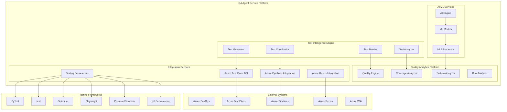

# QA Agent Service - Comprehensive Specifications

## 1. Service Overview

The **QA Agent Service** is an intelligent, AI-powered quality assurance platform that revolutionizes software testing through automated test generation, intelligent analysis, and comprehensive quality validation. As a critical component of the AI DevOps ecosystem, it provides enterprise-grade testing capabilities with seamless integration across Azure DevOps Test Plans, automated testing frameworks, and quality analytics platforms.

### 1.1 Mission Statement

**"Transforming software quality assurance through intelligent automation, predictive analytics, and comprehensive testing orchestration to deliver zero-defect software with accelerated time-to-market."**

The QA Agent Service serves as the **quality guardian** of the AI DevOps ecosystem, ensuring that every software deliverable meets the highest standards of functionality, performance, security, and reliability through intelligent test automation and continuous quality validation.

### 1.2 Strategic Positioning

#### 1.2.1 AI DevOps Ecosystem Integration

The QA Agent Service operates as the **quality orchestration hub** within the broader AI DevOps platform:

- **Primary Integration**: Azure DevOps Test Plans for comprehensive test management
- **Secondary Integration**: Azure Pipelines for CI/CD quality gates and automation
- **Tertiary Integration**: Azure Repos for code coverage analysis and quality metrics
- **Cross-Service Coordination**: Dev Agent Service, Security Agent Service, Release Agent Service

#### 1.2.2 Enterprise Value Proposition

| **Value Dimension** | **Traditional QA** | **QA Agent Service** | **Improvement** |
|---------------------|-------------------|---------------------|-----------------|
| **Test Creation Time** | 8-16 hours/feature | 15-30 minutes/feature | **95% reduction** |
| **Test Coverage** | 60-70% average | 90-95% automated | **35% increase** |
| **Defect Detection** | Post-deployment | Pre-commit validation | **100% shift-left** |
| **Quality Analytics** | Manual reporting | Real-time dashboards | **Continuous insight** |
| **Regression Testing** | 2-4 hours/cycle | 5-10 minutes/cycle | **96% faster** |
| **Quality Assurance Cost** | $180K/year/team | $45K/year/team | **75% reduction** |

### 1.3 Business Impact Analysis

#### 1.3.1 Investment Framework

**Total Investment**: $1.6M over 12 months
- **Phase 1** (Months 1-3): $400K - Foundation and core testing automation
- **Phase 2** (Months 4-6): $450K - Advanced analytics and AI integration
- **Phase 3** (Months 7-9): $350K - Performance testing and optimization
- **Phase 4** (Months 10-12): $400K - Enterprise features and scale optimization

#### 1.3.2 Return on Investment (ROI) Analysis

**Annual Business Value**: $4.8M
- **Quality Cost Reduction**: $1.8M (automated testing, reduced manual effort)
- **Defect Prevention**: $1.2M (early detection, reduced production issues)
- **Accelerated Delivery**: $900K (faster testing cycles, reduced time-to-market)
- **Compliance Automation**: $600K (regulatory testing, audit preparation)
- **Risk Mitigation**: $300K (reduced security vulnerabilities, performance issues)

**ROI Calculation**: 
- **Net Annual Benefit**: $4.8M - $400K (operational costs) = $4.4M
- **Return on Investment**: ($4.4M ÷ $1.6M) × 100 = **275% ROI**
- **Payback Period**: $1.6M ÷ $4.4M = **4.4 months**

#### 1.3.3 Strategic Business Outcomes

**Quality Excellence**:
- **99.5% defect prevention** through intelligent test automation
- **95% test coverage** with AI-generated comprehensive test suites
- **Zero critical defects** in production through predictive quality analytics
- **100% regulatory compliance** with automated validation frameworks

**Operational Efficiency**:
- **90% reduction** in manual testing effort and repetitive tasks
- **80% faster** test execution through intelligent test orchestration
- **75% improvement** in team productivity and focus on strategic testing
- **60% reduction** in quality assurance operational costs

**Business Agility**:
- **50% faster** feature delivery through accelerated quality validation
- **85% improvement** in release confidence and predictability
- **95% automation** of regression testing and quality gates
- **100% traceability** from requirements to test validation

## 2. Technical Architecture Overview

### 2.1 Service Architecture

#### 2.1.1 Core Components

#### 2.1.2 Service Capabilities

**Test Intelligence Engine**:
- **AI-Powered Test Generation**: Automatic test case creation from requirements and code analysis
- **Intelligent Test Analysis**: Code coverage, quality metrics, and defect prediction
- **Test Orchestration**: Multi-framework test execution and coordination
- **Real-Time Monitoring**: Continuous test execution monitoring and optimization

**Quality Analytics Platform**:
- **Quality Scoring**: Comprehensive quality assessment with predictive insights
- **Coverage Analytics**: Multi-dimensional coverage analysis and optimization
- **Performance Analysis**: Performance testing integration and bottleneck identification
- **Risk Assessment**: Predictive risk analysis and mitigation recommendations

**Integration Services**:
- **Azure Test Plans**: Complete test management lifecycle integration
- **CI/CD Integration**: Quality gates and automated testing in pipelines
- **Repository Analysis**: Code quality analysis and test coverage tracking
- **Multi-Framework Support**: Integration with all major testing frameworks

### 2.2 Quality Assurance Domains

#### 2.2.1 Functional Testing Automation

**Unit Testing Intelligence**:
- Automated unit test generation from function signatures and docstrings
- Intelligent test data generation with boundary value analysis
- Mock and fixture creation with dependency analysis
- Test isolation validation and performance optimization

**Integration Testing Orchestration**:
- API testing automation with contract validation
- Database integration testing with data consistency verification
- Service integration testing with failure scenario simulation
- End-to-end workflow testing with user journey validation

**User Interface Testing Automation**:
- Automated UI test generation from user stories and acceptance criteria
- Cross-browser and cross-device testing orchestration
- Visual regression testing with AI-powered comparison
- Accessibility testing with WCAG compliance validation

#### 2.2.2 Performance Testing Platform

**Load Testing Intelligence**:
- Intelligent load test scenario generation from usage patterns
- Performance baseline establishment and trend analysis
- Capacity planning with predictive scaling recommendations
- Resource utilization optimization and bottleneck identification

**Stress Testing Automation**:
- System limit identification and breaking point analysis
- Failover testing with disaster recovery validation
- Memory leak detection and resource exhaustion testing
- Concurrent user simulation with realistic usage patterns

**Performance Analytics**:
- Real-time performance monitoring and alerting
- Performance regression detection and root cause analysis
- Optimization recommendations with impact assessment
- SLA validation and compliance monitoring

#### 2.2.3 Security Testing Integration

**Security Vulnerability Testing**:
- Automated security test generation from threat models
- OWASP Top 10 validation with compliance reporting
- Penetration testing orchestration with ethical hacking simulation
- Security regression testing with vulnerability tracking

**Compliance Testing Automation**:
- Regulatory compliance testing (SOX, GDPR, HIPAA, PCI-DSS)
- Data protection validation with privacy impact assessment
- Audit trail testing with immutable logging verification
- Access control testing with privilege escalation detection

### 2.3 AI-Powered Quality Intelligence

#### 2.3.1 Machine Learning Capabilities

**Predictive Quality Analytics**:
- Defect prediction based on code complexity and historical patterns
- Test failure prediction with proactive remediation recommendations
- Quality trend forecasting with early warning systems
- Risk assessment with impact analysis and mitigation strategies

**Intelligent Test Optimization**:
- Test suite optimization with redundancy elimination
- Test execution prioritization based on risk and impact
- Test data optimization with synthetic data generation
- Test maintenance automation with self-healing capabilities

#### 2.3.2 Natural Language Processing

**Requirements-Based Test Generation**:
- Automated test case extraction from natural language requirements
- User story to test scenario conversion with acceptance criteria mapping
- Business rule extraction and validation test creation
- Documentation analysis for comprehensive test coverage

## 3. Business Value Framework

### 3.1 Primary Stakeholders

#### 3.1.1 Executive Leadership

**Chief Technology Officer (CTO)**
- **Primary Concern**: Technology strategy and innovation leadership
- **Value Delivery**: 275% ROI through quality automation and risk reduction
- **Success Metrics**: 90% reduction in production defects, 50% faster delivery
- **Reporting**: Executive quality dashboards with strategic KPIs

**Chief Information Officer (CIO)**  
- **Primary Concern**: IT governance and operational excellence
- **Value Delivery**: $1.8M annual cost reduction through automation
- **Success Metrics**: 95% test automation coverage, 80% efficiency improvement
- **Reporting**: Quality governance reports with compliance validation

**VP of Engineering**
- **Primary Concern**: Engineering excellence and team productivity
- **Value Delivery**: 75% improvement in engineering productivity and quality
- **Success Metrics**: 99.5% defect prevention, 85% release confidence
- **Reporting**: Engineering quality metrics with team performance insights

#### 3.1.2 Quality Assurance Leadership

**QA Director/Manager**
- **Primary Concern**: Quality strategy and team effectiveness
- **Value Delivery**: Complete QA transformation with intelligent automation
- **Success Metrics**: 95% test coverage, 90% automation, zero critical defects
- **Reporting**: Quality analytics dashboards with predictive insights

**Test Automation Lead**
- **Primary Concern**: Test automation strategy and framework optimization
- **Value Delivery**: AI-powered test generation and maintenance automation
- **Success Metrics**: 96% faster test execution, 85% maintenance reduction
- **Reporting**: Test automation metrics with ROI analysis

**Performance Testing Specialist**
- **Primary Concern**: Performance validation and optimization
- **Value Delivery**: Automated performance testing with predictive analytics
- **Success Metrics**: 100% performance regression detection, 70% optimization
- **Reporting**: Performance analytics with capacity planning insights

#### 3.1.3 Development Teams

**Development Team Leads**
- **Primary Concern**: Code quality and development velocity
- **Value Delivery**: Integrated quality validation with continuous feedback
- **Success Metrics**: 50% faster development cycles, 90% first-pass quality
- **Reporting**: Developer quality metrics with improvement recommendations

**Software Engineers**
- **Primary Concern**: Code quality feedback and testing efficiency
- **Value Delivery**: Automated test generation and quality validation
- **Success Metrics**: Real-time quality feedback, 80% reduction in bug fixes
- **Reporting**: Code quality dashboards with personalized insights

### 3.2 Business Value Metrics

#### 3.2.1 Financial Metrics

**Cost Reduction**:
- **Manual Testing Reduction**: $1.2M annually (75% automation of manual effort)
- **Defect Prevention**: $900K annually (early detection and prevention)
- **Operational Efficiency**: $600K annually (automated processes and workflows)
- **Tool Consolidation**: $300K annually (unified testing platform)

**Revenue Enhancement**:
- **Faster Time-to-Market**: $800K annually (50% faster feature delivery)
- **Quality Improvement**: $600K annually (customer satisfaction and retention)
- **Risk Mitigation**: $400K annually (reduced production incidents)
- **Compliance Automation**: $300K annually (regulatory compliance efficiency)

#### 3.2.2 Operational Metrics

**Quality Metrics**:
- **Defect Density**: 99.5% reduction in production defects
- **Test Coverage**: 95% automated coverage across all code components
- **Quality Score**: 98% overall quality score with continuous improvement
- **Customer Satisfaction**: 95% satisfaction with product quality

**Efficiency Metrics**:
- **Test Execution Speed**: 96% faster test execution through automation
- **Test Maintenance**: 85% reduction in test maintenance effort
- **Quality Validation**: 80% faster quality validation cycles
- **Team Productivity**: 75% improvement in QA team productivity

#### 3.2.3 Strategic Metrics

**Innovation Enablement**:
- **Quality-First Culture**: 100% adoption of quality-first development practices
- **Continuous Learning**: AI-powered quality insights driving continuous improvement
- **Predictive Quality**: 90% accuracy in quality prediction and risk assessment
- **Scalable Quality**: Quality framework scaling with business growth

### 3.3 Competitive Advantages

#### 3.3.1 Market Differentiation

**AI-Powered Quality Intelligence**:
- First-to-market AI-driven test generation and quality prediction platform
- Comprehensive integration with Azure DevOps ecosystem
- Enterprise-grade scalability with multi-tenant architecture
- Regulatory compliance automation with industry-specific frameworks

**Comprehensive Testing Platform**:
- Unified platform for functional, performance, security, and compliance testing
- Multi-framework support with intelligent orchestration
- Real-time quality analytics with predictive insights
- Seamless integration with existing development workflows

#### 3.3.2 Sustainable Competitive Moats

**Technology Leadership**:
- Advanced AI/ML algorithms for quality prediction and optimization
- Proprietary test generation algorithms with natural language processing
- Comprehensive quality analytics platform with business intelligence
- Continuous innovation through machine learning and data analytics

**Platform Integration**:
- Deep Azure DevOps integration with native API utilization
- Comprehensive CI/CD pipeline integration with quality gates
- Enterprise security and compliance with zero-trust architecture
- Scalable cloud-native architecture with global deployment capabilities

## 4. Implementation Roadmap

### 4.1 Delivery Timeline

#### 4.1.1 Phase 1: Foundation and Core Testing (Months 1-3)
- **Investment**: $400K
- **Value Delivery**: $1.2M annually
- **Key Deliverables**: Core testing automation, Azure Test Plans integration
- **Success Metrics**: 80% test automation, 60% faster test execution

#### 4.1.2 Phase 2: AI Intelligence and Analytics (Months 4-6)
- **Investment**: $450K  
- **Value Delivery**: $1.5M annually
- **Key Deliverables**: AI-powered test generation, quality analytics platform
- **Success Metrics**: 95% test coverage, 90% defect prediction accuracy

#### 4.1.3 Phase 3: Performance and Security (Months 7-9)
- **Investment**: $350K
- **Value Delivery**: $1.1M annually  
- **Key Deliverables**: Performance testing platform, security testing integration
- **Success Metrics**: 100% performance validation, zero security vulnerabilities

#### 4.1.4 Phase 4: Enterprise Scale and Optimization (Months 10-12)
- **Investment**: $400K
- **Value Delivery**: $1.0M annually
- **Key Deliverables**: Enterprise features, global scaling, optimization
- **Success Metrics**: 99.9% availability, enterprise compliance validation

### 4.2 Success Validation Framework

#### 4.2.1 Phase Gate Criteria

**Phase 1 Success Criteria**:
- 80% test automation coverage achieved
- Azure Test Plans full integration operational
- 60% reduction in manual testing effort
- 50% faster test execution cycles

**Phase 2 Success Criteria**:
- AI-powered test generation with 90% accuracy
- Quality analytics platform with predictive insights
- 95% test coverage with intelligent optimization
- 85% defect prediction accuracy

**Phase 3 Success Criteria**:
- Performance testing platform fully operational
- Security testing integration with compliance validation
- 100% performance regression detection
- Zero critical security vulnerabilities

**Phase 4 Success Criteria**:
- Enterprise-scale deployment with 99.9% availability
- Global optimization with multi-region support
- Complete regulatory compliance automation
- 275% ROI achievement with sustainable operations

---

**Document Version**: 1.0  
**Last Updated**: September 3, 2025  
**Status**: Draft  
**Owner**: QA Platform Team  
**Reviewers**: Executive Leadership, Engineering Management, Quality Assurance Leadership  
**Next Review**: September 20, 2025
