# Release Agent Service - Master Specification

## 1. Executive Summary

### 1.1 Service Overview

The **Release Agent Service** is a mission-critical component of the AI DevOps ecosystem that orchestrates comprehensive **release note generation** and **deployment analysis** capabilities. Operating as the **deployment intelligence hub**, this service transforms traditional manual release processes into an AI-powered, data-driven deployment orchestration platform that delivers predictive deployment insights, automated release documentation, and comprehensive deployment validation.

**Strategic Positioning**: The Release Agent Service serves as the **bridge between development completion and production success**, ensuring that every deployment is thoroughly analyzed, properly documented, and strategically optimized for business impact and operational excellence.

### 1.2 Core Value Proposition

**Release Intelligence Excellence**:
- **AI-Powered Release Notes**: Automatically generate comprehensive, stakeholder-specific release documentation from work item history, code changes, and business impact analysis
- **Deployment Risk Analysis**: Predictive deployment analysis with risk assessment, impact evaluation, and mitigation recommendations
- **Rollback Intelligence**: Intelligent rollback planning with automated recovery procedures and zero-downtime deployment strategies
- **Compliance Automation**: Automated regulatory compliance validation and audit trail generation for enterprise governance

**Business Impact**: $3.2M annual value through **accelerated time-to-market** (40% faster releases), **deployment risk reduction** (95% deployment success rate), **operational efficiency** (80% manual effort reduction), and **compliance automation** (100% audit readiness).

### 1.3 Technical Architecture

**Intelligent Release Platform**:
- **Release Intelligence Engine**: AI-powered analysis of code changes, work items, and deployment patterns for comprehensive release insights
- **Documentation Generation Platform**: Automated creation of stakeholder-specific release notes, deployment guides, and communication materials
- **Deployment Orchestration Hub**: Blue-green deployments, canary releases, and intelligent traffic routing with automated monitoring
- **Risk Assessment Framework**: Predictive risk analysis with machine learning models for deployment success probability and impact assessment

**AI DevOps Integration**: Native integration with Dev Agent Service (code analysis), QA Agent Service (quality validation), Security Agent Service (security assessment), and PM Agent Service (business impact analysis) for holistic release intelligence.

### 1.4 Business Value Framework

#### 1.4.1 Financial Investment

**Total Investment**: $1,400,000 over 12 months
- **Core Platform Development**: $840,000 (60% - AI engine, deployment orchestration, release automation)
- **Integration and Infrastructure**: $280,000 (20% - Azure DevOps integration, CI/CD platforms, monitoring tools)
- **Training and Adoption**: $140,000 (10% - team training, process optimization, change management)
- **Operations and Support**: $140,000 (10% - ongoing operations, maintenance, continuous improvement)

**Annual Operating Costs**: $350,000
- **Platform Operations**: $175,000 (infrastructure, licensing, monitoring, support)
- **Continuous Enhancement**: $105,000 (feature development, optimization, AI model improvement)
- **Training and Development**: $70,000 (ongoing training, skill development, best practices)

#### 1.4.2 Return on Investment Analysis

**Annual Business Value**: $4,500,000

**Direct Cost Savings** ($2,400,000):
- **Manual Release Process Reduction**: $1,000,000 (80% automation of manual release activities)
- **Deployment Issue Prevention**: $800,000 (95% deployment success rate preventing production issues)
- **Documentation Automation**: $600,000 (automated generation reducing manual documentation effort)

**Revenue Enhancement** ($1,500,000):
- **Faster Time-to-Market**: $900,000 (40% faster release cycles enabling revenue acceleration)
- **Customer Satisfaction**: $400,000 (reliable deployments improving customer experience and retention)
- **Competitive Advantage**: $200,000 (deployment excellence enabling market leadership)

**Strategic Value** ($600,000):
- **Compliance Automation**: $300,000 (regulatory compliance efficiency with audit readiness)
- **Risk Mitigation**: $200,000 (deployment risk reduction preventing business disruption)
- **Innovation Enablement**: $100,000 (team focus on strategic initiatives rather than manual processes)

**ROI Calculation**:
- **Net Annual Benefit**: $4,500,000 - $350,000 = $4,150,000
- **Return on Investment**: ($4,150,000 ÷ $1,400,000) × 100 = **296% ROI**
- **Payback Period**: $1,400,000 ÷ $4,150,000 ≈ **4.0 months**
- **Net Present Value (3 years)**: $10,800,000 (assuming 10% discount rate)

### 1.5 Success Metrics and KPIs

#### 1.5.1 Release Excellence Metrics

**Deployment Performance**:
- **Deployment Success Rate**: 95% first-time deployment success (vs. 70% baseline)
- **Release Frequency**: 40% increase in release frequency with maintained quality
- **Time-to-Production**: 50% reduction in average time from code complete to production
- **Rollback Frequency**: 90% reduction in production rollbacks and incidents

**Documentation Quality**:
- **Release Note Accuracy**: 98% accuracy in automated release note generation
- **Stakeholder Satisfaction**: 95% satisfaction with release communication quality
- **Documentation Coverage**: 100% automated documentation coverage for all releases
- **Compliance Score**: 100% compliance with regulatory and audit requirements

#### 1.5.2 Business Impact Metrics

**Operational Efficiency**:
- **Manual Effort Reduction**: 80% reduction in manual release preparation and documentation
- **Process Standardization**: 100% standardized release processes across all projects
- **Team Productivity**: 75% improvement in release team productivity and satisfaction
- **Knowledge Transfer**: 95% improvement in release knowledge documentation and sharing

**Strategic Performance**:
- **Customer Impact**: 95% customer satisfaction with release quality and communication
- **Business Agility**: 60% improvement in ability to respond to market opportunities
- **Risk Management**: 95% reduction in deployment-related business risks
- **Innovation Velocity**: 50% improvement in team focus on strategic innovation vs. operational tasks

## 2. Service Architecture

### 2.1 High-Level Architecture

**Release Agent Service Architecture**:

```mermaid
graph TB
    subgraph "Release Intelligence Layer"
        RIE[Release Intelligence Engine]
        DGP[Documentation Generation Platform]
        DOH[Deployment Orchestration Hub]
        RAF[Risk Assessment Framework]
    end
    
    subgraph "AI DevOps Integration"
        DAS[Dev Agent Service]
        QAS[QA Agent Service]
        SAS[Security Agent Service]
        PAS[PM Agent Service]
    end
    
    subgraph "Azure DevOps Platform"
        AR[Azure Repos]
        AP[Azure Pipelines]
        AW[Azure Wiki]
        AB[Azure Boards]
    end
    
    subgraph "Deployment Infrastructure"
        AKS[Azure Kubernetes Service]
        ACI[Azure Container Instances]
        ASE[Azure App Service]
        ACR[Azure Container Registry]
    end
    
    subgraph "Monitoring and Analytics"
        AI[Application Insights]
        AM[Azure Monitor]
        LA[Log Analytics]
        ALT[Azure Load Testing]
    end
    
    RIE --> DAS
    RIE --> QAS
    RIE --> SAS
    RIE --> PAS
    
    DGP --> AB
    DGP --> AW
    
    DOH --> AP
    DOH --> AKS
    DOH --> ACI
    DOH --> ASE
    
    RAF --> AI
    RAF --> AM
    RAF --> LA
    
    RIE --> AR
    DOH --> ACR
```

### 2.2 Core Components

#### 2.2.1 Release Intelligence Engine

**Purpose**: AI-powered analysis and intelligence generation for comprehensive release insights

**Key Capabilities**:
- **Code Change Analysis**: Deep analysis of code changes, impact assessment, and risk evaluation
- **Work Item Intelligence**: Comprehensive analysis of work item history, business impact, and stakeholder communication
- **Deployment Pattern Recognition**: Machine learning analysis of historical deployment patterns and success factors
- **Predictive Analytics**: AI-powered prediction of deployment success probability and potential issues

**Technology Stack**:
- **AI/ML Framework**: Azure Machine Learning with custom models for deployment analysis
- **Natural Language Processing**: Advanced NLP for work item content analysis and release note generation
- **Data Analysis Engine**: Apache Spark for large-scale data processing and pattern recognition
- **Integration APIs**: RESTful APIs for seamless integration with AI DevOps ecosystem

#### 2.2.2 Documentation Generation Platform

**Purpose**: Automated generation of comprehensive, stakeholder-specific release documentation

**Key Capabilities**:
- **Release Note Automation**: AI-powered generation of detailed, accurate release notes from multiple data sources
- **Stakeholder Communication**: Customized communication materials for different audience types (technical, business, executive)
- **Deployment Guide Creation**: Automated generation of deployment procedures, rollback plans, and operational guides
- **Compliance Documentation**: Automated creation of audit trails, compliance reports, and regulatory documentation

**Technology Stack**:
- **Template Engine**: Jinja2 with custom extensions for dynamic content generation
- **Document Processing**: Python-docx and ReportLab for various document format generation
- **Content Management**: Azure Blob Storage with version control for document templates and assets
- **Distribution System**: Automated distribution via email, Slack, Teams, and portal integration

#### 2.2.3 Deployment Orchestration Hub

**Purpose**: Comprehensive deployment orchestration with intelligent routing and automated monitoring

**Key Capabilities**:
- **Blue-Green Deployment**: Zero-downtime deployments with automated traffic switching and validation
- **Canary Release Management**: Gradual rollout with automated monitoring, metrics analysis, and rollback triggers
- **Multi-Environment Orchestration**: Coordinated deployment across development, staging, and production environments
- **Infrastructure as Code**: Terraform and ARM template management with automated provisioning and configuration

**Technology Stack**:
- **Orchestration Engine**: Kubernetes with Helm charts for container orchestration
- **CI/CD Integration**: Azure DevOps Pipelines with custom tasks and extensions
- **Infrastructure Automation**: Terraform with Azure provider for infrastructure management
- **Service Mesh**: Istio for advanced traffic management and security

#### 2.2.4 Risk Assessment Framework

**Purpose**: Comprehensive risk analysis and mitigation planning for deployment excellence

**Key Capabilities**:
- **Deployment Risk Scoring**: Machine learning models for risk assessment based on code changes, environment factors, and historical data
- **Impact Analysis**: Business impact assessment with customer, revenue, and operational considerations
- **Mitigation Planning**: Automated generation of risk mitigation strategies and contingency plans
- **Continuous Monitoring**: Real-time monitoring with automated alerting and incident response

**Technology Stack**:
- **Risk Analysis Engine**: Scikit-learn and TensorFlow for machine learning risk models
- **Monitoring Platform**: Prometheus and Grafana for comprehensive metrics collection and visualization
- **Alerting System**: Azure Monitor with custom alert rules and notification channels
- **Incident Response**: PagerDuty integration for automated incident management and escalation

### 2.3 Integration Architecture

#### 2.3.1 AI DevOps Ecosystem Integration

**Dev Agent Service Integration**:
- **Code Analysis Data**: Receive code quality metrics, complexity analysis, and technical debt assessment
- **Build Information**: Integration with build results, artifact information, and dependency analysis
- **Repository Insights**: Access to commit history, branch information, and code change patterns

**QA Agent Service Integration**:
- **Test Results**: Comprehensive test execution results, coverage analysis, and quality metrics
- **Quality Gates**: Integration with quality gate status and validation results
- **Performance Data**: Performance test results and benchmarking information

**Security Agent Service Integration**:
- **Security Assessment**: Security scan results, vulnerability analysis, and compliance validation
- **Risk Evaluation**: Security risk assessment and mitigation recommendations
- **Compliance Status**: Regulatory compliance validation and audit readiness confirmation

**PM Agent Service Integration**:
- **Business Context**: Business requirements, stakeholder priorities, and impact assessment
- **Project Metrics**: Project health, timeline information, and resource utilization
- **Stakeholder Communication**: Stakeholder preferences and communication requirements

#### 2.3.2 Azure DevOps Platform Integration

**Azure Repos Integration**:
- **Branch Management**: Automated branch creation, merging, and cleanup for release processes
- **Tag Management**: Release versioning with semantic versioning and tag automation
- **Change Tracking**: Comprehensive tracking of code changes between releases

**Azure Pipelines Integration**:
- **Pipeline Orchestration**: Triggering and monitoring of deployment pipelines
- **Stage Management**: Coordination of deployment stages with approval workflows
- **Artifact Management**: Release artifact tracking and promotion across environments

**Azure Boards Integration**:
- **Work Item Updates**: Automated updates to work item status and release information
- **Release Planning**: Integration with release planning and milestone tracking
- **Stakeholder Notification**: Automated notifications and updates to relevant stakeholders

### 2.4 Data Architecture

#### 2.4.1 Release Data Models

**Release Entity**:
- **Release ID**: Unique identifier with version information and timestamp
- **Release Metadata**: Version, branch, commit information, and release type
- **Content Analysis**: Code changes, work items, and impact assessment
- **Quality Metrics**: Test results, coverage, security scans, and compliance status
- **Deployment Information**: Environment details, deployment strategy, and monitoring configuration

**Deployment Entity**:
- **Deployment ID**: Unique identifier with environment and timestamp information
- **Deployment Configuration**: Strategy, infrastructure, and routing configuration
- **Monitoring Data**: Performance metrics, health checks, and alert configurations
- **Rollback Plan**: Automated rollback procedures and recovery strategies

**Risk Assessment Entity**:
- **Assessment ID**: Unique identifier with timestamp and scope information
- **Risk Factors**: Identified risks with probability and impact scoring
- **Mitigation Strategies**: Recommended actions and contingency plans
- **Historical Analysis**: Lessons learned and pattern recognition insights

#### 2.4.2 Data Storage Strategy

**Operational Data Storage**:
- **Azure SQL Database**: Relational data for release metadata, deployment tracking, and audit trails
- **Azure Cosmos DB**: Document storage for complex release configurations and analysis results
- **Azure Blob Storage**: Large file storage for documentation, artifacts, and backup data
- **Azure Table Storage**: High-performance storage for metrics, logs, and time-series data

**Analytics Data Platform**:
- **Azure Data Lake**: Comprehensive data lake for advanced analytics and machine learning
- **Azure Synapse Analytics**: Data warehouse for business intelligence and reporting
- **Azure Stream Analytics**: Real-time processing for monitoring and alerting
- **Power BI Integration**: Business intelligence dashboards and executive reporting

## 3. Functional Capabilities

### 3.1 Release Note Generation

#### 3.1.1 AI-Powered Content Creation

**Intelligent Release Note Generation**:
- **Multi-Source Analysis**: Aggregation and analysis of code changes, work items, test results, and business requirements
- **Stakeholder-Specific Content**: Customized release notes for technical teams, business stakeholders, and executive leadership
- **Natural Language Generation**: AI-powered creation of clear, comprehensive, and actionable release documentation
- **Template Customization**: Flexible template system with organization-specific branding and formatting

**Content Intelligence Features**:
- **Change Categorization**: Automatic categorization of changes by type (features, bug fixes, security updates, performance improvements)
- **Impact Assessment**: Business impact analysis with customer-facing change identification
- **Risk Communication**: Clear communication of deployment risks and mitigation strategies
- **Compliance Notation**: Automated inclusion of compliance-related changes and regulatory impact

#### 3.1.2 Documentation Automation

**Comprehensive Documentation Suite**:
- **Release Notes**: Detailed, formatted release notes with stakeholder-appropriate content
- **Deployment Guides**: Step-by-step deployment procedures with rollback instructions
- **Communication Materials**: Email templates, Slack messages, and announcement content
- **Audit Documentation**: Compliance-ready documentation with full audit trails

**Distribution and Management**:
- **Automated Distribution**: Intelligent distribution to appropriate stakeholders based on roles and preferences
- **Version Control**: Comprehensive version control for all documentation with change tracking
- **Template Management**: Centralized template management with customization capabilities
- **Feedback Integration**: Stakeholder feedback collection and documentation improvement

### 3.2 Deployment Analysis

#### 3.2.1 Predictive Deployment Intelligence

**Deployment Success Prediction**:
- **Risk Scoring Models**: Machine learning models analyzing deployment success probability based on code changes, environment factors, and historical patterns
- **Complexity Analysis**: Assessment of deployment complexity with resource requirement prediction
- **Environmental Impact**: Analysis of target environment health and readiness for deployment
- **Dependency Validation**: Comprehensive dependency analysis with impact assessment

**Performance Forecasting**:
- **Resource Utilization Prediction**: Forecasting of CPU, memory, and network utilization post-deployment
- **Scalability Assessment**: Analysis of scalability requirements and auto-scaling configuration
- **Performance Benchmarking**: Comparison with historical performance baselines and expectations
- **Capacity Planning**: Resource capacity recommendations for optimal performance

#### 3.2.2 Real-Time Deployment Monitoring

**Comprehensive Monitoring Suite**:
- **Health Check Automation**: Automated health checks with customizable validation criteria
- **Performance Monitoring**: Real-time performance metrics with threshold monitoring and alerting
- **Error Rate Analysis**: Continuous monitoring of error rates with anomaly detection
- **User Experience Tracking**: Customer-facing metrics including response times and availability

**Intelligent Alerting**:
- **Anomaly Detection**: Machine learning-powered anomaly detection with contextual alerting
- **Escalation Management**: Automated escalation procedures with stakeholder notification
- **Root Cause Analysis**: AI-powered root cause analysis with resolution recommendations
- **Recovery Automation**: Automated recovery procedures with rollback trigger conditions

### 3.3 Risk Assessment and Mitigation

#### 3.3.1 Comprehensive Risk Analysis

**Multi-Dimensional Risk Assessment**:
- **Technical Risk Evaluation**: Code complexity, test coverage, dependency changes, and infrastructure modifications
- **Business Risk Analysis**: Customer impact, revenue implications, and operational disruption assessment
- **Security Risk Assessment**: Security vulnerability analysis and compliance impact evaluation
- **Operational Risk Review**: Support readiness, monitoring coverage, and incident response preparedness

**Risk Quantification**:
- **Probability Scoring**: Statistical analysis of risk probability based on historical data and current conditions
- **Impact Assessment**: Quantitative analysis of potential business and technical impact
- **Risk Matrix Generation**: Visual risk matrix with priority-based action recommendations
- **Trend Analysis**: Historical risk trend analysis with predictive insights

#### 3.3.2 Mitigation Strategy Development

**Automated Mitigation Planning**:
- **Risk-Specific Strategies**: Customized mitigation strategies based on risk type and severity
- **Contingency Planning**: Comprehensive contingency plans with step-by-step procedures
- **Resource Allocation**: Resource requirement analysis for mitigation implementation
- **Timeline Development**: Implementation timeline with milestone tracking and validation

**Continuous Improvement**:
- **Lessons Learned Integration**: Incorporation of historical lessons learned into future risk assessments
- **Best Practice Development**: Identification and codification of deployment best practices
- **Process Optimization**: Continuous optimization of risk assessment and mitigation processes
- **Knowledge Management**: Centralized knowledge management for risk patterns and solutions

### 3.4 Deployment Orchestration

#### 3.4.1 Advanced Deployment Strategies

**Blue-Green Deployment**:
- **Environment Management**: Automated provisioning and configuration of blue-green environments
- **Traffic Routing**: Intelligent traffic routing with gradual cutover and validation
- **Validation Automation**: Comprehensive validation testing before traffic switch
- **Rollback Capabilities**: Instant rollback with zero-downtime recovery

**Canary Release Management**:
- **Gradual Rollout**: Configurable percentage-based rollout with monitoring and validation
- **A/B Testing Integration**: Integration with A/B testing frameworks for performance comparison
- **Automated Decision Making**: AI-powered decision making for rollout continuation or rollback
- **Performance Analysis**: Real-time performance analysis with success criteria validation

#### 3.4.2 Infrastructure Automation

**Infrastructure as Code**:
- **Terraform Integration**: Comprehensive Terraform management with state tracking and automation
- **ARM Template Management**: Azure Resource Manager template automation with parameter management
- **Configuration Management**: Automated configuration management with drift detection and correction
- **Environment Provisioning**: On-demand environment provisioning with consistent configuration

**Container Orchestration**:
- **Kubernetes Integration**: Native Kubernetes integration with Helm chart management
- **Container Registry Management**: Automated container image management with security scanning
- **Service Mesh Configuration**: Istio configuration for advanced traffic management and security
- **Scaling Automation**: Automated scaling based on performance metrics and demand patterns

## 4. Technology Stack

### 4.1 Core Technology Platform

**Programming Languages and Frameworks**:
- **Python 3.11+**: Core service development with asyncio for high-performance async operations
- **FastAPI**: REST API framework with automatic OpenAPI documentation and validation
- **Celery**: Distributed task queue for long-running deployment and analysis operations
- **SQLAlchemy**: Database ORM with async support for data persistence

**AI and Machine Learning**:
- **Azure Machine Learning**: Model training, deployment, and management platform
- **Scikit-learn**: Classical machine learning algorithms for risk assessment and pattern recognition
- **TensorFlow/PyTorch**: Deep learning frameworks for advanced predictive analytics
- **Transformers**: Natural language processing for release note generation and content analysis

### 4.2 Infrastructure and Platform

**Cloud Platform**:
- **Microsoft Azure**: Primary cloud platform with comprehensive service integration
- **Azure Kubernetes Service**: Container orchestration with enterprise-grade security and scaling
- **Azure Container Registry**: Container image storage with security scanning and compliance
- **Azure Service Bus**: Message queuing for reliable service-to-service communication

**Data Platform**:
- **Azure SQL Database**: Relational database for structured data with high availability
- **Azure Cosmos DB**: NoSQL database for flexible schema and global distribution
- **Azure Data Lake Storage**: Scalable data lake for analytics and machine learning
- **Redis**: In-memory caching and session storage for high-performance operations

### 4.3 Integration and DevOps

**CI/CD Platform**:
- **Azure DevOps Pipelines**: CI/CD automation with custom tasks and extensions
- **GitHub Actions**: Secondary CI/CD platform for GitHub-hosted repositories
- **Terraform**: Infrastructure as Code with Azure provider for resource management
- **Helm**: Kubernetes package manager for application deployment and management

**Monitoring and Observability**:
- **Azure Monitor**: Comprehensive monitoring platform with custom metrics and alerting
- **Application Insights**: Application performance monitoring with distributed tracing
- **Prometheus**: Metrics collection and storage with Grafana for visualization
- **ELK Stack**: Centralized logging with Elasticsearch, Logstash, and Kibana

### 4.4 Security and Compliance

**Security Framework**:
- **Azure Active Directory**: Identity and access management with role-based access control
- **Azure Key Vault**: Secrets management with encryption key storage and rotation
- **Azure Security Center**: Security posture management with compliance monitoring
- **Istio Service Mesh**: Service-to-service security with mTLS and policy enforcement

**Compliance and Governance**:
- **Azure Policy**: Governance and compliance enforcement with custom policy definitions
- **Azure Blueprints**: Repeatable compliance templates with audit and reporting
- **Compliance Manager**: Compliance assessment and reporting for regulatory frameworks
- **Azure Information Protection**: Data classification and protection with encryption

## 5. Success Metrics and Validation

### 5.1 Technical Performance Metrics

**Release Intelligence Performance**:
- **Analysis Accuracy**: 98% accuracy in deployment risk assessment and prediction
- **Processing Speed**: Release analysis completion within 5 minutes for standard complexity releases
- **Documentation Quality**: 95% stakeholder satisfaction with automated release note quality
- **Prediction Reliability**: 95% accuracy in deployment success probability prediction

**System Performance**:
- **API Response Time**: <500ms for 95% of API requests under normal load
- **Throughput**: Support for 500+ concurrent release operations
- **Availability**: 99.9% service availability with automated failover and recovery
- **Scalability**: Linear scaling to support 10x increase in deployment volume

### 5.2 Business Value Metrics

**Operational Excellence**:
- **Deployment Success Rate**: 95% first-time deployment success (baseline: 70%)
- **Release Frequency**: 40% increase in release frequency with maintained quality
- **Time-to-Production**: 50% reduction in deployment preparation and execution time
- **Manual Effort Reduction**: 80% reduction in manual release preparation activities

**Strategic Impact**:
- **Customer Satisfaction**: 95% customer satisfaction with release quality and communication
- **Business Agility**: 60% improvement in ability to respond to market opportunities
- **Risk Reduction**: 95% reduction in deployment-related business risks and incidents
- **Compliance Achievement**: 100% compliance with regulatory and audit requirements

### 5.3 Continuous Improvement Framework

**Performance Optimization**:
- **Machine Learning Model Improvement**: Continuous model training with feedback loops and accuracy improvement
- **Process Automation Enhancement**: Ongoing automation of manual processes with efficiency measurement
- **User Experience Optimization**: Regular user feedback collection with interface and workflow improvements
- **Integration Enhancement**: Continuous improvement of integration points with ecosystem services

**Innovation Metrics**:
- **Feature Adoption Rate**: 90% adoption of new features within 3 months of release
- **Process Innovation**: Monthly identification and implementation of process improvements
- **Technology Advancement**: Quarterly evaluation and adoption of emerging technologies
- **Best Practice Development**: Continuous identification and codification of deployment best practices

---

**Document Version**: 1.0  
**Last Updated**: September 3, 2025  
**Status**: Final  
**Owner**: Release Engineering Team  
**Reviewers**: Engineering Leadership, DevOps Teams, Business Stakeholders  
**Next Review**: September 17, 2025  
**Approval**: Pending Executive Committee Review
