# Security Agent Service - Master Specification

## 1. Executive Summary

### 1.1 Service Overview

The **Security Agent Service** is a mission-critical component of the AI DevOps ecosystem that provides comprehensive **security analysis** and **vulnerability scanning** capabilities. Operating as the **security intelligence hub**, this service transforms traditional reactive security practices into a proactive, AI-powered security orchestration platform that delivers predictive threat intelligence, automated vulnerability assessment, and continuous security validation across the entire software development lifecycle.

**Strategic Positioning**: The Security Agent Service serves as the **security guardian** of the AI DevOps ecosystem, ensuring that every line of code, every dependency, and every deployment meets the highest security standards while enabling rapid, secure software delivery that protects business assets and customer data.

### 1.2 Core Value Proposition

**Security Excellence Foundation**:
- **AI-Powered Threat Detection**: Advanced machine learning algorithms for identifying sophisticated security threats, zero-day vulnerabilities, and emerging attack patterns
- **Comprehensive Vulnerability Scanning**: Multi-layered security analysis covering static code analysis, dynamic testing, dependency scanning, and infrastructure security assessment
- **Proactive Risk Mitigation**: Predictive security intelligence with automated remediation recommendations and priority-based action planning
- **Compliance Automation**: Automated regulatory compliance validation with comprehensive audit trails for SOX, GDPR, HIPAA, PCI-DSS, and industry-specific frameworks

**Business Impact**: $3.8M annual value through **security incident prevention** (99.5% reduction in security breaches), **compliance automation** (100% audit readiness), **operational efficiency** (85% reduction in manual security tasks), and **competitive advantage** (security-first culture enabling customer trust and market leadership).

### 1.3 Technical Architecture

**Intelligent Security Platform**:
- **Security Intelligence Engine**: AI-powered analysis of code patterns, dependency vulnerabilities, and threat landscapes for comprehensive security insights
- **Vulnerability Assessment Framework**: Multi-tool integration with intelligent correlation and prioritization for comprehensive vulnerability management
- **Threat Detection Platform**: Real-time monitoring and analysis with behavioral analytics and anomaly detection for proactive threat identification
- **Compliance Validation Hub**: Automated regulatory compliance assessment with gap analysis and remediation planning

**AI DevOps Integration**: Native integration with Dev Agent Service (secure coding analysis), QA Agent Service (security testing validation), Release Agent Service (deployment security gates), and PM Agent Service (security risk business impact) for holistic security orchestration.

### 1.4 Business Value Framework

#### 1.4.1 Financial Investment

**Total Investment**: $1,800,000 over 12 months
- **Core Platform Development**: $1,080,000 (60% - AI engine, security tools integration, threat intelligence)
- **Integration and Infrastructure**: $360,000 (20% - Azure Security Center, compliance frameworks, monitoring tools)
- **Training and Adoption**: $180,000 (10% - security training, process optimization, change management)
- **Operations and Support**: $180,000 (10% - ongoing operations, maintenance, security updates)

**Annual Operating Costs**: $450,000
- **Platform Operations**: $225,000 (infrastructure, licensing, security tool subscriptions, monitoring)
- **Continuous Enhancement**: $135,000 (threat intelligence updates, AI model improvement, tool integration)
- **Training and Development**: $90,000 (ongoing security training, certification, best practices)

#### 1.4.2 Return on Investment Analysis

**Annual Business Value**: $5,200,000

**Direct Cost Savings** ($2,800,000):
- **Security Incident Prevention**: $1,200,000 (99.5% reduction in security breaches preventing data loss and remediation costs)
- **Manual Security Task Automation**: $900,000 (85% automation of manual security assessment and monitoring)
- **Compliance Automation**: $700,000 (automated regulatory compliance reducing audit costs and preparation time)

**Revenue Protection and Enhancement** ($1,800,000):
- **Data Breach Prevention**: $1,000,000 (prevention of data breach costs including fines, legal fees, and reputation damage)
- **Customer Trust and Retention**: $500,000 (security excellence driving customer confidence and retention)
- **Competitive Advantage**: $300,000 (security-first positioning enabling premium pricing and market differentiation)

**Strategic Value** ($600,000):
- **Risk Mitigation**: $300,000 (comprehensive risk reduction preventing business disruption and regulatory penalties)
- **Innovation Enablement**: $200,000 (security automation enabling team focus on strategic initiatives)
- **Market Leadership**: $100,000 (security thought leadership and industry recognition)

**ROI Calculation**:
- **Net Annual Benefit**: $5,200,000 - $450,000 = $4,750,000
- **Return on Investment**: ($4,750,000 ÷ $1,800,000) × 100 = **264% ROI**
- **Payback Period**: $1,800,000 ÷ $4,750,000 ≈ **4.5 months**
- **Net Present Value (3 years)**: $12,350,000 (assuming 10% discount rate)

### 1.5 Success Metrics and KPIs

#### 1.5.1 Security Excellence Metrics

**Vulnerability Management**:
- **Vulnerability Detection Rate**: 99.5% detection of security vulnerabilities with zero false negatives
- **Mean Time to Detection (MTTD)**: <15 minutes for critical vulnerabilities through real-time monitoring
- **Mean Time to Remediation (MTTR)**: <4 hours for critical vulnerabilities with automated prioritization
- **Vulnerability Recurrence Rate**: <1% for previously identified and remediated vulnerabilities

**Threat Prevention**:
- **Security Incident Reduction**: 99.5% reduction in security incidents through proactive detection and prevention
- **False Positive Rate**: <2% for security alerts through intelligent filtering and correlation
- **Security Coverage**: 100% code coverage for security analysis across all repositories and deployments
- **Threat Intelligence Accuracy**: 98% accuracy in threat detection and risk assessment

#### 1.5.2 Business Impact Metrics

**Operational Excellence**:
- **Manual Task Automation**: 85% reduction in manual security assessment and monitoring activities
- **Compliance Readiness**: 100% automated compliance validation with audit-ready documentation
- **Security Team Productivity**: 90% improvement in security team effectiveness and strategic focus
- **Security Knowledge Transfer**: 95% improvement in security awareness and capability across development teams

**Strategic Performance**:
- **Customer Security Confidence**: 98% customer satisfaction with security transparency and communication
- **Regulatory Compliance**: 100% compliance with all applicable regulatory frameworks
- **Security Culture Maturity**: 95% adoption of security-first development practices across teams
- **Business Risk Reduction**: 95% reduction in security-related business risks and potential impact

## 2. Service Architecture

### 2.1 High-Level Architecture

**Security Agent Service Architecture**:

```mermaid
graph TB
    subgraph "Security Intelligence Layer"
        SIE[Security Intelligence Engine]
        VAF[Vulnerability Assessment Framework]
        TDP[Threat Detection Platform]
        CVH[Compliance Validation Hub]
    end
    
    subgraph "AI DevOps Integration"
        DAS[Dev Agent Service]
        QAS[QA Agent Service]
        RAS[Release Agent Service]
        PAS[PM Agent Service]
    end
    
    subgraph "Security Tools Ecosystem"
        SAST[Static Analysis Tools]
        DAST[Dynamic Analysis Tools]
        SCA[Software Composition Analysis]
        IAST[Interactive Application Testing]
    end
    
    subgraph "Azure Security Platform"
        ASC[Azure Security Center]
        AKV[Azure Key Vault]
        AIP[Azure Information Protection]
        ASG[Azure Sentinel]
    end
    
    subgraph "Compliance Frameworks"
        SOX[SOX Compliance]
        GDPR[GDPR Compliance]
        HIPAA[HIPAA Compliance]
        PCI[PCI-DSS Compliance]
    end
    
    SIE --> DAS
    SIE --> QAS
    SIE --> RAS
    SIE --> PAS
    
    VAF --> SAST
    VAF --> DAST
    VAF --> SCA
    VAF --> IAST
    
    TDP --> ASC
    TDP --> ASG
    
    CVH --> SOX
    CVH --> GDPR
    CVH --> HIPAA
    CVH --> PCI
    
    SIE --> AKV
    VAF --> AIP
```

### 2.2 Core Components

#### 2.2.1 Security Intelligence Engine

**Purpose**: AI-powered security analysis and intelligence generation for comprehensive threat assessment

**Key Capabilities**:
- **Code Pattern Analysis**: Deep learning analysis of code patterns for vulnerability identification and secure coding validation
- **Threat Intelligence Integration**: Real-time threat intelligence feeds with correlation and context-aware analysis
- **Behavioral Analytics**: Machine learning models for detecting anomalous behavior and potential security threats
- **Risk Scoring and Prioritization**: Intelligent risk assessment with business impact correlation and priority-based action planning

**Technology Stack**:
- **AI/ML Framework**: Azure Machine Learning with custom security models for threat detection and risk assessment
- **Natural Language Processing**: Advanced NLP for security documentation analysis and compliance validation
- **Graph Analysis**: Neo4j for dependency mapping and attack surface analysis
- **Real-Time Processing**: Apache Kafka for streaming security event processing and analysis

#### 2.2.2 Vulnerability Assessment Framework

**Purpose**: Comprehensive vulnerability scanning and assessment with intelligent correlation and prioritization

**Key Capabilities**:
- **Multi-Tool Integration**: Seamless integration with leading security tools (SonarQube, OWASP ZAP, Snyk, Veracode)
- **Vulnerability Correlation**: Intelligent correlation of findings across multiple tools with deduplication and impact analysis
- **Automated Prioritization**: AI-powered vulnerability prioritization based on exploitability, business impact, and threat landscape
- **Remediation Planning**: Automated generation of remediation strategies with effort estimation and resource allocation

**Technology Stack**:
- **Static Analysis Integration**: SonarQube, CodeQL, Semgrep for comprehensive static code analysis
- **Dynamic Testing Tools**: OWASP ZAP, Burp Suite for runtime vulnerability detection
- **Dependency Scanning**: Snyk, WhiteSource, OWASP Dependency Check for supply chain security
- **Container Security**: Trivy, Clair, Twistlock for container and infrastructure security

#### 2.2.3 Threat Detection Platform

**Purpose**: Real-time threat monitoring and detection with proactive incident response

**Key Capabilities**:
- **Continuous Monitoring**: 24/7 monitoring of code repositories, applications, and infrastructure for security threats
- **Anomaly Detection**: Machine learning algorithms for identifying unusual patterns and potential security incidents
- **Incident Response Automation**: Automated incident response workflows with escalation and notification procedures
- **Forensic Analysis**: Comprehensive security incident analysis with root cause identification and lessons learned

**Technology Stack**:
- **SIEM Integration**: Azure Sentinel for security information and event management
- **Log Analytics**: Azure Monitor and Log Analytics for comprehensive security event correlation
- **Threat Intelligence**: Microsoft Threat Intelligence and third-party feeds for contextual threat analysis
- **Incident Response**: Azure Logic Apps for automated incident response and workflow orchestration

#### 2.2.4 Compliance Validation Hub

**Purpose**: Automated regulatory compliance validation with comprehensive audit trail generation

**Key Capabilities**:
- **Multi-Framework Support**: Comprehensive support for SOX, GDPR, HIPAA, PCI-DSS, and industry-specific regulations
- **Automated Assessment**: Continuous compliance monitoring with gap analysis and remediation recommendations
- **Audit Trail Generation**: Immutable audit trails with cryptographic verification for regulatory compliance
- **Reporting and Documentation**: Automated compliance reports with stakeholder-specific formatting and distribution

**Technology Stack**:
- **Compliance Engines**: Custom compliance validation engines with rule-based and AI-powered assessment
- **Audit Management**: Azure Information Protection for data classification and audit trail management
- **Document Generation**: Automated report generation with compliance-specific templates and formatting
- **Blockchain Integration**: Hyperledger Fabric for immutable audit trail verification and integrity

### 2.3 Integration Architecture

#### 2.3.1 AI DevOps Ecosystem Integration

**Dev Agent Service Integration**:
- **Secure Code Analysis**: Real-time analysis of code commits for security vulnerabilities and compliance violations
- **Security Gate Integration**: Automated security validation in development workflows with blocking and approval mechanisms
- **Secure Development Guidance**: AI-powered recommendations for secure coding practices and vulnerability prevention

**QA Agent Service Integration**:
- **Security Test Orchestration**: Integration with security testing frameworks for comprehensive security validation
- **Test Coverage Analysis**: Security test coverage assessment with gap identification and improvement recommendations
- **Quality Security Correlation**: Analysis of quality metrics impact on security posture and risk assessment

**Release Agent Service Integration**:
- **Deployment Security Gates**: Automated security validation before production deployments with risk assessment
- **Security Release Notes**: Integration of security improvements and vulnerability fixes in release documentation
- **Production Security Monitoring**: Continuous security monitoring of deployed applications with incident response

**PM Agent Service Integration**:
- **Security Risk Business Impact**: Assessment of security risks in business context with stakeholder communication
- **Security Roadmap Planning**: Integration of security initiatives with project planning and resource allocation
- **Stakeholder Security Reporting**: Security metrics and insights for business stakeholders and executive leadership

#### 2.3.2 Azure Security Platform Integration

**Azure Security Center Integration**:
- **Security Posture Management**: Comprehensive security posture assessment with continuous monitoring and improvement
- **Threat Protection**: Advanced threat protection with machine learning and behavioral analytics
- **Compliance Dashboard**: Centralized compliance monitoring with regulatory framework support

**Azure Sentinel Integration**:
- **Security Information and Event Management**: Centralized security event collection, correlation, and analysis
- **Threat Hunting**: Proactive threat hunting with AI-powered investigation and response capabilities
- **Incident Response**: Automated incident response with workflow orchestration and stakeholder notification

**Azure Key Vault Integration**:
- **Secrets Management**: Comprehensive secrets management with rotation, access control, and audit logging
- **Cryptographic Operations**: Hardware security module (HSM) backed cryptographic operations for data protection
- **Certificate Management**: Automated certificate lifecycle management with renewal and compliance validation

### 2.4 Data Architecture

#### 2.4.1 Security Data Models

**Vulnerability Entity**:
- **Vulnerability ID**: Unique identifier with CVE mapping and internal tracking
- **Vulnerability Details**: Description, severity, exploitability, and impact assessment
- **Detection Information**: Tool source, detection timestamp, and validation status
- **Remediation Data**: Remediation strategies, effort estimation, and implementation status
- **Business Context**: Asset criticality, business impact, and stakeholder notification requirements

**Threat Intelligence Entity**:
- **Threat ID**: Unique identifier with external threat intelligence correlation
- **Threat Details**: Attack vectors, indicators of compromise, and attribution information
- **Impact Assessment**: Potential business impact, affected systems, and risk scoring
- **Mitigation Strategies**: Recommended countermeasures and prevention techniques
- **Intelligence Sources**: Threat intelligence feeds, analysis confidence, and temporal relevance

**Security Incident Entity**:
- **Incident ID**: Unique identifier with correlation to related events and threats
- **Incident Classification**: Severity, category, and impact assessment
- **Timeline Information**: Detection, response, and resolution timestamps
- **Investigation Data**: Forensic analysis, root cause, and lessons learned
- **Response Actions**: Containment, eradication, and recovery procedures

#### 2.4.2 Data Storage Strategy

**Operational Data Storage**:
- **Azure SQL Database**: Relational data for vulnerability tracking, compliance records, and audit trails
- **Azure Cosmos DB**: Document storage for threat intelligence, security configurations, and investigation data
- **Azure Data Lake**: Large-scale data storage for security logs, forensic evidence, and analytical datasets
- **Azure Table Storage**: High-performance storage for security events, metrics, and real-time monitoring data

**Security-Specific Storage**:
- **Encrypted Storage**: AES-256 encryption for all sensitive security data with key management via Azure Key Vault
- **Immutable Storage**: Write-once, read-many storage for audit trails and compliance evidence
- **Geo-Redundant Storage**: Multi-region replication for business continuity and disaster recovery
- **Retention Policies**: Automated data retention with compliance-driven lifecycle management

## 3. Functional Capabilities

### 3.1 Security Analysis and Vulnerability Scanning

#### 3.1.1 Comprehensive Code Security Analysis

**Static Application Security Testing (SAST)**:
- **Multi-Language Support**: Comprehensive analysis for Java, C#, Python, JavaScript, TypeScript, Go, and emerging languages
- **Pattern-Based Detection**: Advanced pattern recognition for common vulnerabilities (OWASP Top 10, CWE Top 25)
- **AI-Enhanced Analysis**: Machine learning models for detecting complex security anti-patterns and logic flaws
- **Custom Rule Development**: Organization-specific security rule creation with domain expert knowledge integration

**Dynamic Application Security Testing (DAST)**:
- **Runtime Vulnerability Detection**: Comprehensive testing of running applications for security vulnerabilities
- **API Security Testing**: Specialized testing for REST APIs, GraphQL, and microservice architectures
- **Authentication and Authorization Testing**: Comprehensive validation of access control mechanisms
- **Business Logic Testing**: AI-powered testing of complex business logic for security flaws

#### 3.1.2 Supply Chain Security

**Dependency Vulnerability Scanning**:
- **Multi-Ecosystem Support**: Comprehensive scanning for npm, PyPI, Maven, NuGet, and other package ecosystems
- **Transitive Dependency Analysis**: Deep analysis of dependency trees for hidden vulnerabilities
- **License Compliance**: Automated license scanning with policy enforcement and risk assessment
- **Vulnerability Database Integration**: Real-time integration with National Vulnerability Database (NVD) and vendor advisories

**Container Security Assessment**:
- **Image Vulnerability Scanning**: Comprehensive analysis of container images for security vulnerabilities
- **Configuration Security**: Analysis of container and Kubernetes configurations for security misconfigurations
- **Runtime Security Monitoring**: Continuous monitoring of container runtime behavior for anomalies
- **Supply Chain Integrity**: Verification of container image provenance and integrity

#### 3.1.3 Infrastructure Security

**Cloud Security Posture Management**:
- **Azure Resource Assessment**: Comprehensive security assessment of Azure resources and configurations
- **Infrastructure as Code Security**: Analysis of Terraform, ARM templates, and CloudFormation for security issues
- **Network Security Analysis**: Assessment of network configurations, firewall rules, and access controls
- **Identity and Access Management**: Analysis of IAM policies, permissions, and access patterns

**Kubernetes Security**:
- **Cluster Security Assessment**: Comprehensive analysis of Kubernetes cluster configurations and policies
- **Pod Security Standards**: Validation of pod security policies and security contexts
- **Network Policy Analysis**: Assessment of network policies and micro-segmentation strategies
- **RBAC Analysis**: Role-based access control validation and privilege escalation detection

### 3.2 Threat Detection and Intelligence

#### 3.2.1 AI-Powered Threat Detection

**Behavioral Analytics**:
- **User Behavior Analysis**: Machine learning analysis of user access patterns and anomaly detection
- **Application Behavior Monitoring**: Continuous monitoring of application behavior for suspicious activities
- **Network Traffic Analysis**: AI-powered analysis of network traffic patterns for threat identification
- **File Integrity Monitoring**: Real-time monitoring of critical files and configurations for unauthorized changes

**Advanced Persistent Threat (APT) Detection**:
- **Multi-Stage Attack Detection**: Correlation of security events across time and systems for APT identification
- **Indicator of Compromise (IoC) Matching**: Real-time matching against known IoCs and threat intelligence feeds
- **Attack Pattern Recognition**: Machine learning models for identifying sophisticated attack patterns
- **Attribution Analysis**: Analysis of attack characteristics for threat actor attribution and intelligence

#### 3.2.2 Threat Intelligence Integration

**External Threat Intelligence**:
- **Commercial Feed Integration**: Integration with leading threat intelligence providers (Microsoft, IBM X-Force, FireEye)
- **Open Source Intelligence**: Automated collection and analysis of open source threat intelligence
- **Industry-Specific Intelligence**: Specialized threat intelligence for relevant industry sectors and attack patterns
- **Geopolitical Threat Analysis**: Assessment of geopolitical threats and nation-state actor activities

**Internal Threat Intelligence**:
- **Historical Attack Analysis**: Analysis of previous security incidents for pattern recognition and prevention
- **Security Metrics Correlation**: Correlation of security metrics with business operations and threat landscape
- **Threat Modeling**: Automated threat modeling based on application architecture and business context
- **Risk Scoring**: Dynamic risk scoring based on threat intelligence, vulnerability data, and business impact

### 3.3 Compliance and Regulatory Validation

#### 3.3.1 Multi-Framework Compliance

**SOX Compliance (Sarbanes-Oxley)**:
- **Financial Reporting Controls**: Automated validation of IT controls supporting financial reporting accuracy
- **Access Control Validation**: Comprehensive assessment of access controls and segregation of duties
- **Change Management Compliance**: Validation of change management processes and audit trail integrity
- **Documentation and Evidence**: Automated generation of compliance documentation and evidence collection

**GDPR Compliance (General Data Protection Regulation)**:
- **Data Classification and Discovery**: Automated identification and classification of personal data across systems
- **Consent Management**: Validation of consent mechanisms and data subject rights implementation
- **Data Protection Impact Assessment**: Automated DPIA generation and risk assessment for data processing activities
- **Breach Notification**: Automated breach detection and notification procedures compliant with GDPR requirements

**HIPAA Compliance (Health Insurance Portability and Accountability Act)**:
- **Protected Health Information (PHI) Discovery**: Automated identification and classification of PHI across systems
- **Access Control and Audit**: Comprehensive access control validation and audit trail management for PHI
- **Encryption and Data Protection**: Validation of encryption standards and data protection mechanisms
- **Business Associate Management**: Compliance validation for third-party business associate agreements

**PCI-DSS Compliance (Payment Card Industry Data Security Standard)**:
- **Cardholder Data Environment**: Comprehensive assessment of cardholder data environment security
- **Network Segmentation**: Validation of network segmentation and access control mechanisms
- **Vulnerability Management**: Automated vulnerability scanning and remediation tracking for PCI compliance
- **Compliance Reporting**: Automated generation of PCI compliance reports and evidence documentation

#### 3.3.2 Industry-Specific Compliance

**Financial Services Compliance**:
- **Banking Regulations**: Compliance validation for banking-specific regulations (Basel III, Dodd-Frank)
- **Anti-Money Laundering (AML)**: Security controls validation for AML compliance and transaction monitoring
- **Know Your Customer (KYC)**: Security assessment of customer identification and verification processes
- **Market Risk Management**: Security controls for trading systems and market risk management platforms

**Healthcare Compliance**:
- **FDA Regulations**: Compliance validation for medical device software and healthcare applications
- **Clinical Trial Data Integrity**: Security controls for clinical trial data management and integrity
- **Telemedicine Security**: Security assessment of telemedicine platforms and patient data protection
- **Pharmaceutical Supply Chain**: Security validation for pharmaceutical supply chain and track-and-trace systems

### 3.4 Incident Response and Forensics

#### 3.4.1 Automated Incident Response

**Detection and Classification**:
- **Real-Time Alert Processing**: Automated processing and classification of security alerts from multiple sources
- **Severity Assessment**: AI-powered severity assessment based on threat intelligence and business impact
- **False Positive Reduction**: Machine learning models for reducing false positives and alert fatigue
- **Escalation Management**: Automated escalation procedures based on severity, impact, and response time requirements

**Containment and Mitigation**:
- **Automated Containment**: Immediate automated containment actions for high-severity security incidents
- **Isolation Procedures**: Automated network isolation and access revocation for compromised systems
- **Mitigation Strategies**: AI-powered recommendation of mitigation strategies based on incident type and context
- **Communication Management**: Automated stakeholder notification and communication during security incidents

#### 3.4.2 Security Forensics and Investigation

**Digital Forensics**:
- **Evidence Collection**: Automated collection and preservation of digital evidence with chain of custody
- **Timeline Reconstruction**: Automated reconstruction of incident timelines from multiple data sources
- **Root Cause Analysis**: AI-powered analysis for identifying root causes and attack vectors
- **Impact Assessment**: Comprehensive assessment of incident impact on business operations and data integrity

**Post-Incident Analysis**:
- **Lessons Learned**: Automated extraction of lessons learned and improvement recommendations
- **Process Improvement**: Analysis of incident response effectiveness and process optimization opportunities
- **Threat Intelligence Enhancement**: Integration of incident findings into threat intelligence and detection capabilities
- **Security Posture Improvement**: Recommendations for security posture improvements based on incident analysis

### 3.5 Security Training and Awareness

#### 3.5.1 Developer Security Education

**Secure Coding Training**:
- **Language-Specific Training**: Tailored secure coding training for different programming languages and frameworks
- **Vulnerability-Specific Education**: Training modules focused on specific vulnerability types and prevention techniques
- **Interactive Learning**: Hands-on labs and capture-the-flag exercises for practical security skills development
- **Continuous Assessment**: Regular assessment of developer security knowledge and skill development tracking

**Security Champions Program**:
- **Champion Identification**: Identification and development of security champions within development teams
- **Advanced Training**: Specialized training for security champions on advanced topics and emerging threats
- **Mentoring and Support**: Ongoing mentoring and support for security champions in their advocacy role
- **Community Building**: Building a community of security champions for knowledge sharing and collaboration

#### 3.5.2 Organization-Wide Security Awareness

**Security Awareness Training**:
- **Role-Based Training**: Customized security awareness training based on job roles and responsibilities
- **Phishing Simulation**: Regular phishing simulation exercises with targeted training for susceptible individuals
- **Social Engineering Awareness**: Training on social engineering tactics and prevention techniques
- **Incident Response Training**: Organization-wide training on incident response procedures and responsibilities

**Security Culture Development**:
- **Culture Assessment**: Regular assessment of organizational security culture and improvement opportunities
- **Behavior Change Programs**: Programs designed to promote positive security behaviors and culture change
- **Recognition and Incentives**: Recognition programs for individuals and teams demonstrating excellent security practices
- **Continuous Improvement**: Continuous improvement of security awareness programs based on effectiveness metrics

## 4. Technology Stack

### 4.1 Core Security Platform

**Programming Languages and Frameworks**:
- **Python 3.11+**: Core service development with asyncio for high-performance security operations
- **FastAPI**: REST API framework with automatic OpenAPI documentation and security validation
- **Celery**: Distributed task queue for long-running security scans and analysis operations
- **Django**: Security-focused web framework for administrative interfaces and reporting dashboards

**Security-Specific Libraries**:
- **PyYAML**: Secure YAML parsing with safety configurations for configuration analysis
- **Cryptography**: Comprehensive cryptographic library for security operations and data protection
- **PyJWT**: JSON Web Token library for secure authentication and authorization
- **Paramiko**: SSH client library for secure remote operations and infrastructure analysis

### 4.2 AI and Machine Learning

**Machine Learning Frameworks**:
- **Scikit-learn**: Classical machine learning for security pattern recognition and anomaly detection
- **TensorFlow**: Deep learning framework for advanced threat detection and behavioral analysis
- **PyTorch**: Research-oriented ML framework for experimental security algorithms and model development
- **Azure Machine Learning**: Cloud-native ML platform for model deployment and management

**Natural Language Processing**:
- **spaCy**: Industrial-strength NLP for security document analysis and threat intelligence processing
- **NLTK**: Natural language toolkit for text analysis and security report generation
- **Transformers**: State-of-the-art NLP models for security content analysis and generation
- **Azure Cognitive Services**: Cloud-based NLP services for text analytics and language understanding

### 4.3 Security Tools Integration

**Static Application Security Testing (SAST)**:
- **SonarQube**: Comprehensive code quality and security analysis platform
- **CodeQL**: Semantic code analysis for finding security vulnerabilities
- **Semgrep**: Lightweight static analysis tool for security and correctness
- **Checkmarx**: Enterprise-grade SAST solution for comprehensive security scanning

**Dynamic Application Security Testing (DAST)**:
- **OWASP ZAP**: Open-source web application security scanner
- **Burp Suite**: Professional web vulnerability scanner and testing platform
- **Netsparker**: Automated web application security scanner with low false positives
- **AppScan**: IBM's dynamic application security testing solution

**Software Composition Analysis (SCA)**:
- **Snyk**: Developer-first security platform for dependency scanning and vulnerability management
- **WhiteSource**: Software composition analysis for open source security and license compliance
- **FOSSA**: Open source license compliance and security vulnerability detection
- **JFrog Xray**: Universal software composition analysis with deep impact analysis

### 4.4 Infrastructure and Cloud Security

**Container Security**:
- **Trivy**: Comprehensive vulnerability scanner for containers and infrastructure as code
- **Clair**: Open source vulnerability analysis for application containers
- **Twistlock (Prisma Cloud)**: Cloud native security platform for containers and serverless
- **Aqua Security**: Container security platform with runtime protection

**Cloud Security Tools**:
- **Azure Security Center**: Unified infrastructure security management platform
- **Azure Sentinel**: Cloud-native SIEM solution for security analytics and threat intelligence
- **Prowler**: AWS security best practices assessment tool adapted for Azure
- **Scout Suite**: Multi-cloud security auditing tool for configuration assessment

### 4.5 Compliance and Governance

**Compliance Management**:
- **Azure Policy**: Cloud governance service for resource compliance and policy enforcement
- **Azure Blueprints**: Repeatable set of Azure resources for compliance and governance
- **Microsoft Compliance Manager**: Compliance risk assessment and management platform
- **ServiceNow GRC**: Governance, risk, and compliance platform for enterprise management

**Audit and Logging**:
- **Azure Monitor**: Comprehensive monitoring solution for applications and infrastructure
- **Azure Log Analytics**: Log data collection and analysis service for security insights
- **Splunk**: Platform for searching, monitoring, and analyzing machine-generated data
- **Elastic Stack (ELK)**: Search and analytics engine for log data and security event analysis

## 5. Success Metrics and Validation

### 5.1 Technical Performance Metrics

**Security Analysis Performance**:
- **Scan Completion Time**: Code security analysis completion within 10 minutes for typical codebase
- **Vulnerability Detection Accuracy**: 99.5% true positive rate with <2% false positives
- **Threat Detection Speed**: Mean time to detection (MTTD) of <15 minutes for critical threats
- **System Throughput**: Support for 1000+ concurrent security scans and analysis operations

**Platform Performance**:
- **API Response Time**: <500ms for 95% of security API requests under normal load
- **Scalability**: Linear scaling to support 10x increase in security operations
- **Availability**: 99.9% service availability with automated failover and recovery
- **Data Processing**: Real-time processing of 100,000+ security events per minute

### 5.2 Security Effectiveness Metrics

**Vulnerability Management**:
- **Vulnerability Coverage**: 100% coverage of OWASP Top 10 and CWE Top 25 vulnerabilities
- **Detection Rate**: 99.5% detection rate for known vulnerabilities with zero false negatives
- **Remediation Time**: Mean time to remediation (MTTR) of <4 hours for critical vulnerabilities
- **Recurrence Rate**: <1% vulnerability recurrence rate after remediation

**Threat Prevention**:
- **Incident Reduction**: 99.5% reduction in security incidents through proactive detection
- **Attack Prevention**: 100% prevention of known attack patterns and techniques
- **Threat Intelligence Accuracy**: 98% accuracy in threat classification and risk assessment
- **False Positive Rate**: <2% false positive rate for security alerts and notifications

### 5.3 Business Value Metrics

**Operational Excellence**:
- **Manual Task Reduction**: 85% reduction in manual security assessment and monitoring
- **Compliance Automation**: 100% automated compliance validation with audit-ready documentation
- **Security Team Productivity**: 90% improvement in security team effectiveness and strategic focus
- **Developer Security Adoption**: 95% adoption of secure development practices across teams

**Strategic Impact**:
- **Customer Security Confidence**: 98% customer satisfaction with security transparency
- **Regulatory Compliance**: 100% compliance with applicable regulatory frameworks
- **Security Culture Maturity**: 95% security-first culture adoption across organization
- **Business Risk Reduction**: 95% reduction in security-related business risks

### 5.4 Continuous Improvement Framework

**Performance Optimization**:
- **AI Model Improvement**: Quarterly model retraining with 5% accuracy improvement targets
- **Tool Integration Enhancement**: Monthly evaluation and integration of emerging security tools
- **Process Automation**: Continuous automation of manual security processes with efficiency measurement
- **User Experience Optimization**: Regular user feedback collection with interface improvements

**Innovation Metrics**:
- **Threat Detection Innovation**: Monthly implementation of new threat detection capabilities
- **Security Technology Advancement**: Quarterly evaluation and adoption of emerging security technologies
- **Best Practice Development**: Continuous identification and codification of security best practices
- **Knowledge Sharing**: Regular security knowledge sharing sessions and community building

---

**Document Version**: 1.0  
**Last Updated**: September 3, 2025  
**Status**: Final  
**Owner**: Security Engineering Team  
**Reviewers**: Security Leadership, Engineering Teams, Compliance Officers  
**Next Review**: September 17, 2025  
**Approval**: Pending Security Committee Review
