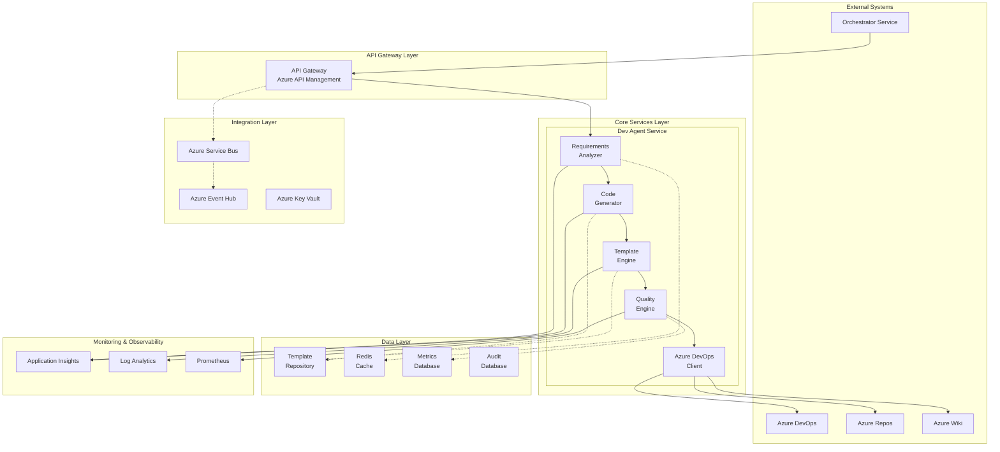
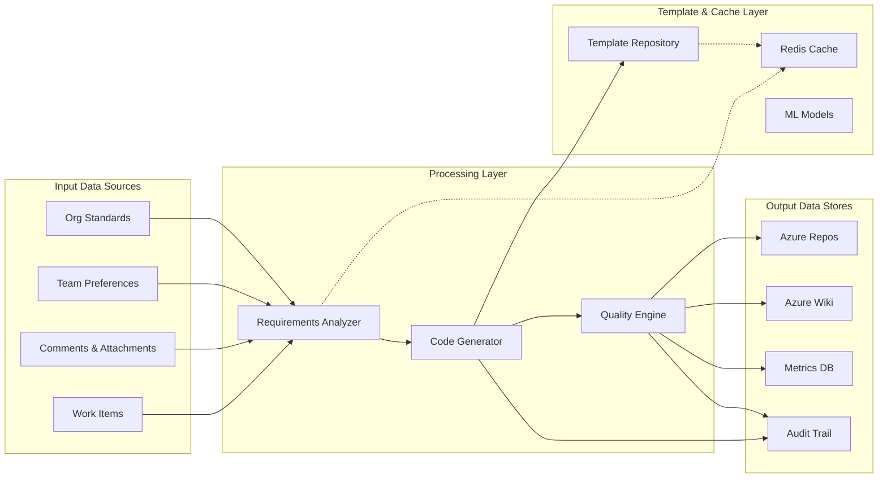

# Dev Agent Service - System Architecture

## 1. Architecture Overview

The Dev Agent Service is designed as a cloud-native, microservice-based intelligent code generation platform that integrates seamlessly with Azure DevOps workflows. The architecture emphasizes scalability, performance, and maintainability while providing enterprise-grade security and compliance capabilities.

### 1.1 Architectural Principles

**Microservice Architecture**: The service is decomposed into focused, independently deployable microservices that can scale horizontally based on demand.

**Event-Driven Design**: Asynchronous processing model using Azure Service Bus for reliable message delivery and processing coordination.

**API-First Approach**: All components expose well-defined RESTful APIs with comprehensive OpenAPI documentation for integration and testing.

**Cloud-Native Patterns**: Designed for Azure cloud with native integration to Azure services and Kubernetes orchestration.

**Security by Design**: Zero-trust security model with comprehensive authentication, authorization, and data protection mechanisms.

### 1.2 High-Level Architecture Diagram



## 2. Component Architecture

### 2.1 Requirements Analyzer Component

**Purpose**: Intelligent analysis of work item content to extract business requirements, entities, and technical specifications.

**Architecture Pattern**: Layered Architecture with Plugin System

```python
# Component Structure
class RequirementsAnalyzer:
    """
    Core component responsible for analyzing work item content
    and extracting actionable development requirements.
    """
    
    def __init__(self):
        self.nlp_processor = NLPProcessor()
        self.entity_extractor = EntityExtractor()
        self.complexity_analyzer = ComplexityAnalyzer()
        self.tech_recommender = TechnologyRecommender()
        self.cache_manager = CacheManager()
    
    async def analyze_work_item(
        self, 
        work_item: WorkItem,
        context: AnalysisContext
    ) -> AnalysisResult:
        """
        Comprehensive analysis workflow for work item processing.
        """
        # Phase 1: Content Processing
        processed_content = await self.nlp_processor.process_content(
            description=work_item.description,
            acceptance_criteria=work_item.acceptance_criteria,
            comments=work_item.comments
        )
        
        # Phase 2: Entity Extraction
        entities = await self.entity_extractor.extract_entities(
            processed_content=processed_content,
            domain_context=context.domain_knowledge
        )
        
        # Phase 3: Complexity Assessment
        complexity_score = await self.complexity_analyzer.assess_complexity(
            entities=entities,
            requirements=processed_content.requirements,
            constraints=context.constraints
        )
        
        # Phase 4: Technology Recommendation
        tech_stack = await self.tech_recommender.recommend_stack(
            entities=entities,
            complexity=complexity_score,
            team_preferences=context.team_preferences,
            org_standards=context.organizational_standards
        )
        
        return AnalysisResult(
            entities=entities,
            complexity_score=complexity_score,
            recommended_stack=tech_stack,
            architectural_patterns=self._determine_patterns(entities, complexity_score),
            implementation_guidance=self._generate_guidance(tech_stack, entities)
        )
```

**Key Capabilities**:
- Natural Language Processing using Azure Cognitive Services
- Business entity extraction with relationship mapping
- Complexity assessment and effort estimation
- Technology stack recommendation based on multiple factors
- Caching of analysis results for performance optimization

**Integration Points**:
- Azure Cognitive Services for NLP processing
- Redis Cache for result caching
- Azure DevOps API for work item data retrieval
- Template Engine for architecture pattern validation

### 2.2 Code Generator Component

**Purpose**: Core code generation engine responsible for creating production-ready application code based on analysis results.

**Architecture Pattern**: Strategy Pattern with Factory Method

```python
# Component Structure
class CodeGenerator:
    """
    Primary code generation engine with multi-framework support
    and intelligent code synthesis capabilities.
    """
    
    def __init__(self):
        self.framework_strategies = {
            'fastapi': FastAPIGenerationStrategy(),
            'react': ReactGenerationStrategy(),
            'django': DjangoGenerationStrategy(),
            'vue': VueGenerationStrategy()
        }
        self.template_resolver = TemplateResolver()
        self.business_logic_generator = BusinessLogicGenerator()
        self.file_organizer = FileOrganizer()
        
    async def generate_application(
        self,
        analysis_result: AnalysisResult,
        generation_config: GenerationConfig,
        correlation_id: str
    ) -> GenerationResult:
        """
        Multi-phase application generation workflow.
        """
        # Phase 1: Strategy Selection and Template Resolution
        primary_strategy = self.framework_strategies[
            analysis_result.recommended_stack.backend_framework
        ]
        frontend_strategy = self.framework_strategies[
            analysis_result.recommended_stack.frontend_framework
        ]
        
        template_set = await self.template_resolver.resolve_templates(
            backend_framework=analysis_result.recommended_stack.backend_framework,
            frontend_framework=analysis_result.recommended_stack.frontend_framework,
            organization_id=generation_config.organization_id
        )
        
        # Phase 2: Business Logic Generation
        business_components = await self.business_logic_generator.generate_components(
            entities=analysis_result.entities,
            business_rules=analysis_result.business_rules,
            integration_requirements=analysis_result.integrations
        )
        
        # Phase 3: Framework-Specific Code Generation
        backend_code = await primary_strategy.generate_backend(
            templates=template_set.backend_templates,
            entities=analysis_result.entities,
            business_components=business_components,
            configuration=generation_config.backend_config
        )
        
        frontend_code = await frontend_strategy.generate_frontend(
            templates=template_set.frontend_templates,
            api_specification=backend_code.api_specification,
            ui_components=analysis_result.ui_requirements,
            configuration=generation_config.frontend_config
        )
        
        # Phase 4: Integration and Organization
        organized_files = await self.file_organizer.organize_application(
            backend_files=backend_code.files,
            frontend_files=frontend_code.files,
            configuration_files=self._generate_configuration_files(
                analysis_result, generation_config
            ),
            documentation_files=self._generate_documentation_files(
                analysis_result, backend_code, frontend_code
            )
        )
        
        return GenerationResult(
            files=organized_files,
            api_specification=backend_code.api_specification,
            deployment_configuration=self._generate_deployment_config(
                analysis_result, generation_config
            ),
            test_configuration=self._generate_test_config(
                backend_code, frontend_code
            ),
            correlation_id=correlation_id
        )
```

**Framework Generation Strategies**:

```yaml
# Framework Strategy Configuration
generation_strategies:
  backend_frameworks:
    fastapi:
      strategy_class: "FastAPIGenerationStrategy"
      capabilities: ["REST API", "OpenAPI", "Async support", "Type validation"]
      generated_components:
        - "API routes with dependency injection"
        - "Pydantic models for request/response"
        - "SQLAlchemy database models"
        - "Authentication middleware"
        - "Error handling and logging"
        - "Health check endpoints"
        
    django:
      strategy_class: "DjangoGenerationStrategy"
      capabilities: ["Full-stack web", "Admin interface", "ORM", "Authentication"]
      generated_components:
        - "Django models with migrations"
        - "REST API with Django REST Framework"
        - "Admin interface configuration"
        - "URL routing and view classes"
        - "Template-based frontend (optional)"
        - "Custom management commands"
        
    flask:
      strategy_class: "FlaskGenerationStrategy"
      capabilities: ["Lightweight web", "Blueprints", "Flexible architecture"]
      generated_components:
        - "Flask application factory"
        - "Blueprint organization"
        - "SQLAlchemy integration"
        - "JWT authentication"
        - "API documentation"
        - "Configuration management"
  
  frontend_frameworks:
    react:
      strategy_class: "ReactGenerationStrategy"
      capabilities: ["SPA", "Component-based", "Modern JavaScript", "TypeScript"]
      generated_components:
        - "Component hierarchy based on entities"
        - "TypeScript interfaces for API models"
        - "Redux/Context state management"
        - "React Router navigation"
        - "API service layer"
        - "Unit and integration tests"
        
    vue:
      strategy_class: "VueGenerationStrategy"
      capabilities: ["Progressive enhancement", "Template syntax", "Composition API"]
      generated_components:
        - "Vue components with composition API"
        - "Vuex store management"
        - "Vue Router configuration"
        - "API integration with Axios"
        - "Component testing with Vue Test Utils"
        - "Build configuration with Vite"
```

**Key Features**:
- Multi-framework support with pluggable strategies
- Intelligent business logic generation from requirements
- Consistent API patterns across different frameworks
- Automatic configuration and deployment file generation
- Comprehensive test suite generation

### 2.3 Template Engine Component

**Purpose**: Advanced template management system supporting organization-specific customizations, inheritance, and version control.

**Architecture Pattern**: Template Method Pattern with Composite Structure

```python
# Component Structure
class TemplateEngine:
    """
    Advanced template management and rendering system with
    organizational customization and inheritance support.
    """
    
    def __init__(self):
        self.template_repository = TemplateRepository()
        self.inheritance_resolver = InheritanceResolver()
        self.customization_applier = CustomizationApplier()
        self.validation_engine = TemplateValidationEngine()
        self.rendering_engine = JinjaRenderingEngine()
        
    async def render_template_set(
        self,
        template_identifiers: List[str],
        context: RenderingContext,
        customizations: OrganizationCustomizations,
        correlation_id: str
    ) -> RenderedTemplateSet:
        """
        Comprehensive template rendering with inheritance and customization.
        """
        # Phase 1: Template Resolution and Inheritance
        base_templates = await self.template_repository.get_templates(
            template_identifiers
        )
        
        resolved_templates = await self.inheritance_resolver.resolve_inheritance(
            base_templates=base_templates,
            organization_overrides=customizations.template_overrides,
            project_customizations=context.project_customizations
        )
        
        # Phase 2: Customization Application
        customized_templates = await self.customization_applier.apply_customizations(
            templates=resolved_templates,
            branding=customizations.branding,
            coding_standards=customizations.coding_standards,
            architectural_patterns=customizations.architectural_patterns
        )
        
        # Phase 3: Template Validation
        validation_result = await self.validation_engine.validate_templates(
            templates=customized_templates,
            quality_rules=customizations.quality_rules,
            security_policies=customizations.security_policies
        )
        
        if not validation_result.is_valid:
            raise TemplateValidationError(
                f"Template validation failed: {validation_result.errors}"
            )
        
        # Phase 4: Context Preparation and Rendering
        enriched_context = await self._enrich_rendering_context(
            base_context=context,
            template_metadata=customized_templates.metadata,
            generation_timestamp=datetime.utcnow()
        )
        
        rendered_files = await self.rendering_engine.render_templates(
            templates=customized_templates,
            context=enriched_context
        )
        
        return RenderedTemplateSet(
            files=rendered_files,
            template_versions=customized_templates.versions,
            customizations_applied=customizations.applied_customizations,
            validation_report=validation_result,
            correlation_id=correlation_id
        )
```

**Template Inheritance Hierarchy**:

```yaml
# Template Inheritance Structure
template_hierarchy:
  base_templates:
    web_application:
      level: "Foundation"
      provides: ["Project structure", "Build configuration", "CI/CD"]
      
    api_service:
      level: "Foundation"
      provides: ["API structure", "Documentation", "Testing framework"]
      
    full_stack_application:
      level: "Foundation"
      provides: ["Frontend + Backend", "Database", "Deployment"]
      
  framework_templates:
    fastapi_api:
      inherits: "api_service"
      level: "Framework"
      provides: ["FastAPI specifics", "Pydantic models", "OpenAPI"]
      
    react_spa:
      inherits: "web_application"
      level: "Framework"
      provides: ["React components", "State management", "Routing"]
      
    django_web:
      inherits: "full_stack_application"
      level: "Framework"
      provides: ["Django models", "Admin interface", "Templates"]
      
  organization_templates:
    company_fastapi:
      inherits: "fastapi_api"
      level: "Organization"
      customizations:
        - "Company authentication system"
        - "Standard middleware stack"
        - "Monitoring and logging configuration"
        - "Company-specific error handling"
        
    company_react:
      inherits: "react_spa"
      level: "Organization"
      customizations:
        - "Company component library"
        - "Standard theme and branding"
        - "Analytics integration"
        - "Accessibility standards"
        
  project_templates:
    customer_portal:
      inherits: "company_fastapi"
      level: "Project"
      specializations:
        - "Customer-specific authentication"
        - "Billing system integration"
        - "Customer support workflows"
        - "Compliance requirements"
```

**Template Customization Framework**:

```python
class OrganizationCustomizations:
    """
    Configuration class for organization-specific template customizations.
    """
    
    def __init__(self):
        self.branding = BrandingCustomizations()
        self.coding_standards = CodingStandardsCustomizations()
        self.architectural_patterns = ArchitecturalPatternsCustomizations()
        self.security_policies = SecurityPolicyCustomizations()
        self.quality_rules = QualityRulesCustomizations()
        
class BrandingCustomizations:
    """Company branding and visual identity customizations."""
    company_name: str
    logo_url: str
    color_scheme: Dict[str, str]
    font_preferences: Dict[str, str]
    footer_content: str
    
class CodingStandardsCustomizations:
    """Organization-specific coding standards and conventions."""
    naming_conventions: Dict[str, str]
    code_formatting_rules: Dict[str, Any]
    documentation_requirements: Dict[str, str]
    testing_requirements: Dict[str, Any]
    
class ArchitecturalPatternsCustomizations:
    """Preferred architectural patterns and practices."""
    authentication_pattern: str  # "JWT", "OAuth2", "Custom"
    database_access_pattern: str  # "Repository", "Active Record", "Data Mapper"
    error_handling_pattern: str  # "Global Handler", "Per-Controller", "Middleware"
    logging_pattern: str  # "Structured", "Traditional", "Custom"
```

### 2.4 Quality Engine Component

**Purpose**: Comprehensive quality assurance, testing framework generation, and code analysis integration.

**Architecture Pattern**: Pipeline Pattern with Plugin Architecture

```python
# Component Structure
class QualityEngine:
    """
    Comprehensive quality assurance engine with automated testing,
    code analysis, and security scanning capabilities.
    """
    
    def __init__(self):
        self.test_generator = TestSuiteGenerator()
        self.static_analyzer = StaticCodeAnalyzer()
        self.security_scanner = SecurityScanner()
        self.performance_analyzer = PerformanceAnalyzer()
        self.quality_gates = QualityGatesValidator()
        self.remediation_engine = AutomatedRemediationEngine()
        
    async def perform_quality_analysis(
        self,
        generated_code: GeneratedCode,
        quality_requirements: QualityRequirements,
        correlation_id: str
    ) -> QualityAnalysisResult:
        """
        Comprehensive quality analysis pipeline with automated remediation.
        """
        # Phase 1: Test Suite Generation
        test_suite = await self.test_generator.generate_comprehensive_tests(
            application_code=generated_code,
            business_requirements=quality_requirements.business_requirements,
            test_frameworks=quality_requirements.test_frameworks
        )
        
        # Phase 2: Static Code Analysis
        static_analysis = await self.static_analyzer.analyze_code(
            code_files=generated_code.files,
            language_rules=quality_requirements.language_rules,
            organizational_standards=quality_requirements.organizational_standards
        )
        
        # Phase 3: Security Scanning
        security_analysis = await self.security_scanner.scan_for_vulnerabilities(
            code_files=generated_code.files,
            dependencies=generated_code.dependencies,
            security_policies=quality_requirements.security_policies
        )
        
        # Phase 4: Performance Analysis
        performance_analysis = await self.performance_analyzer.analyze_performance(
            code_structure=generated_code.structure,
            database_operations=generated_code.database_operations,
            api_endpoints=generated_code.api_endpoints
        )
        
        # Phase 5: Quality Gates Validation
        quality_validation = await self.quality_gates.validate_against_gates(
            static_analysis=static_analysis,
            security_analysis=security_analysis,
            performance_analysis=performance_analysis,
            test_coverage=test_suite.coverage_metrics,
            quality_thresholds=quality_requirements.quality_thresholds
        )
        
        # Phase 6: Automated Remediation
        remediation_result = await self.remediation_engine.apply_automated_fixes(
            issues=static_analysis.issues + security_analysis.issues,
            code_files=generated_code.files,
            remediation_policies=quality_requirements.remediation_policies
        )
        
        return QualityAnalysisResult(
            test_suite=test_suite,
            static_analysis=static_analysis,
            security_analysis=security_analysis,
            performance_analysis=performance_analysis,
            quality_validation=quality_validation,
            remediation_result=remediation_result,
            overall_quality_score=self._calculate_overall_score(
                static_analysis, security_analysis, performance_analysis, test_suite
            ),
            correlation_id=correlation_id
        )
```

**Test Generation Framework**:

```python
class TestSuiteGenerator:
    """
    Advanced test suite generation with multiple testing levels
    and framework-specific implementations.
    """
    
    async def generate_comprehensive_tests(
        self,
        application_code: GeneratedCode,
        business_requirements: BusinessRequirements,
        test_frameworks: TestFrameworkConfig
    ) -> ComprehensiveTestSuite:
        
        # Unit Test Generation
        unit_tests = await self._generate_unit_tests(
            business_logic=application_code.business_logic,
            api_endpoints=application_code.api_endpoints,
            data_models=application_code.data_models,
            test_framework=test_frameworks.unit_test_framework
        )
        
        # Integration Test Generation
        integration_tests = await self._generate_integration_tests(
            database_operations=application_code.database_operations,
            external_services=application_code.external_services,
            api_contracts=application_code.api_contracts,
            test_framework=test_frameworks.integration_test_framework
        )
        
        # End-to-End Test Generation
        e2e_tests = await self._generate_e2e_tests(
            user_workflows=business_requirements.user_workflows,
            api_endpoints=application_code.api_endpoints,
            frontend_components=application_code.frontend_components,
            test_framework=test_frameworks.e2e_test_framework
        )
        
        # Performance Test Generation
        performance_tests = await self._generate_performance_tests(
            api_endpoints=application_code.api_endpoints,
            critical_paths=business_requirements.critical_paths,
            performance_requirements=business_requirements.performance_requirements
        )
        
        return ComprehensiveTestSuite(
            unit_tests=unit_tests,
            integration_tests=integration_tests,
            e2e_tests=e2e_tests,
            performance_tests=performance_tests,
            test_data=await self._generate_test_data(application_code),
            coverage_configuration=self._generate_coverage_config(test_frameworks)
        )
```

### 2.5 Azure DevOps Client Component

**Purpose**: Comprehensive integration with Azure DevOps services for work item management, repository operations, and documentation automation.

**Architecture Pattern**: Facade Pattern with Circuit Breaker

```python
# Component Structure
class AzureDevOpsClient:
    """
    Comprehensive Azure DevOps integration client with robust error handling,
    rate limiting, and audit trail capabilities.
    """
    
    def __init__(self, config: AzureDevOpsConfig):
        self.work_item_service = WorkItemService(config)
        self.repos_service = RepositoryService(config)
        self.wiki_service = WikiService(config)
        self.pipeline_service = PipelineService(config)
        self.circuit_breaker = CircuitBreaker(config.circuit_breaker_config)
        self.rate_limiter = RateLimiter(config.rate_limit_config)
        self.audit_logger = AuditLogger(config.audit_config)
        
    async def process_work_item_assignment(
        self,
        work_item_id: int,
        generation_context: GenerationContext,
        correlation_id: str
    ) -> WorkItemProcessingResult:
        """
        Complete work item processing workflow with Azure DevOps integration.
        """
        async with self.circuit_breaker:
            # Phase 1: Work Item Retrieval and Analysis
            work_item = await self.work_item_service.get_work_item_with_context(
                work_item_id=work_item_id,
                include_comments=True,
                include_attachments=True,
                include_relations=True
            )
            
            await self._update_work_item_progress(
                work_item_id, "In Progress", 
                f"Dev Agent processing started. Correlation: {correlation_id}"
            )
            
            # Phase 2: Repository Preparation
            repository_config = await self._prepare_repository_configuration(
                work_item=work_item,
                generation_context=generation_context
            )
            
            # Phase 3: Code Generation Coordination
            # (This would typically call back to the main generation pipeline)
            generation_result = await self._coordinate_code_generation(
                work_item=work_item,
                repository_config=repository_config,
                correlation_id=correlation_id
            )
            
            # Phase 4: Repository Operations
            repository_result = await self._execute_repository_operations(
                generation_result=generation_result,
                repository_config=repository_config,
                work_item=work_item
            )
            
            # Phase 5: Documentation Generation
            documentation_result = await self._generate_project_documentation(
                work_item=work_item,
                generation_result=generation_result,
                repository_result=repository_result
            )
            
            # Phase 6: Final Work Item Update
            await self._finalize_work_item_processing(
                work_item_id=work_item_id,
                repository_result=repository_result,
                documentation_result=documentation_result,
                correlation_id=correlation_id
            )
            
            # Phase 7: Audit Trail Completion
            await self.audit_logger.log_work_item_completion(
                work_item_id=work_item_id,
                processing_result=repository_result,
                correlation_id=correlation_id
            )
            
            return WorkItemProcessingResult(
                work_item_id=work_item_id,
                repository_url=repository_result.repository_url,
                pull_request_url=repository_result.pull_request_url,
                documentation_url=documentation_result.main_page_url,
                processing_duration=repository_result.processing_duration,
                correlation_id=correlation_id
            )
```

**Repository Operations Framework**:

```python
class RepositoryService:
    """
    Advanced repository management with branching strategy,
    automated commits, and pull request creation.
    """
    
    async def create_development_workflow(
        self,
        generation_result: GenerationResult,
        work_item: WorkItem,
        repository_config: RepositoryConfig
    ) -> RepositoryOperationResult:
        
        # Phase 1: Repository Creation or Access
        repository = await self._ensure_repository_exists(
            project_id=work_item.project_id,
            repository_name=repository_config.repository_name,
            template_repository=repository_config.template_repository
        )
        
        # Phase 2: Branch Strategy Implementation
        feature_branch = await self._create_feature_branch(
            repository=repository,
            branch_name=f"feature/work-item-{work_item.id}",
            source_branch="develop"
        )
        
        # Phase 3: Code Commit with Comprehensive Metadata
        commit_result = await self._commit_generated_code(
            repository=repository,
            branch=feature_branch,
            files=generation_result.files,
            commit_message=self._generate_detailed_commit_message(
                work_item, generation_result
            ),
            work_item_linking=True
        )
        
        # Phase 4: Pull Request Creation
        pull_request = await self._create_comprehensive_pull_request(
            repository=repository,
            source_branch=feature_branch,
            target_branch="develop",
            work_item=work_item,
            generation_result=generation_result
        )
        
        # Phase 5: CI/CD Pipeline Configuration
        pipeline_result = await self._configure_build_pipeline(
            repository=repository,
            technology_stack=generation_result.technology_stack,
            quality_requirements=generation_result.quality_requirements
        )
        
        return RepositoryOperationResult(
            repository_url=repository.web_url,
            feature_branch_name=feature_branch.name,
            commit_id=commit_result.commit_id,
            pull_request_url=pull_request.web_url,
            pipeline_configuration=pipeline_result,
            files_created=len(generation_result.files)
        )
```

## 3. Data Architecture

### 3.1 Data Flow Architecture



### 3.2 Data Models

**Core Entity Models**:

```python
# Primary Data Models
@dataclass
class WorkItemAnalysis:
    work_item_id: int
    correlation_id: str
    analysis_timestamp: datetime
    extracted_entities: List[BusinessEntity]
    complexity_score: float
    recommended_technology_stack: TechnologyStack
    business_rules: List[BusinessRule]
    integration_requirements: List[IntegrationRequirement]
    estimated_effort_hours: int
    confidence_score: float
    
@dataclass
class BusinessEntity:
    name: str
    type: EntityType  # "Aggregate", "Entity", "Value Object"
    attributes: List[EntityAttribute]
    relationships: List[EntityRelationship]
    business_rules: List[str]
    crud_operations: List[CrudOperation]
    validation_rules: List[ValidationRule]
    
@dataclass
class GenerationResult:
    correlation_id: str
    generation_timestamp: datetime
    technology_stack: TechnologyStack
    generated_files: List[GeneratedFile]
    api_specification: OpenAPISpecification
    database_schema: DatabaseSchema
    test_configuration: TestConfiguration
    deployment_configuration: DeploymentConfiguration
    quality_metrics: QualityMetrics
    generation_duration_seconds: float
    
@dataclass
class QualityAnalysisResult:
    correlation_id: str
    analysis_timestamp: datetime
    static_analysis_results: StaticAnalysisResults
    security_scan_results: SecurityScanResults
    test_coverage_metrics: TestCoverageMetrics
    performance_analysis: PerformanceAnalysis
    overall_quality_score: float
    quality_gate_status: QualityGateStatus
    remediation_suggestions: List[RemediationSuggestion]
```

**Template and Configuration Models**:

```python
@dataclass
class TemplateDefinition:
    template_id: str
    name: str
    version: str
    description: str
    framework: str
    inheritance_hierarchy: List[str]
    template_files: List[TemplateFile]
    required_context: List[str]
    optional_context: List[str]
    customization_points: List[CustomizationPoint]
    validation_rules: List[ValidationRule]
    
@dataclass
class OrganizationConfiguration:
    organization_id: str
    name: str
    coding_standards: CodingStandards
    architectural_patterns: ArchitecturalPatterns
    security_policies: SecurityPolicies
    quality_thresholds: QualityThresholds
    template_customizations: List[TemplateCustomization]
    branding_configuration: BrandingConfiguration
    
@dataclass
class AuditTrailEntry:
    entry_id: str
    correlation_id: str
    timestamp: datetime
    operation_type: OperationType
    component: str
    user_id: str
    work_item_id: Optional[int]
    operation_details: Dict[str, Any]
    success: bool
    error_details: Optional[str]
    performance_metrics: Optional[PerformanceMetrics]
```

### 3.3 Caching Strategy

**Multi-Level Caching Architecture**:

```python
class CachingStrategy:
    """
    Comprehensive caching strategy for performance optimization
    across multiple layers of the application.
    """
    
    def __init__(self):
        # L1 Cache: In-Memory Application Cache
        self.l1_cache = LRUCache(max_size=1000, ttl=300)  # 5 minutes
        
        # L2 Cache: Redis Distributed Cache
        self.l2_cache = RedisCache(
            host=config.redis_host,
            port=config.redis_port,
            default_ttl=3600  # 1 hour
        )
        
        # L3 Cache: Azure Cache for Redis (Premium)
        self.l3_cache = AzureCacheForRedis(
            connection_string=config.azure_redis_connection,
            default_ttl=86400  # 24 hours
        )
        
    async def get_cached_analysis(
        self, 
        work_item_content_hash: str
    ) -> Optional[AnalysisResult]:
        """Hierarchical cache lookup for analysis results."""
        
        # Check L1 Cache first
        result = await self.l1_cache.get(f"analysis:{work_item_content_hash}")
        if result:
            return result
            
        # Check L2 Cache
        result = await self.l2_cache.get(f"analysis:{work_item_content_hash}")
        if result:
            # Populate L1 Cache
            await self.l1_cache.set(f"analysis:{work_item_content_hash}", result)
            return result
            
        # Check L3 Cache
        result = await self.l3_cache.get(f"analysis:{work_item_content_hash}")
        if result:
            # Populate L1 and L2 Caches
            await self.l1_cache.set(f"analysis:{work_item_content_hash}", result)
            await self.l2_cache.set(f"analysis:{work_item_content_hash}", result)
            return result
            
        return None
```

**Cache Invalidation Strategy**:

```yaml
# Cache Invalidation Configuration
cache_invalidation:
  triggers:
    template_update:
      affected_caches: ["template_cache", "generation_cache"]
      invalidation_pattern: "template:*"
      
    organization_config_change:
      affected_caches: ["config_cache", "customization_cache"]
      invalidation_pattern: "org:{organization_id}:*"
      
    work_item_update:
      affected_caches: ["analysis_cache"]
      invalidation_pattern: "analysis:{work_item_hash}"
      
  strategies:
    immediate_invalidation:
      use_for: ["Security updates", "Critical bug fixes"]
      
    lazy_invalidation:
      use_for: ["Template updates", "Configuration changes"]
      ttl_reduction: 50%
      
    scheduled_invalidation:
      use_for: ["Bulk updates", "Maintenance operations"]
      schedule: "Daily at 2:00 AM UTC"
```

## 4. Security Architecture

### 4.1 Security Model

**Zero-Trust Security Architecture**:

```python
class SecurityManager:
    """
    Comprehensive security management with zero-trust principles,
    multi-layer authentication, and fine-grained authorization.
    """
    
    def __init__(self):
        self.authentication_service = AuthenticationService()
        self.authorization_service = AuthorizationService()
        self.encryption_service = EncryptionService()
        self.audit_service = SecurityAuditService()
        self.threat_detection = ThreatDetectionService()
        
    async def validate_request_security(
        self,
        request: Request,
        operation: Operation,
        resource: Resource
    ) -> SecurityValidationResult:
        """
        Comprehensive security validation for all operations.
        """
        # Phase 1: Authentication Validation
        auth_result = await self.authentication_service.validate_authentication(
            bearer_token=request.headers.get('Authorization'),
            client_certificate=request.client_certificate,
            source_ip=request.client_ip
        )
        
        if not auth_result.is_valid:
            await self.audit_service.log_authentication_failure(
                request=request,
                reason=auth_result.failure_reason
            )
            raise AuthenticationError(auth_result.failure_reason)
        
        # Phase 2: Authorization Validation
        authz_result = await self.authorization_service.validate_authorization(
            user=auth_result.user,
            operation=operation,
            resource=resource,
            context=request.context
        )
        
        if not authz_result.is_authorized:
            await self.audit_service.log_authorization_failure(
                user=auth_result.user,
                operation=operation,
                resource=resource,
                reason=authz_result.denial_reason
            )
            raise AuthorizationError(authz_result.denial_reason)
        
        # Phase 3: Threat Detection
        threat_result = await self.threat_detection.analyze_request(
            request=request,
            user=auth_result.user,
            operation=operation
        )
        
        if threat_result.threat_level > ThreatLevel.MEDIUM:
            await self.audit_service.log_security_incident(
                threat_result=threat_result,
                request=request,
                user=auth_result.user
            )
            
        return SecurityValidationResult(
            authenticated_user=auth_result.user,
            authorized_operations=authz_result.permitted_operations,
            threat_assessment=threat_result,
            security_context=self._build_security_context(
                auth_result, authz_result, threat_result
            )
        )
```

**Role-Based Access Control (RBAC)**:

```yaml
# RBAC Configuration
security_model:
  roles:
    developer:
      permissions:
        - "code_generation:create"
        - "work_item:read"
        - "template:use"
        - "repository:create_branch"
        - "repository:commit"
      restrictions:
        - "Cannot modify organization templates"
        - "Cannot access other teams' projects"
        
    lead_developer:
      inherits: "developer"
      additional_permissions:
        - "code_generation:review"
        - "quality_gates:override"
        - "template:customize"
        - "repository:create_repository"
        
    architect:
      inherits: "lead_developer"
      additional_permissions:
        - "template:create"
        - "template:approve"
        - "organization_config:modify"
        - "security_policy:configure"
        
    admin:
      inherits: "architect"
      additional_permissions:
        - "user_management:*"
        - "audit_trail:access"
        - "system_configuration:*"
        - "emergency_access:grant"
        
  resource_access_patterns:
    work_items:
      access_control: "team_based"
      inheritance: "project_hierarchy"
      
    templates:
      access_control: "organization_based"
      inheritance: "template_hierarchy"
      
    repositories:
      access_control: "project_based"
      inheritance: "team_membership"
```

### 4.2 Data Protection

**Encryption Architecture**:

```python
class DataProtectionManager:
    """
    Comprehensive data protection with encryption at rest,
    in transit, and in processing.
    """
    
    def __init__(self):
        self.key_management = AzureKeyVault()
        self.encryption_service = EncryptionService()
        self.data_classification = DataClassificationService()
        
    async def protect_sensitive_data(
        self,
        data: Any,
        data_type: DataType,
        classification: DataClassification
    ) -> ProtectedData:
        """
        Apply appropriate protection based on data classification.
        """
        # Data Classification Analysis
        classification_result = await self.data_classification.classify_data(
            data=data,
            data_type=data_type,
            context=classification
        )
        
        # Encryption Key Selection
        encryption_key = await self.key_management.get_encryption_key(
            classification=classification_result.classification,
            key_purpose=KeyPurpose.DATA_ENCRYPTION
        )
        
        # Apply Encryption
        if classification_result.requires_encryption:
            protected_data = await self.encryption_service.encrypt_data(
                data=data,
                encryption_key=encryption_key,
                algorithm=classification_result.recommended_algorithm
            )
        else:
            protected_data = data
            
        # Apply Additional Protections
        if classification_result.requires_tokenization:
            protected_data = await self.tokenization_service.tokenize_sensitive_fields(
                data=protected_data,
                sensitive_fields=classification_result.sensitive_fields
            )
            
        return ProtectedData(
            data=protected_data,
            protection_metadata=ProtectionMetadata(
                classification=classification_result.classification,
                encryption_applied=classification_result.requires_encryption,
                tokenization_applied=classification_result.requires_tokenization,
                key_id=encryption_key.key_id if encryption_key else None
            )
        )
```

## 5. Performance and Scalability

### 5.1 Performance Architecture

**High-Performance Design Patterns**:

```python
class PerformanceOptimizationManager:
    """
    Comprehensive performance management with monitoring,
    optimization, and adaptive scaling capabilities.
    """
    
    def __init__(self):
        self.performance_monitor = PerformanceMonitor()
        self.resource_optimizer = ResourceOptimizer()
        self.scaling_manager = ScalingManager()
        self.cache_optimizer = CacheOptimizer()
        
    async def optimize_operation_performance(
        self,
        operation: Operation,
        performance_requirements: PerformanceRequirements
    ) -> OptimizedOperation:
        """
        Apply performance optimizations based on operation characteristics
        and performance requirements.
        """
        # Performance Profiling
        performance_profile = await self.performance_monitor.profile_operation(
            operation=operation,
            baseline_metrics=performance_requirements.baseline_metrics
        )
        
        # Resource Optimization
        resource_optimization = await self.resource_optimizer.optimize_resources(
            operation=operation,
            current_utilization=performance_profile.resource_utilization,
            target_utilization=performance_requirements.target_utilization
        )
        
        # Caching Optimization
        cache_optimization = await self.cache_optimizer.optimize_caching(
            operation=operation,
            access_patterns=performance_profile.access_patterns,
            cache_requirements=performance_requirements.caching_requirements
        )
        
        # Parallel Processing Optimization
        parallel_optimization = await self._optimize_parallel_processing(
            operation=operation,
            parallelization_opportunities=performance_profile.parallelization_opportunities
        )
        
        return OptimizedOperation(
            operation=operation,
            resource_optimization=resource_optimization,
            cache_optimization=cache_optimization,
            parallel_optimization=parallel_optimization,
            expected_performance_improvement=self._calculate_performance_improvement(
                performance_profile, resource_optimization, cache_optimization, parallel_optimization
            )
        )
```

**Scalability Configuration**:

```yaml
# Scalability Configuration
scalability:
  horizontal_scaling:
    kubernetes_configuration:
      min_replicas: 2
      max_replicas: 50
      target_cpu_utilization: 70
      target_memory_utilization: 80
      
    auto_scaling_policies:
      scale_up:
        metrics: ["CPU > 70%", "Memory > 80%", "Queue Length > 100"]
        evaluation_period: "5 minutes"
        scale_up_factor: 2
        
      scale_down:
        metrics: ["CPU < 30%", "Memory < 40%", "Queue Length < 10"]
        evaluation_period: "10 minutes"
        scale_down_factor: 0.5
        cooldown_period: "15 minutes"
        
  vertical_scaling:
    resource_limits:
      cpu: "2000m"
      memory: "4Gi"
      
    resource_requests:
      cpu: "500m"
      memory: "1Gi"
      
  performance_targets:
    response_time:
      p50: "< 15 seconds"
      p95: "< 30 seconds"
      p99: "< 60 seconds"
      
    throughput:
      concurrent_requests: 100
      requests_per_minute: 500
      
    resource_utilization:
      cpu: "< 70%"
      memory: "< 80%"
      cache_hit_ratio: "> 85%"
```

### 5.2 Monitoring and Observability

**Comprehensive Monitoring Architecture**:

```python
class ObservabilityManager:
    """
    Comprehensive observability with metrics, logging, tracing,
    and intelligent alerting capabilities.
    """
    
    def __init__(self):
        self.metrics_collector = MetricsCollector()
        self.distributed_tracer = DistributedTracer()
        self.log_aggregator = LogAggregator()
        self.alerting_manager = AlertingManager()
        self.dashboard_manager = DashboardManager()
        
    async def instrument_operation(
        self,
        operation: Operation,
        correlation_id: str
    ) -> InstrumentedOperation:
        """
        Comprehensive instrumentation for operation observability.
        """
        # Distributed Tracing
        trace_context = await self.distributed_tracer.start_trace(
            operation_name=operation.name,
            correlation_id=correlation_id,
            parent_span=operation.parent_span
        )
        
        # Metrics Collection
        metrics_context = await self.metrics_collector.create_metrics_context(
            operation=operation,
            trace_context=trace_context
        )
        
        # Structured Logging
        log_context = await self.log_aggregator.create_log_context(
            operation=operation,
            correlation_id=correlation_id,
            trace_context=trace_context
        )
        
        return InstrumentedOperation(
            operation=operation,
            trace_context=trace_context,
            metrics_context=metrics_context,
            log_context=log_context,
            instrumentation_manager=self
        )
```

**Monitoring Dashboard Configuration**:

```yaml
# Monitoring Configuration
monitoring:
  metrics:
    business_metrics:
      - "code_generation_requests_total"
      - "code_generation_success_rate"
      - "average_generation_time"
      - "work_items_processed_total"
      - "quality_gate_pass_rate"
      
    technical_metrics:
      - "http_requests_total"
      - "http_request_duration_seconds"
      - "cpu_usage_percent"
      - "memory_usage_bytes"
      - "cache_hit_ratio"
      
    custom_metrics:
      - "template_rendering_duration"
      - "azure_api_call_duration"
      - "quality_analysis_duration"
      - "test_generation_duration"
      
  alerting:
    critical_alerts:
      - name: "Service Down"
        condition: "up == 0"
        severity: "critical"
        
      - name: "High Error Rate"
        condition: "error_rate > 0.05"
        severity: "critical"
        
    warning_alerts:
      - name: "High Response Time"
        condition: "p95_response_time > 45s"
        severity: "warning"
        
      - name: "High CPU Usage"
        condition: "cpu_usage > 80%"
        severity: "warning"
        
  dashboards:
    operational_dashboard:
      panels:
        - "Request Rate and Error Rate"
        - "Response Time Distribution"
        - "Resource Utilization"
        - "Cache Performance"
        
    business_dashboard:
      panels:
        - "Code Generation Volume"
        - "Success Rate Trends"
        - "Quality Metrics"
        - "User Satisfaction"
```

## 6. Deployment Architecture

### 6.1 Container Architecture

**Kubernetes Deployment Strategy**:

```yaml
# Kubernetes Deployment Configuration
apiVersion: apps/v1
kind: Deployment
metadata:
  name: dev-agent-service
  namespace: ai-devops
spec:
  replicas: 3
  selector:
    matchLabels:
      app: dev-agent-service
  template:
    metadata:
      labels:
        app: dev-agent-service
        version: v1.0.0
    spec:
      containers:
      - name: dev-agent-service
        image: acr.azurecr.io/ai-devops/dev-agent-service:v1.0.0
        ports:
        - containerPort: 8080
          name: http
        - containerPort: 8081
          name: metrics
        env:
        - name: AZURE_DEVOPS_TOKEN
          valueFrom:
            secretKeyRef:
              name: azure-devops-secrets
              key: personal-access-token
        - name: REDIS_CONNECTION_STRING
          valueFrom:
            secretKeyRef:
              name: redis-secrets
              key: connection-string
        resources:
          requests:
            cpu: 500m
            memory: 1Gi
          limits:
            cpu: 2000m
            memory: 4Gi
        livenessProbe:
          httpGet:
            path: /health/live
            port: 8080
          initialDelaySeconds: 30
          periodSeconds: 10
        readinessProbe:
          httpGet:
            path: /health/ready
            port: 8080
          initialDelaySeconds: 5
          periodSeconds: 5
---
apiVersion: v1
kind: Service
metadata:
  name: dev-agent-service
  namespace: ai-devops
spec:
  selector:
    app: dev-agent-service
  ports:
  - name: http
    port: 80
    targetPort: 8080
  - name: metrics
    port: 8081
    targetPort: 8081
  type: ClusterIP
```

### 6.2 CI/CD Pipeline Architecture

**Azure DevOps Pipeline Configuration**:

```yaml
# azure-pipelines.yml
trigger:
  branches:
    include:
    - main
    - develop
  paths:
    include:
    - src/*
    - tests/*
    - Dockerfile

variables:
  imageRepository: 'ai-devops/dev-agent-service'
  containerRegistry: 'acr.azurecr.io'
  dockerfilePath: 'Dockerfile'
  tag: '$(Build.BuildId)'

stages:
- stage: Build
  displayName: Build and Test
  jobs:
  - job: BuildAndTest
    displayName: Build and Test
    pool:
      vmImage: 'ubuntu-latest'
    steps:
    - task: UsePythonVersion@0
      inputs:
        versionSpec: '3.11'
      displayName: 'Use Python 3.11'
      
    - script: |
        python -m pip install --upgrade pip
        pip install -r requirements.txt
        pip install -r requirements-dev.txt
      displayName: 'Install dependencies'
      
    - script: |
        python -m pytest tests/ --junitxml=junit/test-results.xml --cov=src --cov-report=html --cov-report=xml
      displayName: 'Run tests'
      
    - task: PublishTestResults@2
      condition: succeededOrFailed()
      inputs:
        testResultsFiles: '**/test-*.xml'
        testRunTitle: 'Publish test results for Python $(python.version)'
        
    - task: PublishCodeCoverageResults@1
      inputs:
        codeCoverageTool: Cobertura
        summaryFileLocation: '$(System.DefaultWorkingDirectory)/**/coverage.xml'
        
    - script: |
        python -m pylint src --output-format=junit > pylint-report.xml
      displayName: 'Run static analysis'
      
    - task: Docker@2
      displayName: Build and push image
      inputs:
        command: buildAndPush
        repository: $(imageRepository)
        dockerfile: $(dockerfilePath)
        containerRegistry: $(containerRegistry)
        tags: |
          $(tag)
          latest

- stage: Deploy
  displayName: Deploy to AKS
  dependsOn: Build
  condition: and(succeeded(), eq(variables['Build.SourceBranch'], 'refs/heads/main'))
  jobs:
  - deployment: DeployToAKS
    displayName: Deploy to AKS
    environment: 'production'
    pool:
      vmImage: 'ubuntu-latest'
    strategy:
      runOnce:
        deploy:
          steps:
          - task: KubernetesManifest@0
            displayName: Deploy to Kubernetes cluster
            inputs:
              action: deploy
              manifests: |
                k8s/deployment.yaml
                k8s/service.yaml
                k8s/ingress.yaml
              containers: |
                $(containerRegistry)/$(imageRepository):$(tag)
```

---

**Document Version**: 1.0  
**Last Updated**: September 2, 2025  
**Status**: Draft  
**Owner**: Architecture Team  
**Reviewers**: Senior Engineers, Platform Team, Security Team  
**Next Review**: September 15, 2025
